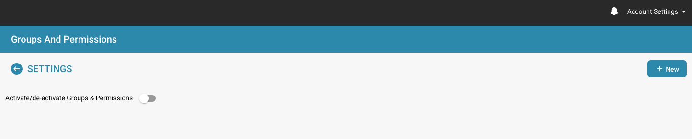
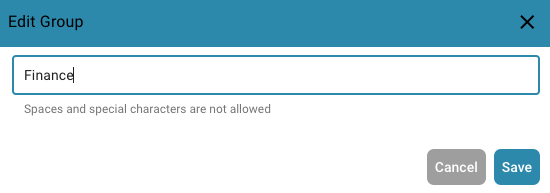

# Adding/Editing Groups


DocBits Groups & Permissions Tutorial: Set User Roles, Access Rights & Secure Your Workspace


## To add a new group or change the permissions of an existing group, you can do the following:

* **Navigate to Group Settings:** Log in to your admin account and go to Group Settings in the admin panel.

<figure><figcaption></figcaption></figure>

This window will open:

<figure><figcaption></figcaption></figure>

* **Click the + New button:** If you want to add a new group, click the + New button to start the process of adding a new group.

<figure><figcaption></figcaption></figure>

* **Fill out the table:** Provide the group name and a description of the group.
* **Save the details:** Once you have filled in the group and description, click the "Save" button.

<figure><figcaption></figcaption></figure>

## Editing Groups:

* **Edit Groups:** To edit groups, click on "edit", here you can change the group name

<figure><figcaption></figcaption></figure>

<figure><figcaption></figcaption></figure>

* **Enable Groups & permissions:** To make the group visible, "Groups & permissions" must be enabled.

<figure><figcaption></figcaption></figure>

* **Check the results:** After saving, review the results to make sure the group was successfully added, edited, or updated.