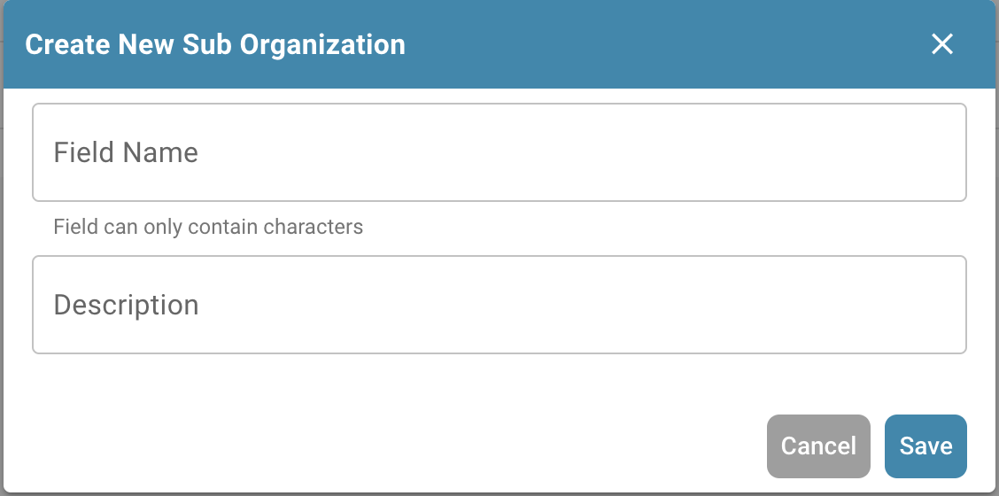
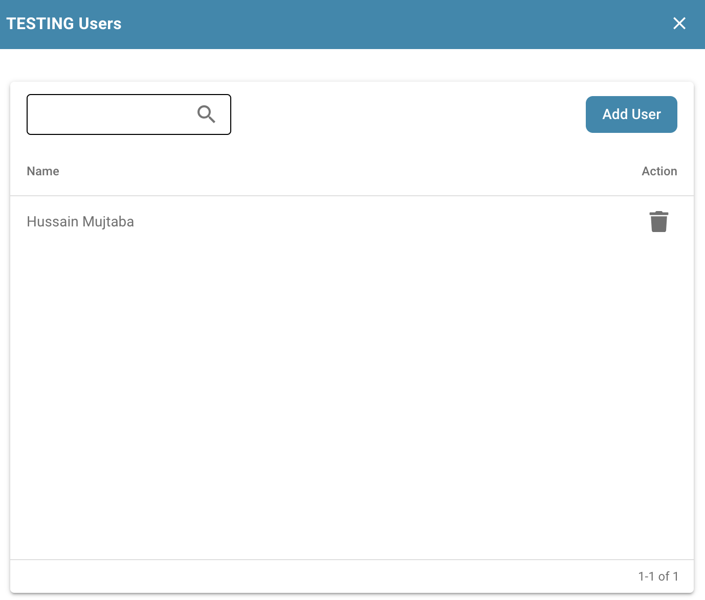

# How to create a Sub-Organization

## Create a new Sub-Organisaztion:

<figure><figcaption></figcaption></figure>

Click on the `+ NEW` button

<figure><figcaption></figcaption></figure>

The following menu will be displayed:

<figure><figcaption></figcaption></figure>

Enter the details of the sub-organization you want to create, the name and description, then click on the `SAVE` button. You should then find your newly created sub-organization at the bottom of the list of existing sub-organizations.

## Editing sub organizations

<figure><figcaption></figcaption></figure>

**Manage Users:**

<figure><figcaption></figcaption></figure>

* **Adding Users:** Administrators can create new user accounts and assign them to the appropriate sub-organization.&#x20;
* **Assigning Roles and Permissions:** Administrators can set the roles and permissions for users within a suborganization. This typically involves assigning access rights to specific documents, folders or functions in the document management system.
* **Manage profile details:** Administrators can edit profile details of users within the sub-organization, such as: B. Contact information or department affiliation. This allows for updated and accurate management of user data.

<figure><figcaption></figcaption></figure>

You can add a new user to the organization and have the option of whether to remove the user from other groups.

**Edit User:**

<figure><figcaption></figcaption></figure>

* **Editing suborganization settings:** Administrators can edit the settings and properties of a suborganization, including its name, description, or hierarchy level within the system.
* **Edit user details:** Administrators can edit the details of individual users within a sub-organization, for example to adjust their access rights or update their contact information.

**Delete User:**

* **Deleting sub-organizations:** Administrators may also have the ability to delete sub-organizations if they are no longer needed or if a restructuring of the organizational structure is required. When deleting a suborganization, administrators must ensure that all users and data associated with it are handled properly.

These management features enable administrators to effectively manage and adapt the user accounts and organizational structures within a document management system to meet the company's changing needs and processes.