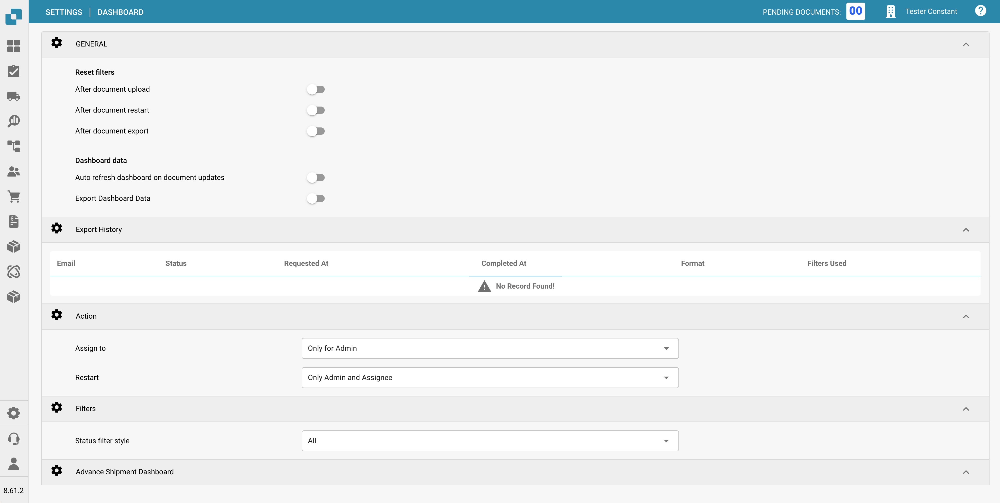

# Pulpit

## Przegląd

Ustawienia pulpitu zostały zaprojektowane, aby pomóc administratorom kontrolować prezentację danych i interakcję w obrębie pulpitu DocBits. Te ustawienia określają, jakie informacje są dostępne od razu po zalogowaniu, zapewniając użytkownikom szybki dostęp do najbardziej istotnych danych dla ich zadań.

<figure><figcaption></figcaption></figure>

## Kluczowe funkcje i opcje

### **Ogólne ustawienia pulpitu**:

* **Resetuj filtry**: Pozwala na konfigurację, kiedy filtry pulpitu powinny się resetować, na przykład po przesłaniu dokumentu, ponownym uruchomieniu dokumentu lub eksporcie dokumentu. Pomaga to w utrzymaniu czystego stanu do przeglądania danych zgodnie z określonymi etapami przepływu pracy.
* **Dane pulpitu**: Kontroluje, czy pulpit powinien automatycznie ładować dane po uzyskaniu dostępu przez użytkownika, co może pomóc w skróceniu czasu ładowania i poprawie doświadczenia użytkownika poprzez ładowanie danych tylko wtedy, gdy jest to potrzebne.

<figure><figcaption></figcaption></figure>

### **Działanie:**

* **Przypisz do:** Ta funkcja pozwala użytkownikom definiować uprawnienia do przypisywania dokumentów
  * **Tylko dla administratora:** Tylko użytkownicy z uprawnieniami administratora mogą przypisywać dokumenty, niezależnie od uprawnień przyznanych użytkownikom niebędącym administratorami.
  * **Wszyscy użytkownicy**: Wszyscy użytkownicy, którym przyznano niezbędne [uprawnienia](groups-users-and-permissions/groups-and-permissions/aktywacja-uprawnien.md), mogą przypisywać dokumenty.
* **Restart:** Ta funkcja pozwala użytkownikom definiować uprawnienia do ponownego uruchamiania dokumentów
  * **Tylko dla administratora**: Tylko użytkownicy z uprawnieniami administratora mogą ponownie uruchamiać dokumenty, niezależnie od uprawnień przyznanych użytkownikom niebędącym administratorami.
  * **Tylko administrator i przypisany użytkownik**: Tylko użytkownicy z uprawnieniami administratora i przypisany użytkownik mogą ponownie uruchomić dokument.
  * **Wszyscy użytkownicy**: Wszyscy użytkownicy, którym przyznano niezbędne [uprawnienia](groups-users-and-permissions/groups-and-permissions/aktywacja-uprawnien.md), mogą ponownie uruchamiać dokumenty.

<figure><figcaption></figcaption></figure>

### **Filtry**:

* **Styl filtra statusu**: Określa styl prezentacji filtrów statusu, który może być ustawiony na domyślny lub dostosowany zgodnie z operacyjnym skupieniem użytkowników.
* **Niestandardowy filtr statusu**: Umożliwia tworzenie i stosowanie niestandardowych filtrów, które mogą celować w określone statusy dokumentów, takie jak "Nowy", "Weryfikacja" czy "Eksport". Pozwala to użytkownikom na szybki dostęp do dokumentów na określonych etapach przetwarzania.

<figure><figcaption></figcaption></figure>

### **Zaawansowany pulpit wysyłki**:

* **Widoczność dostarczonych zamówień:** Ta funkcja pozwala użytkownikowi określić czas trwania, przez jaki dostarczone zamówienia będą widoczne.

<figure><figcaption></figcaption></figure>

Te ustawienia pulpitu są kluczowe dla zapewnienia, że platforma DocBits jest jak najbardziej responsywna i użyteczna, dostarczając użytkownikom potężne narzędzie do monitorowania i zarządzania działaniami przetwarzania dokumentów bezpośrednio z pulpitu.
