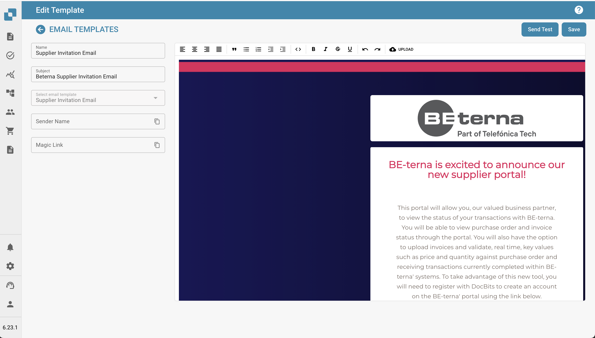
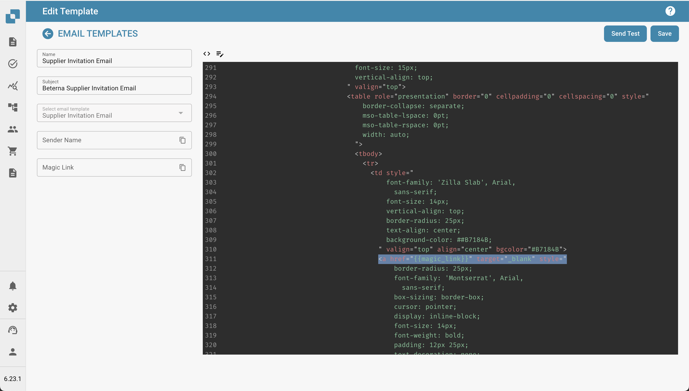

# E-mail Sjablonen Bewerken





## Overzicht

De functie E-mail Sjablonen stelt beheerders in staat om e-mailcommunicatie te maken en aan te passen die automatisch naar leveranciers wordt gestuurd. Een van de belangrijkste elementen die in deze sjablonen worden gebruikt, is de `{{magic_link}}`, die een dynamische link biedt die is afgestemd op elke ontvanger.

<figure><figcaption></figcaption></figure>

**Wat is `{{magic_link}}`?**

De `{{magic_link}}` is een tijdelijke aanduiding die dynamisch wordt vervangen door een unieke URL wanneer de e-mail wordt verzonden. Deze URL leidt de ontvanger meestal naar het voltooien van een actie, zoals registratie, goedkeuring of toegang tot een specifiek deel van het leveranciersportaal.

## E-mail Sjablonen Bewerken

<figure><figcaption></figcaption></figure>

**Toegang tot de E-mail Sjabloon Editor**

1. **Navigeer naar E-mail Sjablonen**:
   * Ga naar het **E-mail Sjablonen** gedeelte vanuit het hoofdmenu.
2. **Selecteer een Sjabloon om te Bewerken**:
   * Kies het e-mail sjabloon dat je wilt bewerken door op de sjabloonnaam te klikken (bijv. "Leveranciersuitnodiging E-mail").
3. **Bewerk het Sjabloon**:
   * De editor stelt je in staat om zowel de HTML-code als het visuele ontwerp van de e-mail aan te passen.
   * Je kunt schakelen tussen visuele bewerking en codebewerking met behulp van de beschikbare tabbladen.

<figure><figcaption></figcaption></figure>

**`{{magic_link}}` als een Link Definiëren**

Om `{{magic_link}}` als een klikbare link in de e-mail te definiëren, moet je ervoor zorgen dat het correct is opgemaakt in de HTML-code van het sjabloon. Volg deze stappen:

1. **Vind het Linkgedeelte in de HTML-code**:
   * Zoek in de code-editor het gedeelte waar je de magic link wilt laten verschijnen. Dit is meestal binnen een `<a>` (anker) tag.
2.  **Voeg de `{{magic_link}}` Placeholder in**:

    * Vervang het `href` attribuut van de anker tag door `{{magic_link}}`.
    * Zorg ervoor dat de link passend is gestyled voor het e-mail sjabloon. Hier is een voorbeeld:

    ```html
    <a href="{{magic_link}}" target="_blank" style="
        background-color: #B7184B;
        border-radius: 25px;
        font-family: 'Montserrat', Arial, sans-serif;
        font-size: 14px;
        font-weight: bold;
        padding: 12px 25px;
        color: #FFFFFF;
        text-decoration: none;
        display: inline-block;
        cursor: pointer;">
        Voltooi Registratie
    </a>
    ```

## 3. Pas de Linktekst aan:

• Wijzig de tekst tussen de opening \<a> en sluitende \</a> tags om de actie weer te geven die je wilt dat de gebruiker onderneemt. Bijvoorbeeld, “Voltooi Registratie” of “Toegang tot Uw Account”.

4\. Sla op en Test het Sjabloon:

• Klik op de Opslaan-knop nadat je de wijzigingen hebt aangebracht.

• Je kunt de Test Verzenden-knop gebruiken om een test-e-mail te verzenden om te controleren of de link werkt zoals verwacht.

## Beste Praktijken voor het Gebruik van \{{magic\_link\}}

• Link Plaatsing: Plaats de \{{magic\_link\}} prominent in de e-mail om ervoor te zorgen dat deze gemakkelijk toegankelijk is voor ontvangers.

• Duidelijke Oproep tot Actie: De tekst binnen de link moet een duidelijke oproep tot actie zijn, zoals “Voltooi Registratie” of “Bevestig Uw E-mail.”

• Styling: Zorg ervoor dat de link consistent is gestyled met de rest van het e-mail sjabloon en visueel opvalt.

• Testen: Verstuur altijd een test-e-mail na het bewerken van het sjabloon om te verifiëren dat de \{{magic\_link\}} correct oplost en de styling geschikt is.

## Conclusie

Door de \{{magic\_link\}} correct te definiëren in je e-mail sjablonen, kun je ervoor zorgen dat ontvangers een gepersonaliseerde en actiegerichte e-mail ontvangen die hen naar de juiste taak binnen je leveranciersportaal leidt. Dit verbetert de gebruikerservaring en zorgt voor soepele onboarding- en communicatieprocessen.


Deze documentatie biedt stapsgewijze instructies voor beheerders over hoe de \{{magic\_link\}} te definiëren en te gebruiken in e-mail sjablonen, zodat e-mails zowel functioneel als visueel aantrekkelijk zijn.
