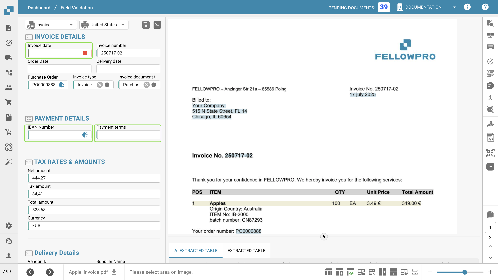
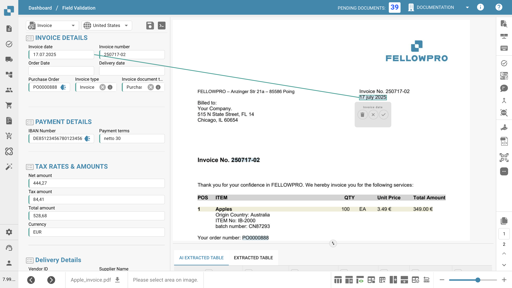
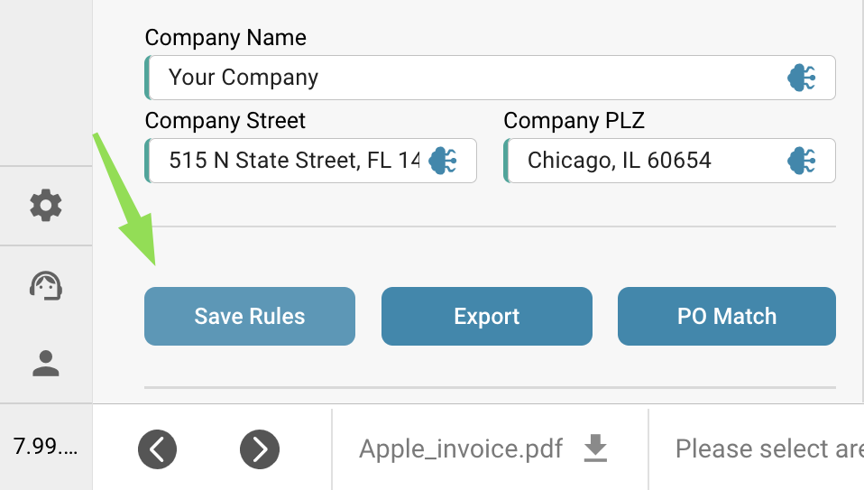

# Training Header Fields

After uploading your document, you'll be taken to the validation screen.\
Some fields may already be populated — this is thanks to DocBits' swarm intelligence. However, other fields might remain empty. This typically means the document type hasn’t been fully trained yet, so DocBits doesn't yet know where to extract that information from.

You can help train DocBits to recognize these fields by manually identifying the correct data. \
**Please note:** if a field remains empty, it might simply be because the information is not present in the uploaded document.

<figure><figcaption></figcaption></figure>

### To train a field:

1. Click on the field you want to train.
2. Then either:
   * **Double-click** on the relevant data within the document, or
   * **Draw a selection box** around the data using your cursor.

<figure><figcaption></figcaption></figure>

Repeat this process for all required fields.\
Once all necessary fields have been populated, **click "Save Rules"** to store the training. This ensures that DocBits learns where to find each piece of information for similar documents in the future.

<figure><figcaption></figcaption></figure>

After saving, your document is ready to be exported — and next time, DocBits will automatically extract the trained fields.
