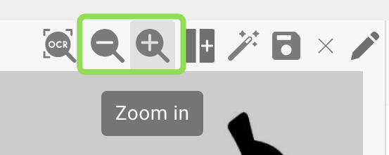

# Defining Tables and Columns

Use this guide to manually define tables and columns for line-item extraction in DocBits. This is especially useful when automatic detection doesn't fully capture the table structure, or when you need to add custom fields.

### 1. Access the Table Extraction View

Open your document in DocBits and click the **“Table Training”** button to enter the table extraction view.

<figure><figcaption></figcaption></figure>

### 2. Activate Training Mode

To manually define or modify tables and columns, click **“TRAINING MODE.”**

<figure><figcaption></figcaption></figure>

### 3. Define the Table Area

After entering Training Mode, you can define where the table is on the document. You have two options:

#### Option 1: Use Auto-Detect

Click the **“Auto-Detect Tables”** button to let DocBits try to identify the table area on its own.

<figure><figcaption></figcaption></figure>

If detection is successful, the table outline will be displayed automatically. You can then proceed to define the columns.

#### Option 2: Define Table Manually

If auto-detection fails or is inaccurate, you can manually define the table:

1. Click the **“Edit”** button to activate table selection mode.
2. Draw a rectangle around the table area on the left-hand document view.

<figure><figcaption></figcaption></figure>

### 4. Add and Define Columns

Once the tables are defined you can manually define the columns via the following button:\

<figure><figcaption></figcaption></figure>

Define and sort the columns via drag and drop on the document. Repeat this for the tables on the other pages as well. As an alternative if the tables are equal on each page you can use the following button to use the same column for all tables defined in the document. This functionality copies the columns that you have defined to all other pages as well:

<figure><figcaption></figcaption></figure>

Use the **zoom** feature to better define columns on cluttered or complex documents, for example, when a lot of information is close together and this makes it difficult to define the columns:

<figure><figcaption></figcaption></figure>

If you defined a column by mistake it can be selected by clicking it and deleted via the following button:

<figure><figcaption></figcaption></figure>

<mark style="color:red;">**Note**</mark>: The button is only visible if the column is selected.

If you are done defining all tables and all columns on your document use the “Save” button to activate your changes and to extract the data from the document:

<figure><figcaption></figcaption></figure>

The data of all defined areas will be extracted and shown on the right side:

<figure><figcaption></figcaption></figure>

### 6. Save and Extract

Click **“Save Rules”** once all tables and columns have been defined.

* This tells DocBits where to find table data for this specific supplier.
* The next time a document from the same supplier is uploaded, DocBits will automatically extract the table using the saved rules.

<mark style="color:red;">**Note**</mark>: This training is supplier-specific. It will not apply to documents from other suppliers.

