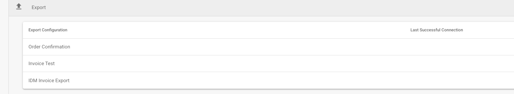
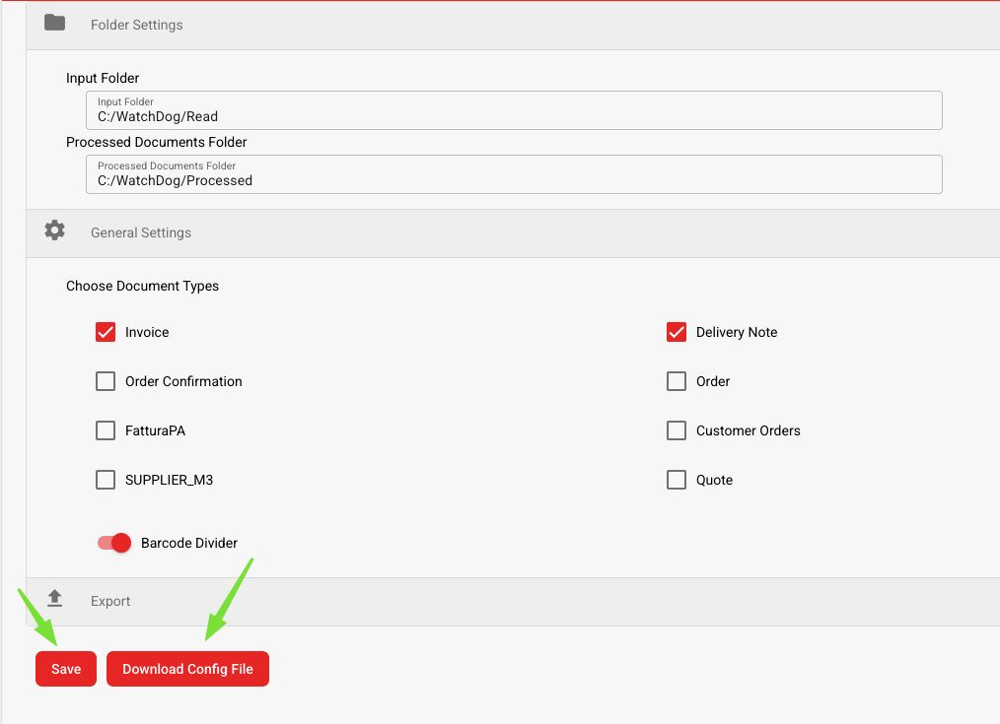

# Instalação do WatchDog

## Configurando o WatchDog no DocBits

1. **Acessar Configurações do WatchDog**
   * Navegue até **Configurações → Processamento de Documentos → WatchDog**.
2. **Configurações de Pasta**
   * Defina os caminhos onde o WatchDog encontra e processa documentos.
   *   Os caminhos das pastas devem corresponder àqueles criados durante a instalação:

       * `C:/WatchDog/Read`
       * `C:/WatchDog/Processed`

       <figure><figcaption></figcaption></figure>
3. **Configurações Gerais**
   *   Selecione os tipos de documentos a serem processados marcando as caixas de seleção correspondentes.

       <figure><figcaption></figcaption></figure>
4. **Configurações de Exportação**
   * Exibe todas as exportações configuradas para **processamento local**.
   *   Mostra a data e hora da **última conexão bem-sucedida** para cada configuração.

       <figure><figcaption></figcaption></figure>
5. **Baixar a Configuração**
   * Salvar a configuração
   *   Baixar a configuração

       <figure><figcaption></figcaption></figure>

## Guia de Instalação do WatchDog

1. **Criar Pastas Necessárias**
   * Crie um diretório principal: `C:/WatchDog`
   * Dentro de `C:/WatchDog`, crie as seguintes subpastas:\
     <mark style="color:red;">**Nota**</mark>**: estas devem corresponder às pastas no DocBits**
     * `C:/WatchDog/Read`
     * `C:/WatchDog/Processed`
2. **Baixar o WatchDog**
   * Baixe a versão mais recente do `WatchDog.exe` em:\
     [https://github.com/Fellow-Consulting-AG/ActualWatchdog/releases](https://github.com/Fellow-Consulting-AG/ActualWatchdog/releases)
   * Coloque o arquivo `WatchDog.exe` baixado em `C:/WatchDog`.
   * Coloque o arquivo `watchdog-config.json` baixado em `C:/WatchDog`.
   * abra o `watchdog-config.json.` e altere o **config\_path.**
   * Neste exemplo:
     * `"config_path": "C:/WatchDog/watchdog-config.json"`
3. **Instalar o WatchDog**
   * Abra o **Prompt de Comando (CMD)** com **direitos de Administrador**.
   * Navegue até a pasta do WatchDog
   *   Execute o seguinte comando para instalar o WatchDog:

       `WatchDog.exe install`
4. **Iniciar o Serviço WatchDog**
   *   Execute o seguinte comando no CMD:

       `WatchDog.exe start`
5. **Definir Tipo de Inicialização**
   * Abra **Serviços** (Pressione `Win + R`, digite `services.msc` e pressione **Enter**).
   * Localize **WatchDog** na lista de serviços.
   * Clique duas vezes para abrir suas propriedades.
   * Defina **Tipo de Inicialização** como **Automático (Início Atrasado)**.
   * Clique em **OK**.
