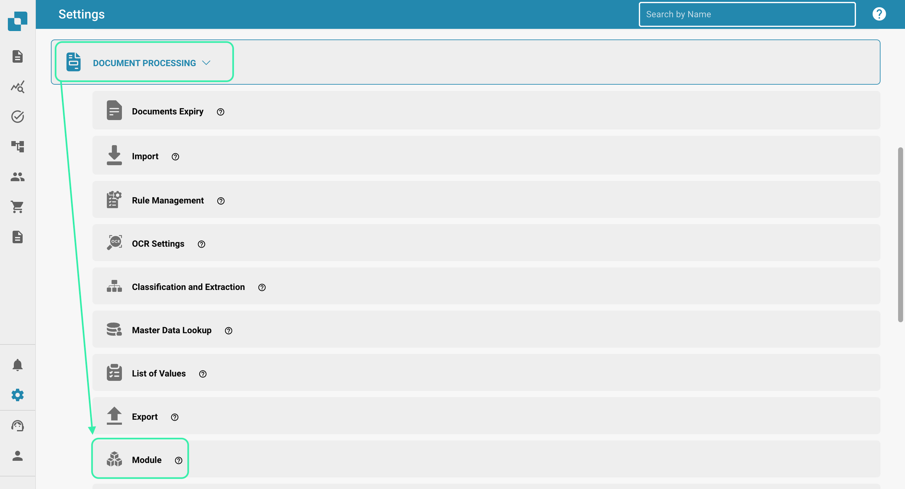
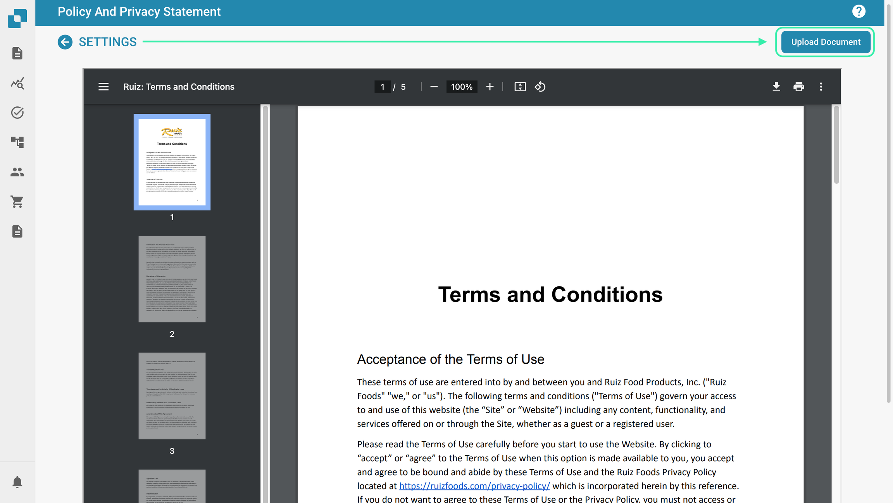

# Portal de Proveedores

### Activación 

Desde el Panel de Control, selecciona Configuración.

<figure><figcaption></figcaption></figure>

Procesamiento de Documentos → Módulo

<figure><figcaption></figcaption></figure>

A continuación, activa el Portal de Proveedores habilitando el control deslizante.

<figure><figcaption></figcaption></figure>

#### Configuración del Proveedor 

Una vez que se ha habilitado la función del Portal de Proveedores, se dispone de una nueva área de Configuración. Si desplazas hacia abajo en la lista de Configuración, verás lo siguiente.

<figure><figcaption></figcaption></figure>

En esta sección, tendrás acceso a lo siguiente.

<figure><figcaption></figcaption></figure>

### **Permisos del Proveedor**

Aquí es donde puedes gestionar todos los proveedores agrupándolos, lo que facilita la gestión de todos los proveedores. También se pueden asignar usuarios a los diversos grupos de proveedores que crees en esta área.

### **Grupo de Proveedores**

Para facilitar la gestión de todos los proveedores, en esta sección, puedes crear grupos y asignar proveedores a estos grupos según su ubicación geográfica, tipo de proveedor, etc. ¡La elección es tuya!

<figure><figcaption></figcaption></figure>

Para crear un nuevo grupo de proveedores, haz clic en el botón +Nuevo en la esquina superior derecha de tu pantalla.

<figure><figcaption></figcaption></figure>

Luego simplemente asigna a este grupo un nombre que describa con precisión a los proveedores que se asignarán a este grupo.

<figure><figcaption></figcaption></figure>

### **Asignación de Usuarios y Grupos de Proveedores**

Todos los grupos de proveedores que has creado se mostrarán aquí, ya que aquí puedes asignar usuarios de DocBits a los grupos de proveedores que crees.

<figure><figcaption></figcaption></figure>

Para asignar un nuevo usuario a un grupo de proveedores, haz clic en el botón +Nuevo y selecciona el usuario que te gustaría asignar.

<figure><figcaption></figcaption></figure>

Selecciona el usuario que te gustaría asignar al grupo de proveedores de la lista desplegable y luego haz clic en Agregar para asignar a ese usuario.

### **Política y Declaración de Privacidad**

Aquí es donde puedes subir tu política y declaración de privacidad para los proveedores que invitarás a través del portal de proveedores. Para subir un documento, simplemente haz clic en Subir Documento en la esquina superior derecha de tu pantalla.

<figure><figcaption></figcaption></figure>

### **Plantillas de Correo Electrónico**

En esta sección puedes subir varias plantillas de correo electrónico, ya que estas serán la estructura de los correos electrónicos que recibirá el proveedor cuando lo invites a unirse al portal de proveedores. Las plantillas requeridas incluyen: invitación, aprobación, finalización de registro y rechazo, ya que estos son todos los posibles correos electrónicos que un proveedor podría recibir. Para subir una plantilla, haz clic en +Nuevo.

<figure><figcaption></figcaption></figure>

### **Diseño del Proveedor**

Puedes personalizar el diseño del formulario de registro que verán los proveedores que invites al registrarse en el portal de proveedores. Esto significa que puedes agregar o eliminar campos según lo que se requiera de los proveedores que invites. El generador de diseño del proveedor funciona exactamente igual que el generador de diseño del tipo de documento; para más información sobre esto, haz clic aquí.

A continuación, puedes ver que puedes configurar múltiples diseños según tus necesidades.

<figure><figcaption></figcaption></figure>

Dentro del diseño, puedes agregar listas desplegables que se pueden crear utilizando la función Lista de Valores.

<figure><figcaption></figcaption></figure>

### **TEN EN CUENTA**

Solo se pueden usar valores que existan en INFOR en estas listas para que la exportación funcione. En el ejemplo mostrado arriba, los valores seleccionables para el campo "Grupo de Proveedores" existen todos dentro de INFOR. El mismo principio se aplica a todas las listas, ya sea para términos de pago, monedas, etc. Para asegurarte de que no haya problemas al exportar, primero consulta los valores almacenados en INFOR antes de configurar estas listas.

### **Configuración General del Proveedor**

Aquí es donde puedes subir el logotipo de tu empresa o un alternativo que se mostrará en el encabezado de todas las plantillas de correo electrónico enviadas, así como en la pantalla de inicio de sesión de DocBits una vez que los proveedores comiencen el proceso de registro. Si se deja vacío, se mostrará el logotipo estándar de DocBits.

Campos Adicionales de Invitación del Portal de Proveedores: Esta opción te permite agregar campos adicionales a la invitación que envías a los proveedores; se te proporciona una lista de campos como se muestra a continuación.

<figure><figcaption></figcaption></figure>

### **Configuración de Exportación**

Sube tu API de ION así como tu archivo de mapeo de IDM aquí y tu archivo de mapeo de M3 se generará a la derecha.

<figure><figcaption></figcaption></figure>
