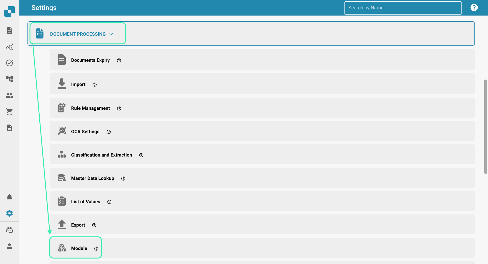
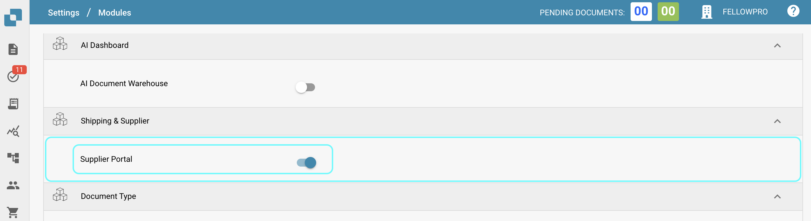
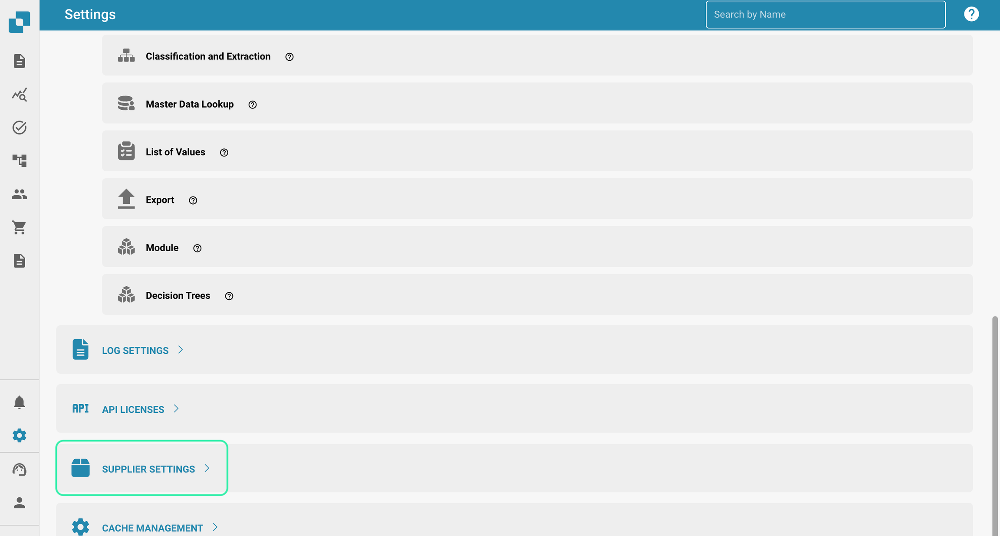
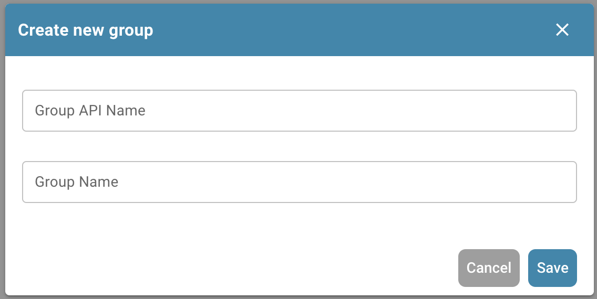
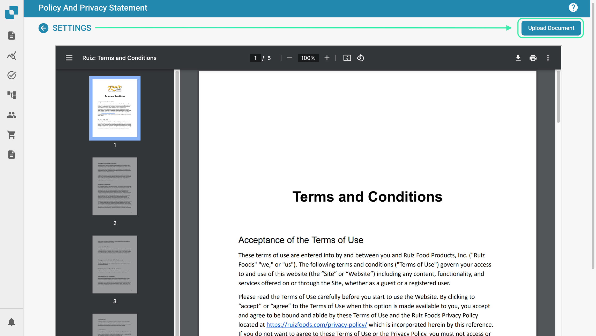
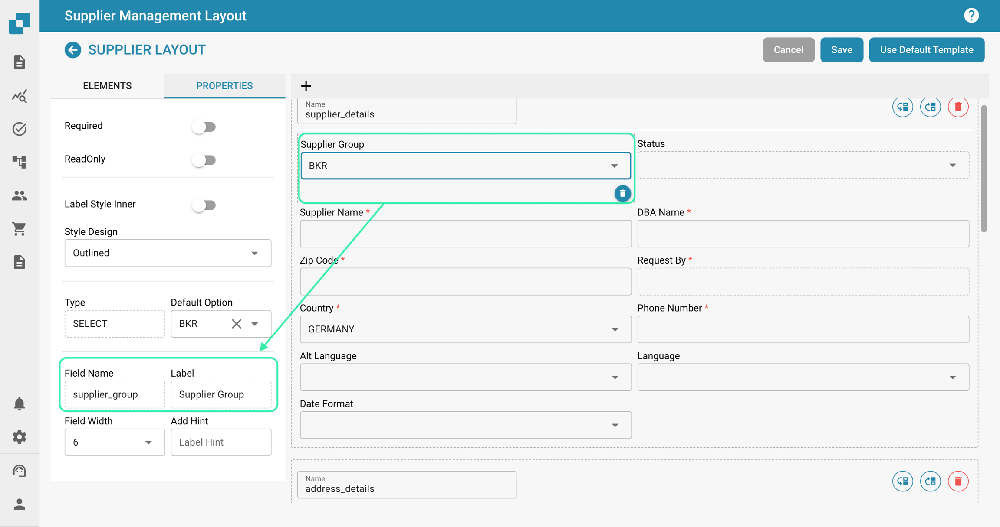
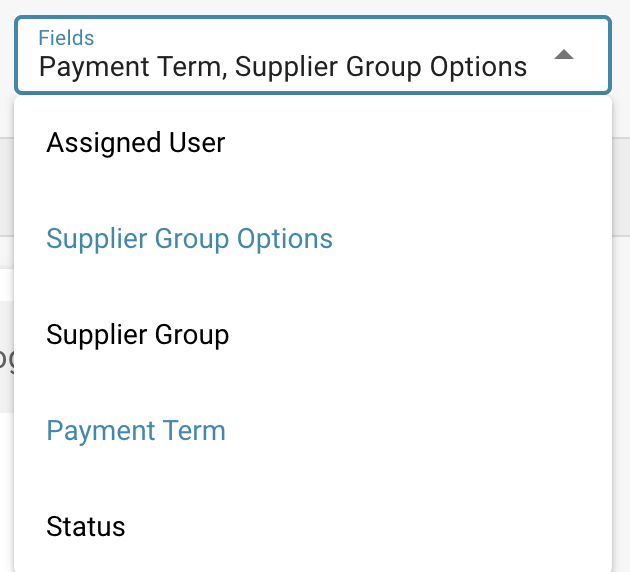
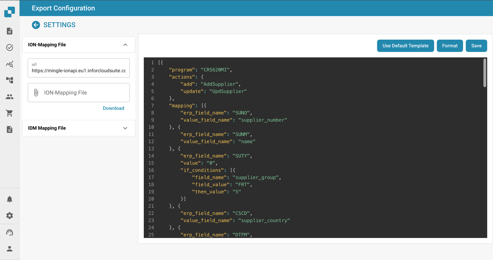

# Portale Fornitori

### Attivazione 

Dalla Dashboard, seleziona Impostazioni.

<figure><figcaption></figcaption></figure>

Elaborazione Documenti → Modulo

<figure><figcaption></figcaption></figure>

Successivamente, attiva il Portale Fornitori abilitando il cursore.

<figure><figcaption></figcaption></figure>

### Impostazioni Fornitori 

Una volta abilitata la funzione Portale Fornitori, diventa disponibile una nuova area nelle Impostazioni. Se scorri fino in fondo all'elenco delle Impostazioni, vedrai quanto segue.

<figure><figcaption></figcaption></figure>

In questa sezione, hai accesso a quanto segue.

<figure><figcaption></figcaption></figure>

### **Permessi Fornitori**

Qui puoi gestire tutti i fornitori raggruppandoli, rendendo più facile gestire tutti i fornitori. Gli utenti possono anche essere assegnati ai vari gruppi di fornitori che crei in quest'area.

### **Gruppo Fornitori**

Per facilitare la gestione di tutti i fornitori, in questa sezione puoi creare gruppi e assegnare fornitori a questi gruppi in base alla loro posizione geografica, tipo di fornitore, ecc. La scelta è tua!

<figure><figcaption></figcaption></figure>

Per creare un nuovo gruppo di fornitori, fai clic sul pulsante +Nuovo nell'angolo in alto a destra dello schermo.

<figure><figcaption></figcaption></figure>

Quindi, assegna semplicemente a questo gruppo un nome che descriva accuratamente i fornitori che saranno assegnati a questo gruppo.

<figure><figcaption></figcaption></figure>

### **Mappatura Utente e Gruppo Fornitori**

Tutti i gruppi di fornitori che hai creato verranno mostrati qui poiché è qui che puoi assegnare gli utenti di DocBits ai gruppi di fornitori che crei.

<figure><figcaption></figcaption></figure>

Per assegnare un nuovo utente a un gruppo di fornitori, fai clic sul pulsante +Nuovo e seleziona l'utente che desideri assegnare.

<figure><figcaption></figcaption></figure>

Seleziona l'utente che desideri assegnare al gruppo di fornitori dall'elenco a discesa e poi fai clic su Aggiungi per assegnare quell'utente.

### **Politica e Dichiarazione sulla Privacy**

Qui puoi caricare la tua politica e dichiarazione sulla privacy per i fornitori che inviterai tramite il portale fornitori. Per caricare un documento, fai semplicemente clic su Carica Documento nell'angolo in alto a destra dello schermo.

<figure><figcaption></figcaption></figure>

### **Modelli di Email**

In questa sezione puoi caricare vari modelli di email poiché questi saranno la struttura delle email ricevute dal fornitore quando lo inviti a unirsi al portale fornitori. I modelli richiesti includono: invito, approvazione, completamento registrazione e rifiuto poiché queste sono tutte le possibili email che un fornitore potrebbe ricevere. Per caricare un modello, fai clic su +Nuovo.

<figure><figcaption></figcaption></figure>

### **Layout Fornitori**

Puoi personalizzare il layout del modulo di registrazione che i fornitori che inviti vedranno quando si registrano per il portale fornitori. Questo significa che puoi aggiungere o rimuovere campi a seconda di ciò che è richiesto dai fornitori che inviti. Il costruttore di layout fornitori funziona esattamente come il costruttore di layout del tipo di documento, per ulteriori informazioni su questo, fai clic qui.

Di seguito puoi vedere che sei in grado di configurare più layout a seconda delle tue esigenze.

<figure><figcaption></figcaption></figure>

All'interno del layout, puoi aggiungere elenchi a discesa che possono essere creati utilizzando la funzione Elenco di Valori.

<figure><figcaption></figcaption></figure>

### **RICORDA**

Solo i valori che esistono in INFOR possono essere utilizzati in questi elenchi affinché l'esportazione funzioni. Nell'esempio mostrato sopra, i valori selezionabili per il campo “Gruppo Fornitori” esistono tutti all'interno di INFOR. Lo stesso principio si applica a tutti gli elenchi, sia per le condizioni di pagamento, le valute, ecc. Per garantire che non ci siano problemi durante l'esportazione, consulta prima i valori memorizzati in INFOR prima di configurare questi elenchi.

### **Impostazioni Generali Fornitori**

Qui puoi caricare il logo della tua azienda o un'alternativa che verrà visualizzato nell'intestazione di tutti i modelli di email inviati, nonché sulla schermata di accesso di DocBits una volta che i fornitori iniziano il processo di registrazione. Se lasciato vuoto, verrà visualizzato il logo standard di DocBits.

Campi Aggiuntivi di Invito Portale Fornitori: Questa opzione ti consente di aggiungere campi aggiuntivi all'invito che invii ai fornitori, un elenco di campi ti viene messo a disposizione come mostrato di seguito.

<figure><figcaption></figcaption></figure>

### **Configurazione Esportazione**

Carica qui il tuo API ION e il tuo file di mappatura IDM e il tuo file di mappatura M3 verrà generato a destra.

<figure><figcaption></figcaption></figure>
