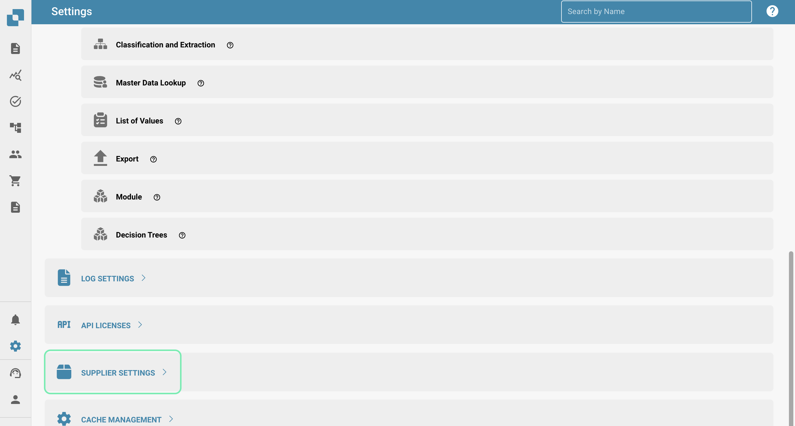
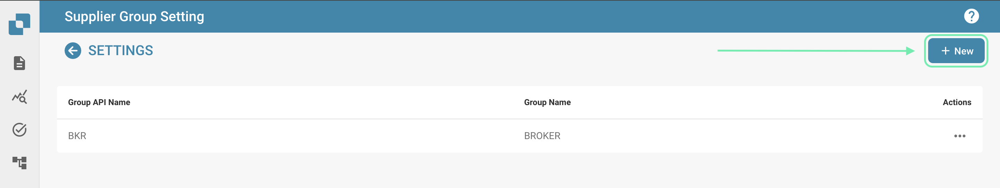
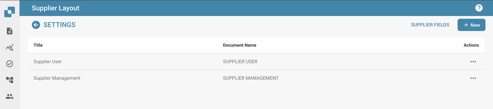

# Supplier Portal

### Activation 

From the Dashboard, select Settings.

Document Processing → Module

<figure><figcaption></figcaption></figure>

Next, activate Supplier Portal by enabling the slider.

<figure><figcaption></figcaption></figure>

### Supplier Settings 

Once the Supplier Portal feature has been enabled, a new area of Settings becomes available. If you scroll to the bottom of the list of Settings, you will see the following.

<figure><figcaption></figcaption></figure>

In this section, you get access to the following.

<figure><figcaption></figcaption></figure>

#### Supplier Permissions 

This is where you can manage all vendors by grouping them, making it easier to manage all suppliers. Users can also be assigned to the various supplier groups you create in this area.

**Supplier Group**

In order to make managing all vendors easier, in this section, you can create groups and assign suppliers to these groups based on their geographical location, type of vendor, etc. The choice is yours!

<figure><figcaption></figcaption></figure>

To create a new supplier group, click on the +New button in the top right corner of your screen.

<figure><figcaption></figcaption></figure>

Then simply assign this group a name that accurately describes the vendors that will be assigned to this group.

<figure><figcaption></figcaption></figure>

**User and Supplier Group Mapping**

All the supplier groups you have created will be shown here as this where you are able to assign DocBits users to the supplier groups you create.

<figure><figcaption></figcaption></figure>

In order to assign a new user to a supplier group, click on the +New button and select the user you would like to assign.

<figure><figcaption></figcaption></figure>

Select the user you would like to assign to the supplier group from the drop down list and then click Add in order to assign that user.

#### Policy and Privacy Statement 

This is where you can upload your policy and privacy statement for the vendors you will be inviting via the supplier portal. To upload a document, simply click Upload Document in the top right corner of your screen.

<figure><figcaption></figcaption></figure>

#### Email Templates 

In this section you can upload various email templates as these will be the structure of the emails received by the supplier when you invite them to join the supplier portal. The required templates include: invitation, approval, registration completion and rejection as these are all the possible emails a supplier could receive. In order to upload a template, click on +New.

<figure><figcaption></figcaption></figure>

#### Supplier Layout 

You can customise the layout of the registration form that the vendors you invite will see when registering for the supplier portal. This means you can add or remove fields depending on what is required from the suppliers you invite. The supplier layout builder works the exact same as the document type layout builder, for more information on this, click [here](document-types/layout-builder.md).

Below you can see that you are able to configure multiple layouts depending on your needs.

<figure><figcaption></figcaption></figure>

Within the layout, you are able to add dropdown lists which can be created using the [List of Values](../settings/document-processing/list-of-values.md) feature.

<figure><figcaption></figcaption></figure>

**KEEP IN MIND**

Only values that exist in INFOR may be used in these lists in order for exporting to work. In the example shown above, the values selectable for the “Supplier Group” field all exist within INFOR. The same principle follows for all lists whether it be for payment terms, currencies, etc. To ensure no issues while exporting, first consult the values stored within INFOR before configuring these lists.

#### Supplier General Settings 

Here is where you are able to upload your company logo or alternative which will be displayed at the header of all email templates sent as well as on the DocBits login screen once suppliers begin the registration process. If left empty, the standard DocBits logo will be displayed.

Supplier Portal Additional Invitation Fields: This option enables you to add additional fields to the invitation you send out to vendors, a list of fields are made available to you as shown below.

<figure><figcaption></figcaption></figure>

#### Export Configuration 

Upload your ION API as well as your IDM mapping file here and your M3 mapping file will be generated on the right.

<figure><figcaption></figcaption></figure>



