# Supplier Portal

## Overview

This page explains how to activate and use the **Supplier Portal**, as well as where to find all relevant settings. The Supplier Portal allows you to invite suppliers to **DocBits**. Once access is granted, suppliers can log in to view the status of their **Purchase Orders** and **Invoices** directly within **DocBits**.

## How to Activate the Supplier Portal

1.  Go to **Settings → Document Processing → Module**.

    <figure>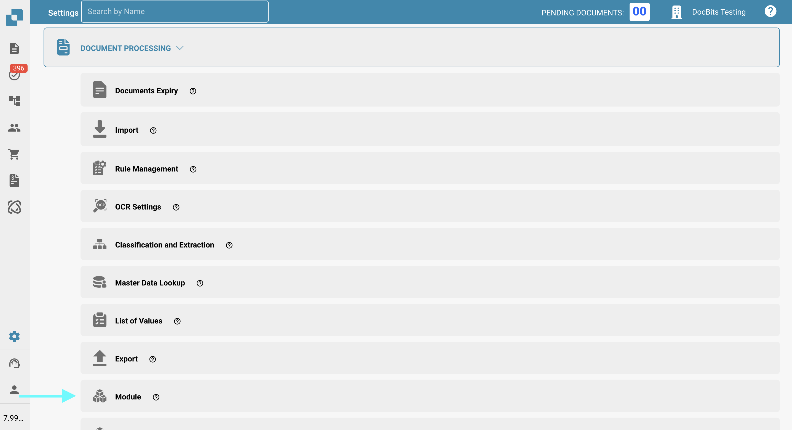<figcaption></figcaption></figure>
2.  In the **Shipping & Supplier** section, enable the **Supplier Portal** option.

    <figure>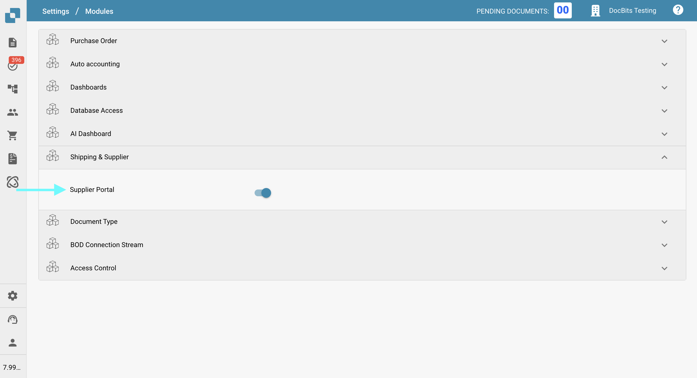<figcaption></figcaption></figure>

## Supplier Settings

Once the **Supplier Portal** feature is enabled, a new **Supplier Settings** section will appear at the bottom of the **Settings** menu.

<figure><figcaption></figcaption></figure>

[**Supplier General Settings**](../../settings/supplier-setting/supplier-general-settings.md): Here, you can customize the **Supplier Portal** by uploading your company logo—displayed in the header of all email templates—and by managing legal documents such as the Terms of Use and Privacy Policy.

[**Email Templates**](../../settings/supplier-setting/editing-email-templates.md)**:** Here you can create and test the invitation email templates that will be sent to invited suppliers.

[**Supplier Layout**](../../settings/supplier-setting/supplier-layout.md)**:** Here you can create and manage the layouts that define which information new suppliers must provide during the registration process.

[**Export Configuration**](../../settings/supplier-setting/export-configuration-for-supplier-portal-for-m3.md): Here you can define how data is mapped and synchronized between the **Supplier Portal** and the **Infor M3** system using ION and IDM mapping files.

[**Supplier Permissions**](../../settings/supplier-setting/supplier-permissions.md): Here you can configure the permissions that suppliers will have within the **Supplier Portal**. You can also group suppliers, making it easier to manage access and settings across multiple suppliers.

A detailed guide to all Supplier Settings can be found [here](../../settings/supplier-setting/).

## Supplier Dashboard 

You can access the **Supplier Dashboard** from the left-hand menu, as shown below.

<figure>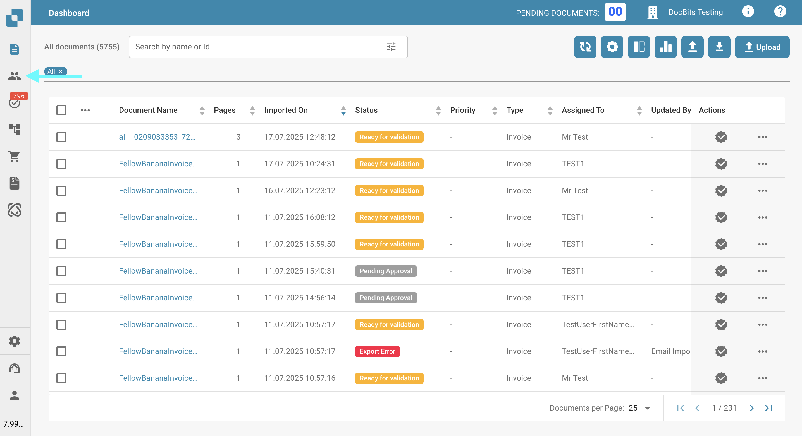<figcaption></figcaption></figure>

All of your created Suppliers are displayed here.

## Filter for Suppliers

You can search for suppliers by N**ame** or N**umber**, or use the advanced filters to narrow results by:

* **Supplier Groups**
* **Status**
* **Created On**

You can also specify how many suppliers should be displayed per page.

<figure>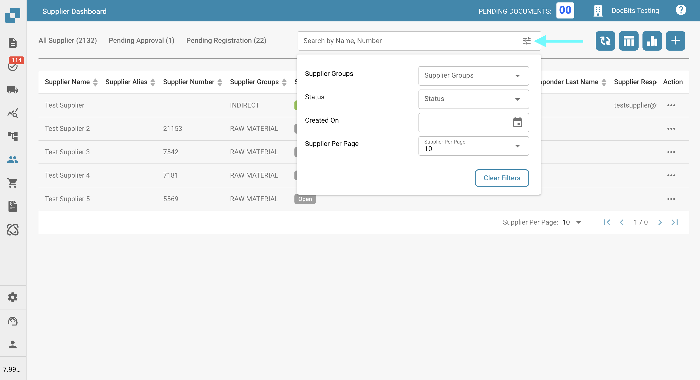<figcaption></figcaption></figure>

Additionally, you can quickly filter by the statuses **Pending Approval** or **Pending Registration** by clicking the corresponding category to the left of the filter ba&#x72;**.**

<figure>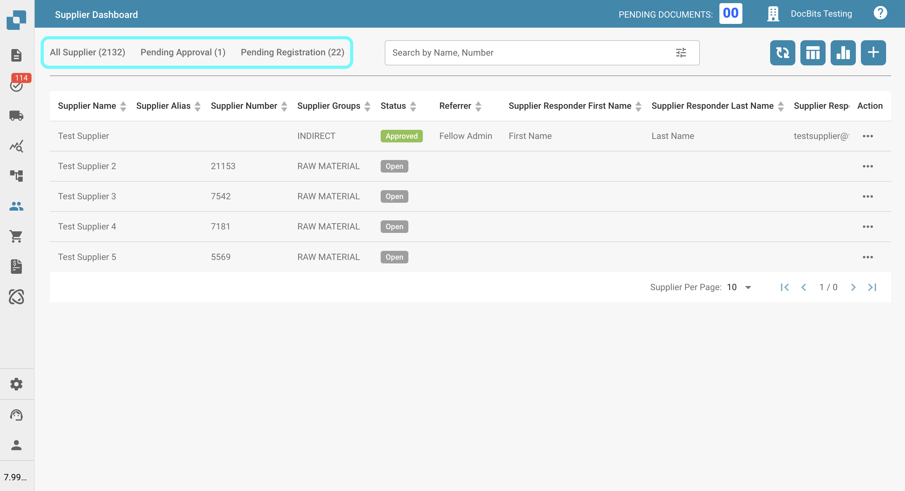<figcaption></figcaption></figure>

## Supplier Status

If you're using the **Supplier Portal**, it's important to understand the different statuses that suppliers can have. Below is a list of all possible supplier statuses and their meanings:

* **Open**: Existing supplier who has not yet been invited to the portal.
* **Pending Registration**: Supplier has been invited but has not yet completed the registration process.
* **Pending Supplier Input**: Registration is complete, but further input or changes are required from the supplier.
* **Pending Approval**: Supplier has completed registration and is awaiting the first approval.
* **Pending AP Approval**: Supplier has received the first approval and is awaiting a second (Accounts Payable) approval.
* **Approved**: Supplier has completed the process and has been fully approved.
* **Rejected**: The supplier’s registration or approval has been rejected.

## Tools in the Supplier Dashboard

To the right of the search bar, you'll find several tools that help you interact with and manage the dashboard more efficiently.

### Refresh table 

<figure><figcaption></figcaption></figure>

Click this button to refresh the dashboard and load the most up-to-date data and statuses.

### Set table columns for organization 

<figure>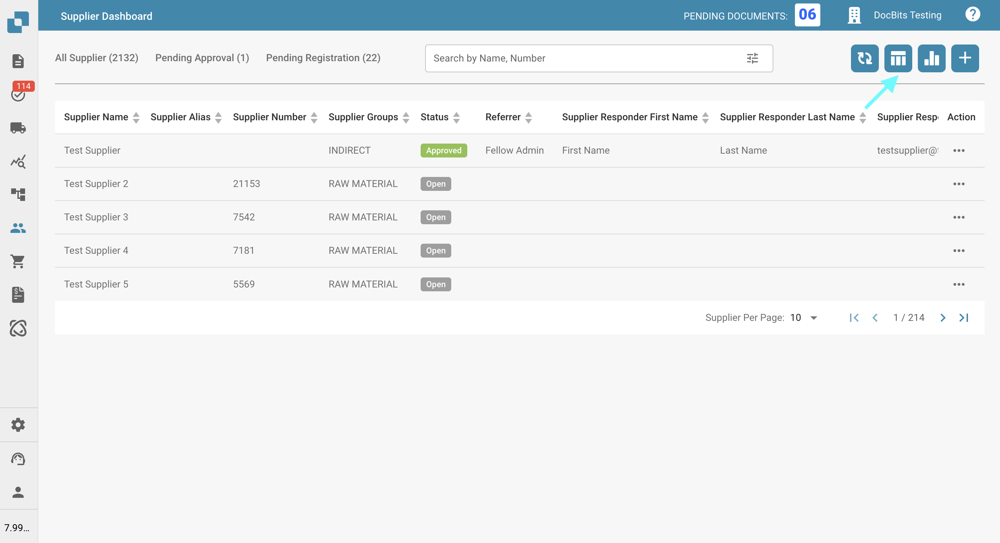<figcaption></figcaption></figure>

Click this button to open a menu where you can manage the visibility of columns in the purchase order table. Use the checkboxes and arrow buttons to move columns between the visible and hidden sections. You can also reorder columns by dragging and dropping the column names. Click **Done** to save your changes.

<figure>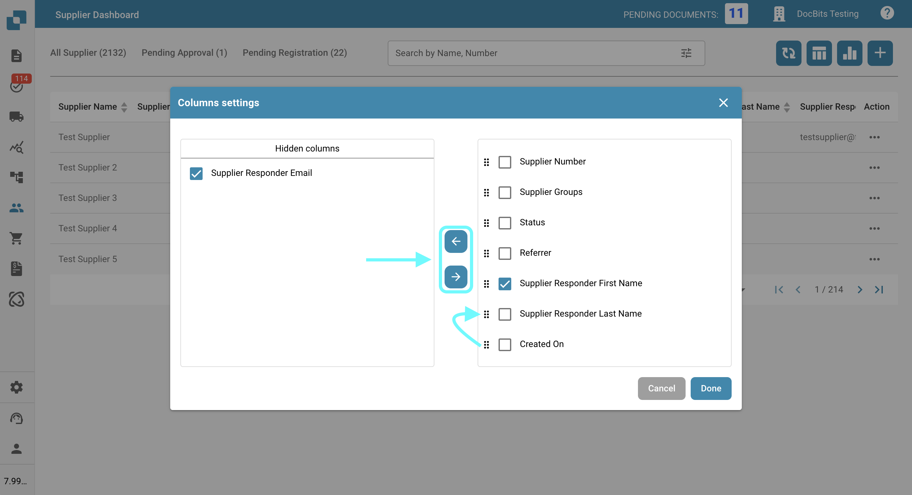<figcaption></figcaption></figure>

### Analytics 

<figure>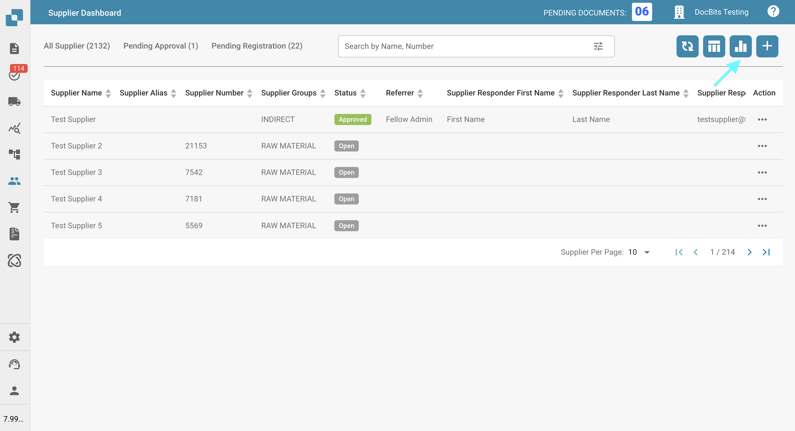<figcaption></figcaption></figure>

Clicking this button will open a new section showing how many suppliers are set to expire and when.\
Click on any category to apply a filter and view only those suppliers.

<figure>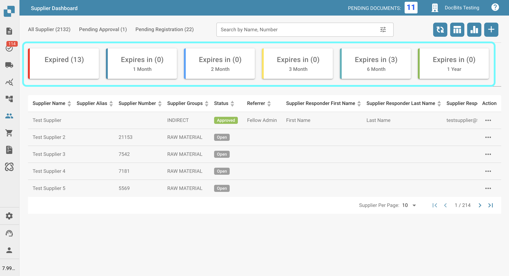<figcaption></figcaption></figure>

## Create Supplier and Send Registration Email

### **To create a new supplier:**

1.  Click the plus (+) icon in the top right corner.

    <figure><figcaption></figcaption></figure>
2.  Fill in the required fields, then click **Save**.

    <figure>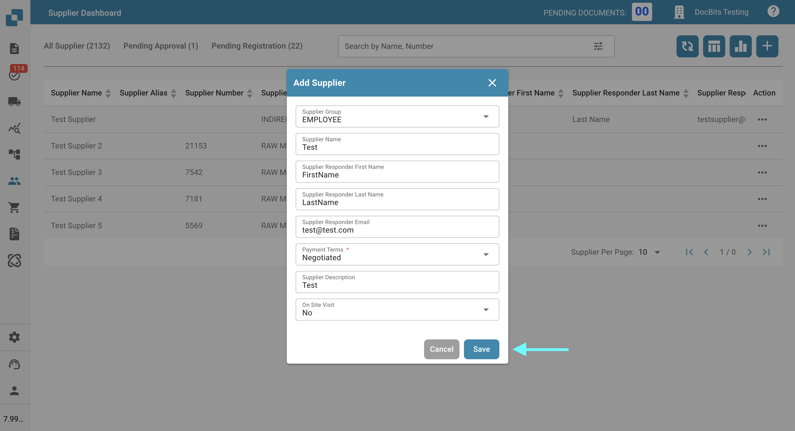<figcaption></figcaption></figure>
3. The supplier will automatically receive an email with a link to create their account.

### **To send a registration email to an existing supplier:**

1. Locate the supplier in the **Supplier Dashboard**.
2. Click the three-dot menu in the **Actions** column.
3.  Select **Magic Link**.

    <figure>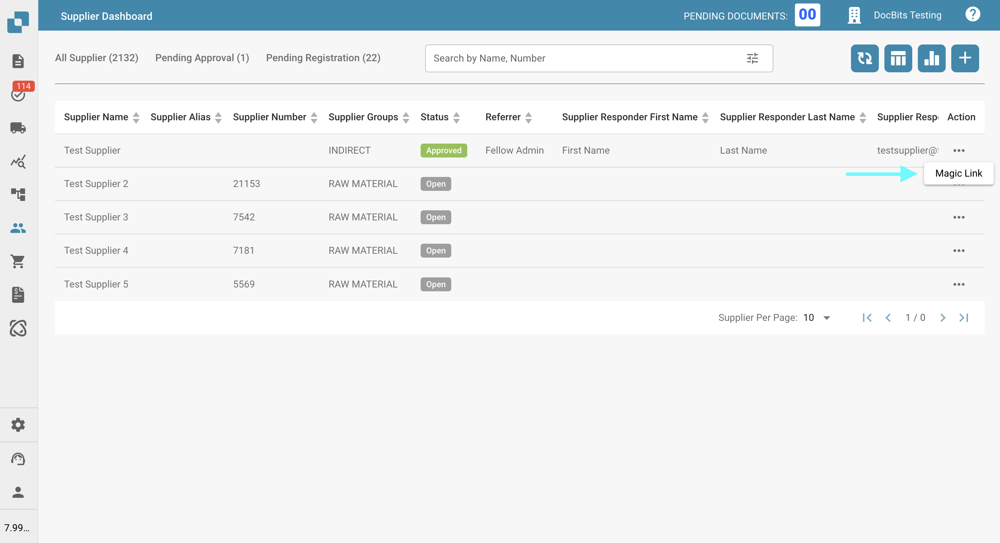<figcaption></figcaption></figure>
4. Verify the supplier’s details.
5.  Click **Send** to email the registration link.

    <figure>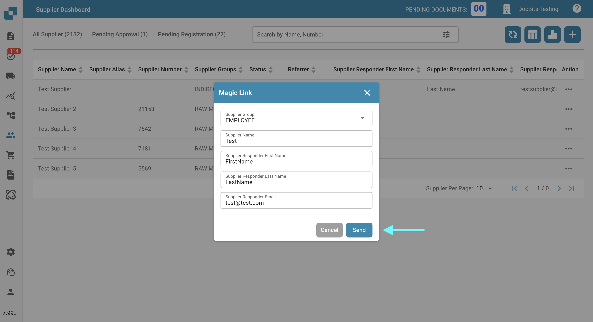<figcaption></figcaption></figure>

## How Does the Registration Process Work for the Supplier?

After an invitation email is sent, the supplier must complete the registration process to access the **Supplier Portal**.

A detailed step-by-step guide on the registration process can be found [here](supplier-registration.md).
