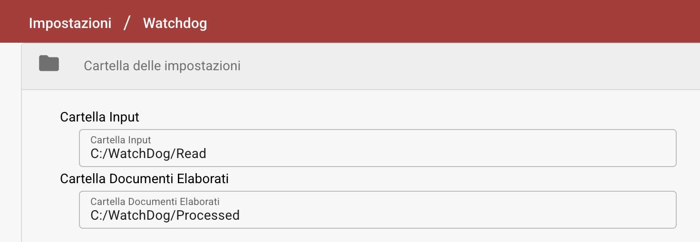
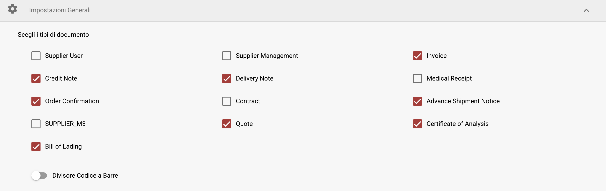
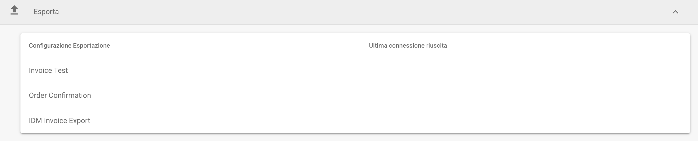
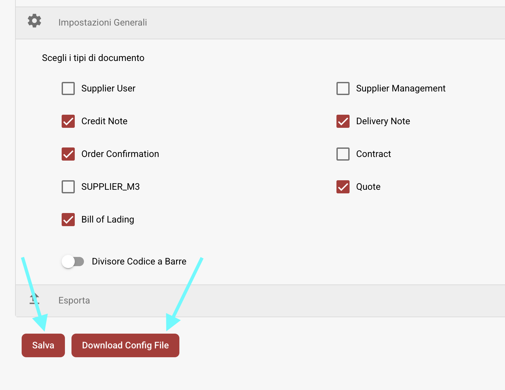

# Installazione di WatchDog

## Configurazione di WatchDog in DocBits

1. **Accedi alle Impostazioni di WatchDog**
   * Naviga su **Impostazioni → Elaborazione Documenti → WatchDog**.
2. **Cartella delle Impostazioni**
   * Definisci i percorsi in cui WatchDog trova ed elabora i documenti.
   *   I percorsi delle cartelle devono corrispondere a quelli creati durante l'installazione:

       * `C:/WatchDog/Read`
       * `C:/WatchDog/Processed`

       <figure><figcaption></figcaption></figure>
3. **Impostazioni Generali**
   *   Seleziona i tipi di documento da elaborare selezionando le caselle corrispondenti.

       <figure><figcaption></figcaption></figure>
4. **Configurazioni di Esportazione**
   * Mostra tutte le esportazioni configurate per **elaborazione on-premise**.
   *   Mostra il timestamp della **ultima connessione riuscita** per ciascuna configurazione.

       <figure><figcaption></figcaption></figure>
5. **Scarica la Configurazione**
   * Salva la configurazione
   *   Scarica la configurazione

       <figure><figcaption></figcaption></figure>

## Guida all'Installazione di WatchDog

1. **Crea le Cartelle Necessarie**
   * Crea una directory principale: `C:/WatchDog`
   * All'interno di `C:/WatchDog`, crea le seguenti sottocartelle:\
     <mark style="color:red;">**Nota**</mark>**: queste devono corrispondere alle cartelle in DocBits**
     * `C:/WatchDog/Read`
     * `C:/WatchDog/Processed`
2. **Scarica WatchDog**
   * Scarica l'ultima versione di `WatchDog.exe` da:\
     [https://github.com/Fellow-Consulting-AG/ActualWatchdog/releases](https://github.com/Fellow-Consulting-AG/ActualWatchdog/releases)
   * Posiziona il file `WatchDog.exe` scaricato in `C:/WatchDog`.
   * Posiziona il file `watchdog-config.json` scaricato in `C:/WatchDog`.
   * Apri il `watchdog-config.json` e modifica il **config\_path.**
   * In questo esempio:
     * `"config_path": "C:/WatchDog/watchdog-config.json"`
3. **Installa WatchDog**
   * Apri **Prompt dei Comandi (CMD)** con **diritti di Amministratore**.
   * Naviga nella cartella di WatchDog
   *   Esegui il seguente comando per installare WatchDog:

       `WatchDog.exe install`
4. **Avvia il Servizio WatchDog**
   *   Esegui il seguente comando in CMD:

       `WatchDog.exe start`
5. **Imposta il Tipo di Avvio**
   * Apri **Servizi** (Premi `Win + R`, digita `services.msc`, e premi **Invio**).
   * Trova **WatchDog** nell'elenco dei servizi.
   * Fai doppio clic per aprire le sue proprietà.
   * Imposta **Tipo di Avvio** su **Automatico (Avvio Ritardato)**.
   * Fai clic su **OK**.
