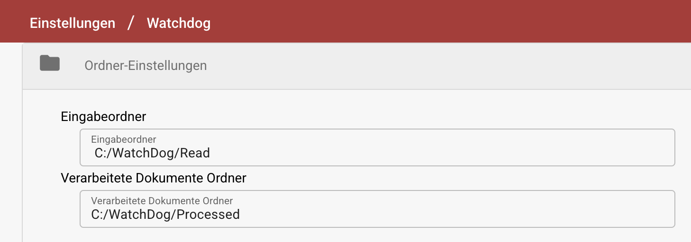
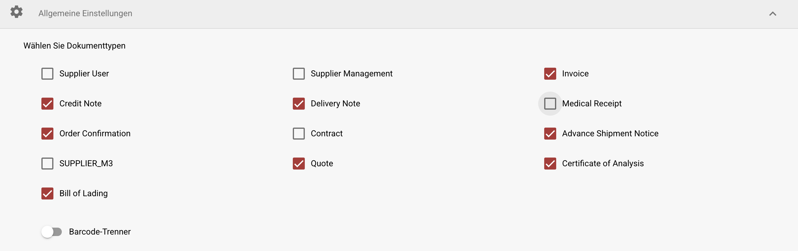
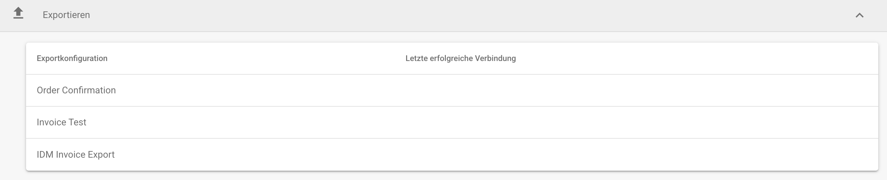
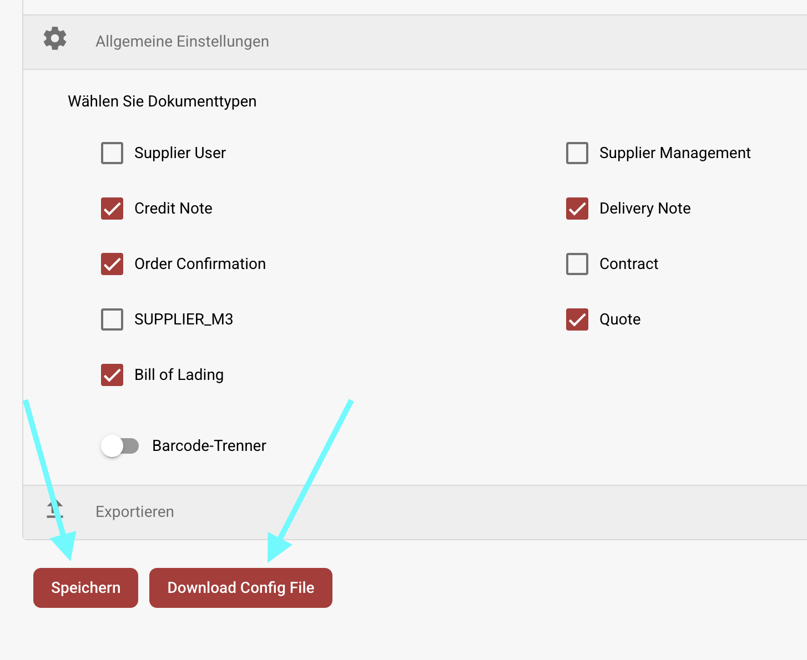

# WatchDog Installation

## Konfigurieren von WatchDog in DocBits

1. **Zugriff auf WatchDog Einstellungen**
   * Navigieren Sie zu **Einstellungen → Dokumentenverarbeitung → WatchDog**.
2. **Ordner-Einstellungen**
   * Definieren Sie die Pfade, wo WatchDog Dokumente findet und verarbeitet.
   *   Die Ordnerpfade sollten mit denen übereinstimmen, die während der Installation erstellt wurden:

       * `C:/WatchDog/Read`
       * `C:/WatchDog/Processed`

       <figure><figcaption></figcaption></figure>
3. **Allgemeine Einstellungen**
   *   Wählen Sie die Dokumenttypen aus, die verarbeitet werden sollen, indem Sie die entsprechenden Kontrollkästchen aktivieren.

       <figure><figcaption></figcaption></figure>
4. **Exportkonfigurationen**
   * Zeigt alle konfigurierten Exporte für **on-premise Verarbeitung** an.
   *   Zeigt den Zeitstempel der **letzten erfolgreichen Verbindung** für jede Konfiguration an.

       <figure><figcaption></figcaption></figure>
5. **Konfiguration herunterladen**
   * Konfiguration speichern
   *   Konfiguration herunterladen

       <figure><figcaption></figcaption></figure>

## WatchDog Installationsanleitung

1. **Erforderliche Ordner erstellen**
   * Erstellen Sie ein Hauptverzeichnis: `C:/WatchDog`
   * Erstellen Sie innerhalb von `C:/WatchDog` die folgenden Unterordner:\
     <mark style="color:red;">**Hinweis**</mark>**: diese sollten mit den Ordnern in DocBits übereinstimmen**
     * `C:/WatchDog/Read`
     * `C:/WatchDog/Processed`
2. **WatchDog herunterladen**
   * Laden Sie die neueste Version von `WatchDog.exe` von:\
     [https://github.com/Fellow-Consulting-AG/ActualWatchdog/releases](https://github.com/Fellow-Consulting-AG/ActualWatchdog/releases)
   * Platzieren Sie die heruntergeladene Datei `WatchDog.exe` in `C:/WatchDog`.
   * Platzieren Sie die heruntergeladene Datei `watchdog-config.json` in `C:/WatchDog`.
   * Öffnen Sie die `watchdog-config.json` und ändern Sie den **config\_path.**
   * In diesem Beispiel:
     * `"config_path": "C:/WatchDog/watchdog-config.json"`
3. **WatchDog installieren**
   * Öffnen Sie die **Eingabeaufforderung (CMD)** mit **Administratorrechten**.
   * Navigieren Sie zum WatchDog-Ordner
   *   Führen Sie den folgenden Befehl aus, um WatchDog zu installieren:

       `WatchDog.exe install`
4. **Starten Sie den WatchDog-Dienst**
   *   Führen Sie den folgenden Befehl in CMD aus:

       `WatchDog.exe start`
5. **Starttyp festlegen**
   * Öffnen Sie **Dienste** (Drücken Sie `Win + R`, geben Sie `services.msc` ein und drücken Sie **Enter**).
   * Suchen Sie **WatchDog** in der Dienstliste.
   * Doppelklicken Sie, um die Eigenschaften zu öffnen.
   * Setzen Sie **Starttyp** auf **Automatisch (Verzögerter Start)**.
   * Klicken Sie auf **OK**.
