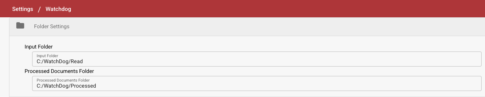
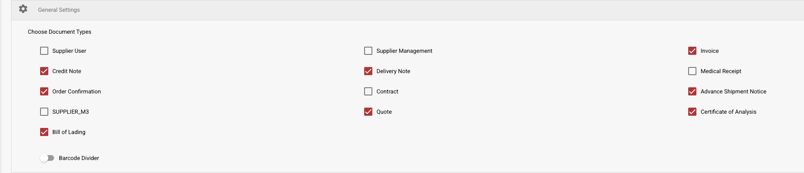
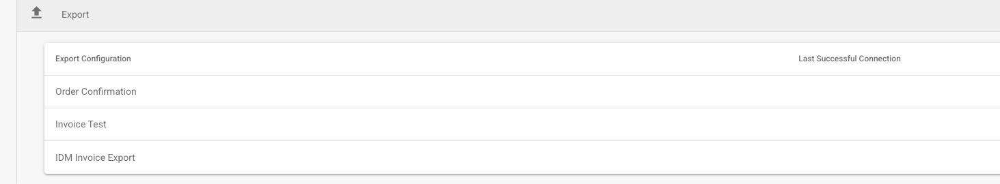
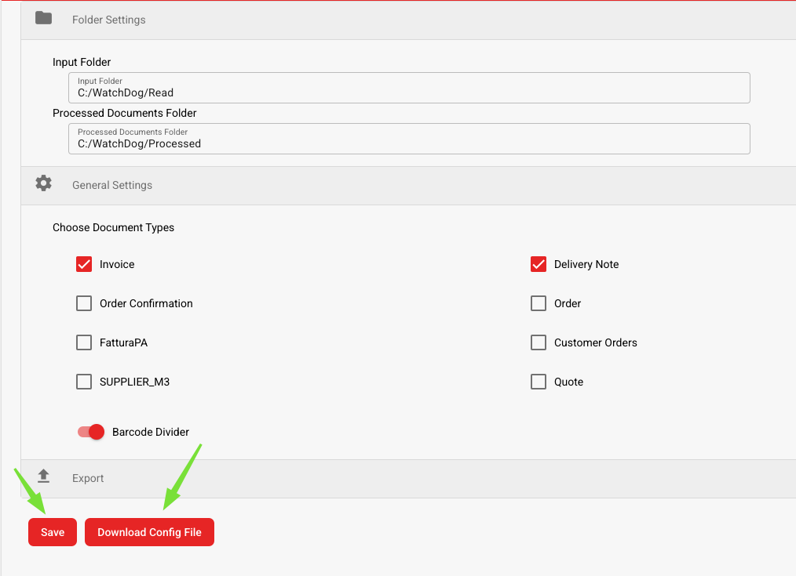

# Instalacja WatchDog

## Konfigurowanie WatchDog w DocBits

1. **Dostęp do ustawień WatchDog**
   * Przejdź do **Ustawienia → Przetwarzanie dokumentów → WatchDog**.
2. **Ustawienia folderów**
   * Zdefiniuj ścieżki, w których WatchDog znajduje i przetwarza dokumenty.
   *   Ścieżki folderów powinny odpowiadać tym utworzonym podczas instalacji:

       * `C:/WatchDog/Read`
       * `C:/WatchDog/Processed`

       <figure><figcaption></figcaption></figure>
3. **Ustawienia ogólne**
   *   Wybierz typy dokumentów do przetworzenia, zaznaczając odpowiednie pola wyboru.

       <figure><figcaption></figcaption></figure>
4. **Konfiguracje eksportu**
   * Wyświetla wszystkie skonfigurowane eksporty dla **przetwarzania lokalnego**.
   *   Pokazuje znacznik czasu **ostatniego udanego połączenia** dla każdej konfiguracji.

       <figure><figcaption></figcaption></figure>
5. **Pobierz konfigurację**
   * Zapisz konfigurację
   *   Pobierz konfigurację

       <figure><figcaption></figcaption></figure>

## Przewodnik instalacji WatchDog

1. **Utwórz wymagane foldery**
   * Utwórz główny katalog: `C:/WatchDog`
   * Wewnątrz `C:/WatchDog` utwórz następujące podfoldery:\
     <mark style="color:red;">**Uwaga**</mark>**: powinny odpowiadać folderom w DocBits**
     * `C:/WatchDog/Read`
     * `C:/WatchDog/Processed`
2. **Pobierz WatchDog**
   * Pobierz najnowszą wersję `WatchDog.exe` z:\
     [https://github.com/Fellow-Consulting-AG/ActualWatchdog/releases](https://github.com/Fellow-Consulting-AG/ActualWatchdog/releases)
   * Umieść pobrany plik `WatchDog.exe` w `C:/WatchDog`.
   * Umieść pobrany plik `watchdog-config.json` w `C:/WatchDog`.
   * otwórz `watchdog-config.json` i zmień **config\_path.**
   * W tym przykładzie:
     * `"config_path": "C:/WatchDog/watchdog-config.json"`
3. **Zainstaluj WatchDog**
   * Otwórz **Wiersz polecenia (CMD)** z **uprawnieniami administratora**.
   * Przejdź do folderu WatchDog
   *   Uruchom następujące polecenie, aby zainstalować WatchDog:

       `WatchDog.exe install`
4. **Uruchom usługę WatchDog**
   *   Uruchom następujące polecenie w CMD:

       `WatchDog.exe start`
5. **Ustaw typ uruchamiania**
   * Otwórz **Usługi** (Naciśnij `Win + R`, wpisz `services.msc` i naciśnij **Enter**).
   * Zlokalizuj **WatchDog** na liście usług.
   * Kliknij dwukrotnie, aby otworzyć jego właściwości.
   * Ustaw **Typ uruchamiania** na **Automatyczny (opóźnione uruchomienie)**.
   * Kliknij **OK**.
