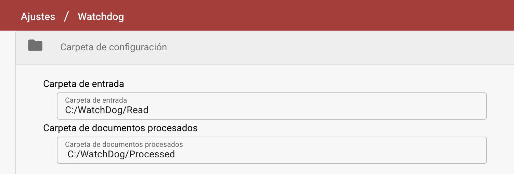
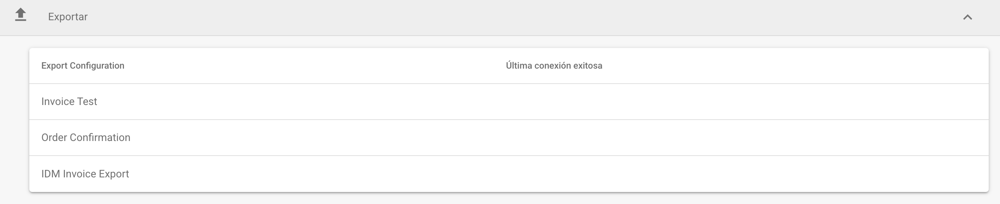
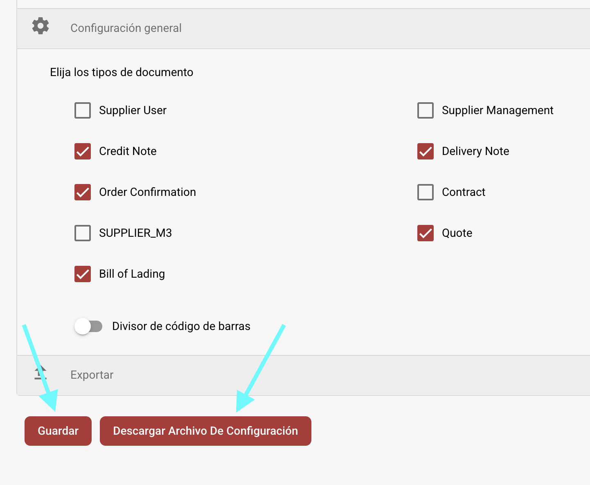

# Instalación de WatchDog

## Configuración de WatchDog en DocBits

1. **Acceder a los Ajustes de WatchDog**
   * Navegar a **Ajustes → Procesamiento de Documentos → WatchDog**.
2. **Carpeta de Configuración**
   * Definir las rutas donde WatchDog encuentra y procesa documentos.
   *   Las rutas de las carpetas deben coincidir con las creadas durante la instalación:

       * `C:/WatchDog/Read`
       * `C:/WatchDog/Processed`

       <figure><figcaption></figcaption></figure>
3. **Configuración General**
   *   Seleccionar los tipos de documentos a procesar marcando las casillas correspondientes.

       <figure><figcaption></figcaption></figure>
4. **Configuraciones de Exportación**
   * Muestra todas las exportaciones configuradas para **procesamiento en las instalaciones**.
   *   Muestra la marca de tiempo de la **última conexión exitosa** para cada configuración.

       <figure><figcaption></figcaption></figure>
5. **Descargar la Configuración**
   * Guardar la configuración
   *   Descargar la configuración

       <figure><figcaption></figcaption></figure>

## Guía de Instalación de WatchDog

1. **Crear Carpetas Requeridas**
   * Crear un directorio principal: `C:/WatchDog`
   * Dentro de `C:/WatchDog`, crear las siguientes subcarpetas:\
     <mark style="color:red;">**Nota**</mark>**: estas deben coincidir con las carpetas en DocBits**
     * `C:/WatchDog/Read`
     * `C:/WatchDog/Processed`
2. **Descargar WatchDog**
   * Descargar la última versión de `WatchDog.exe` desde:\
     [https://github.com/Fellow-Consulting-AG/ActualWatchdog/releases](https://github.com/Fellow-Consulting-AG/ActualWatchdog/releases)
   * Colocar el archivo descargado `WatchDog.exe` en `C:/WatchDog`.
   * Colocar el archivo descargado `watchdog-config.json` en `C:/WatchDog`.
   * abrir el `watchdog-config.json.` y cambiar el **config\_path.**
   * En este ejemplo:
     * `"config_path": "C:/WatchDog/watchdog-config.json"`
3. **Instalar WatchDog**
   * Abrir **Símbolo del sistema (CMD)** con **derechos de Administrador**.
   * Navegar a la carpeta de WatchDog
   *   Ejecutar el siguiente comando para instalar WatchDog:

       `WatchDog.exe install`
4. **Iniciar el Servicio de WatchDog**
   *   Ejecutar el siguiente comando en CMD:

       `WatchDog.exe start`
5. **Establecer Tipo de Inicio**
   * Abrir **Servicios** (Presionar `Win + R`, escribir `services.msc`, y presionar **Enter**).
   * Localizar **WatchDog** en la lista de servicios.
   * Hacer doble clic para abrir sus propiedades.
   * Establecer **Tipo de Inicio** en **Automático (Inicio Retrasado)**.
   * Hacer clic en **OK**.
