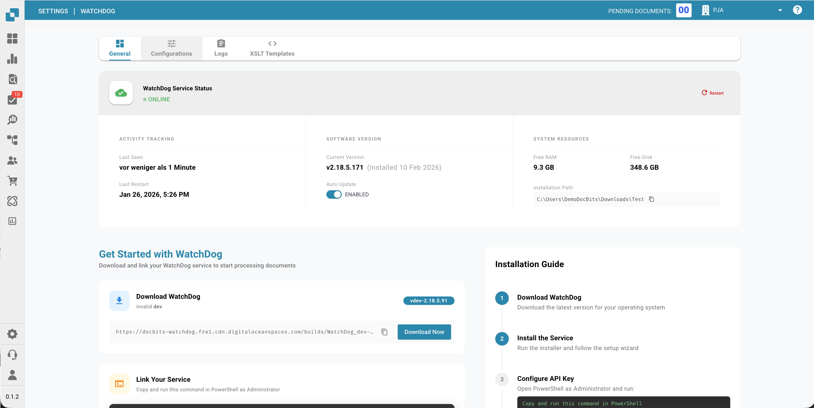
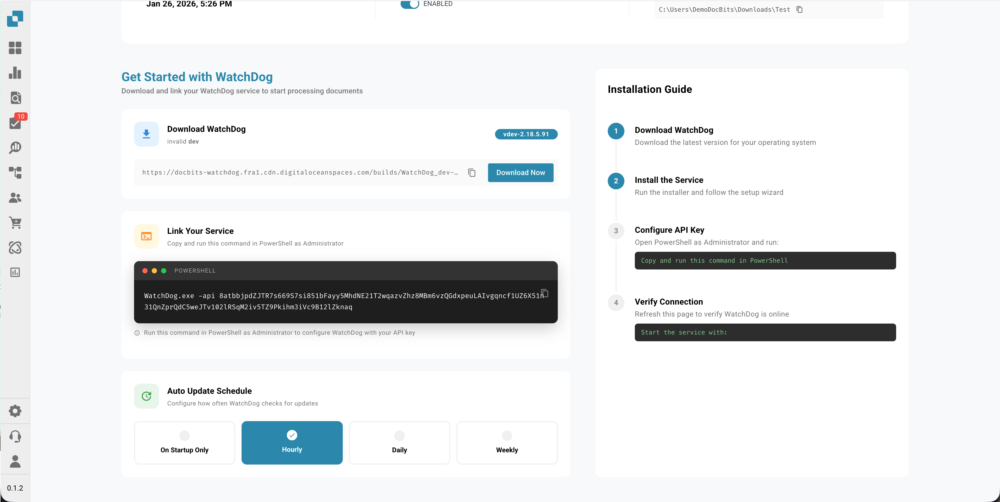
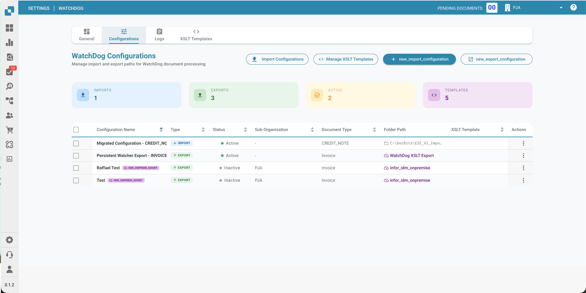
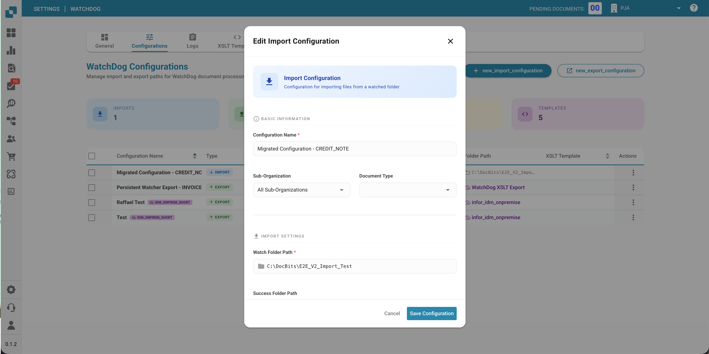
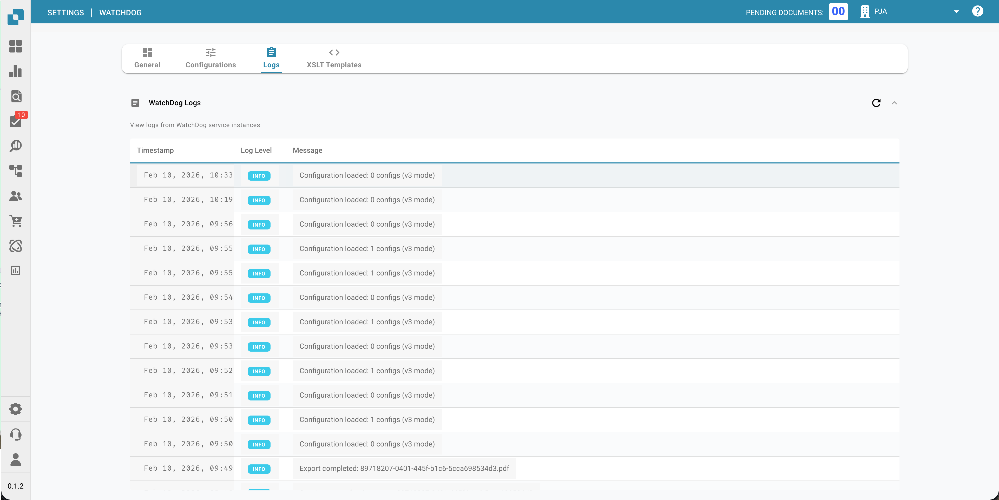
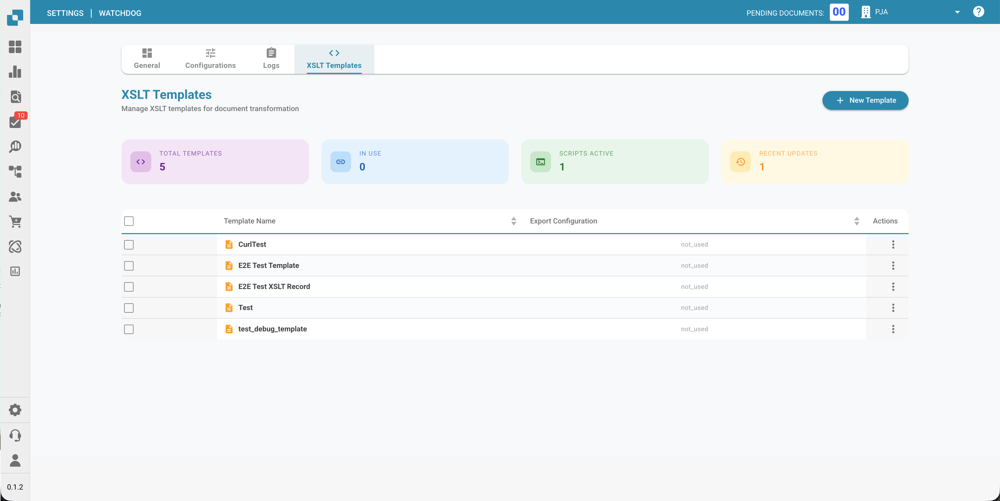
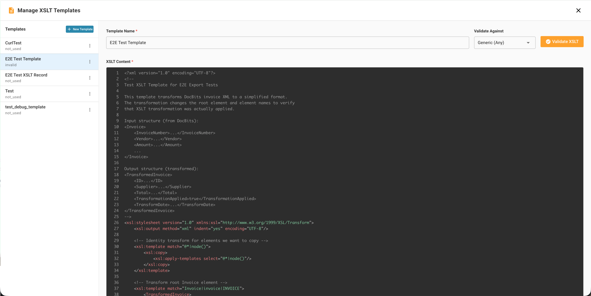

# WatchDog Configuration

This guide explains how to configure WatchDog within the DocBits application.

## 1. Overview

Access the WatchDog settings from the DocBits settings menu.

<figure><figcaption></figcaption></figure>

## 2. Folder Settings

Configure the file pathways for importing and exporting documents. These paths must be reachable from the Windows environment where the WatchDog service is installed.

*   **Watch Folder:** The directory where WatchDog monitors for new documents to import.
*   **Success Folder:** The directory where documents are moved after a successful import.
*   **Export Folder:** The directory where processed export files (XML/PDF) are written.

<figure><figcaption></figcaption></figure>

## 3. General Settings

Configure general settings such as document types and other processing options.

<figure><figcaption></figcaption></figure>

## 4. Export Settings

Set up the export destinations and methods.

<figure><figcaption></figcaption></figure>

## 5. Export Configuration Details

View and manage specific export configurations.

<figure><figcaption></figcaption></figure>

## 6. BOD Mapping Configuration

Configure the BOD mapping for integration with Infor.

<figure><figcaption></figcaption></figure>

## 7. Download Configuration

Once configured, download the configuration file to be used with the WatchDog executable.

<figure><figcaption></figcaption></figure>
