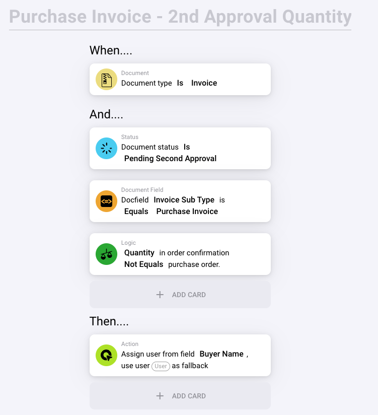

# Purchase Invoice - 2nd Approval Quantity

<figure><figcaption></figcaption></figure>

This title indicates that the rule pertains specifically to handling purchase invoices during a secondary approval phase, with a focus on verifying the accuracy of the quantities listed.

#### Rule Configuration:

1. **When…**
   * **Document Type is Invoice**: This condition ensures that the rule is activated only for documents classified as invoices. This is essential for maintaining specificity and relevance in the workflow.
2. **And…**
   * **Document Status is Pending Second Approval**: This specifies that the invoice is currently pending a second approval. This stage is typically intended to provide additional oversight before finalizing the invoice.
   * **Document Field Invoice Sub Type is Equals Purchase Invoice**: This condition further refines the rule to apply exclusively to invoices identified as "Purchase Invoices." This categorization helps differentiate them from other invoice types.
   * **Logic Quantity in order confirmation Not Equals purchase order**: This critical condition checks whether the quantity stated in the order confirmation matches the quantity on the original purchase order. The action is triggered if there is a discrepancy, indicating a potential error or issue that needs resolution.

#### Action (Then…):

* **Assign user from field Buyer Name, use user User as fallback**: If the rule's conditions are met (i.e., there's a discrepancy in quantities), the invoice is automatically assigned to the person listed in the 'Buyer Name' field for further review. If this field is empty or the specified person is unavailable, a default user (likely an administrator or another designated staff member) takes over to ensure timely review and resolution.

#### Purpose of This Rule:

* **Accuracy and Compliance**: The rule is vital for ensuring that the invoicing process is accurate and aligns with the terms agreed upon in the purchase order. It helps prevent financial discrepancies and potential inventory errors.
* **Streamlined Approvals**: Automating the review process for specific discrepancies helps streamline approvals and ensures that any issues are quickly addressed by the appropriate personnel.
* **Enhanced Financial Oversight**: Requiring a secondary approval for quantity verifications strengthens financial controls and accountability within the organization.

This setup exemplifies how workflow automation can be utilized to enhance operational efficiency and ensure financial integrity, particularly in managing complex purchase processes within a company.
