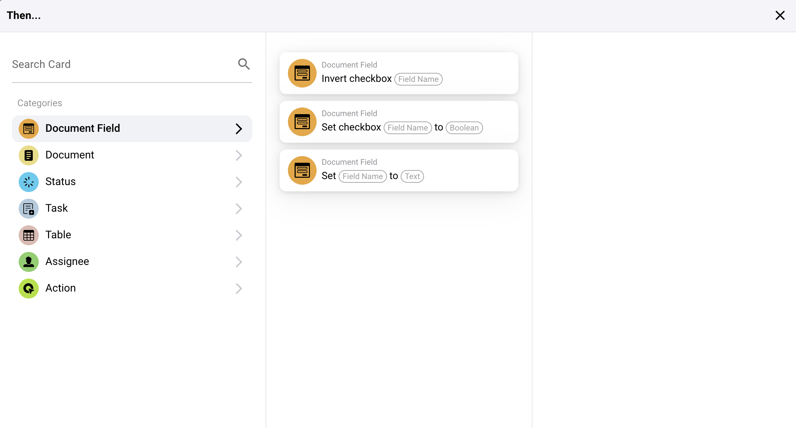
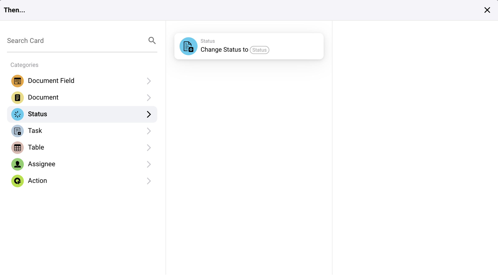
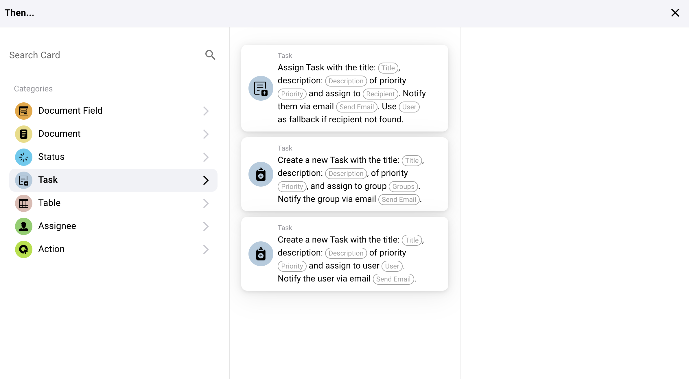
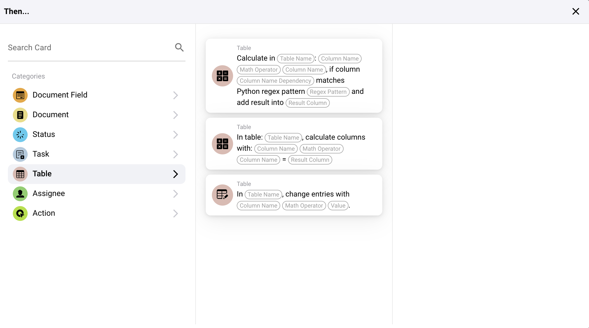
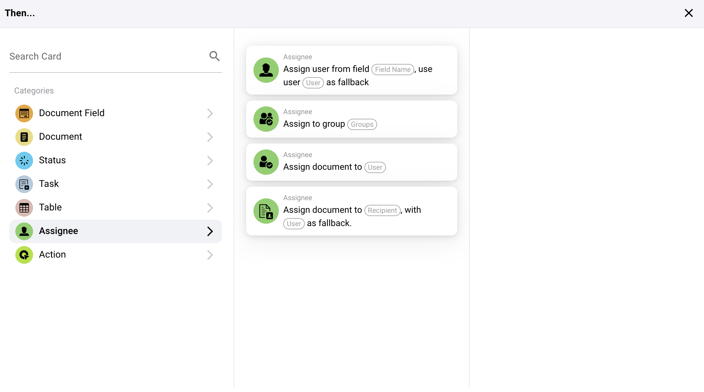
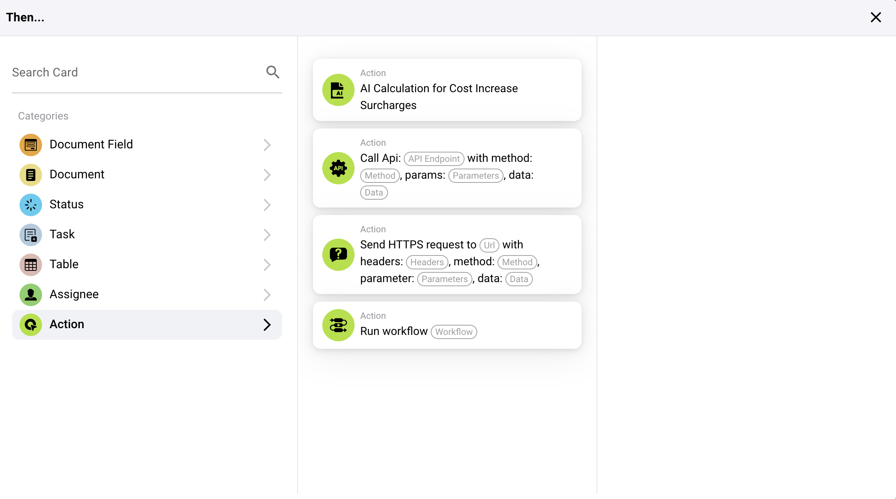

# (Español)

# Then

## Overview of "Then..." Action Cards

### **1. Document Field Actions:**

* **Invert Checkbox:** This action toggles the state of a checkbox field in a document.
* **Set Checkbox:** This sets the state of a checkbox field to either true (checked) or false (unchecked).
* **Set Field to Text:** This action sets a specified document field to a given text value.

<figure><figcaption></figcaption></figure>

### **2. Document Actions:**

* **Approve the Document:** Marks a document as approved within the system.
* **Reject the Document:** Marks a document as rejected.

<figure><figcaption></figcaption></figure>

### **3. Export Actions:**

* **Export document with export configuration:**   Starts the export process  with a specific export configuration.
* **Start Export:** Starts the Export process.

<figure><figcaption></figcaption></figure>

### **4. Status Actions:**

* **Change Status:** Changes the status of a document or task to a specified new status.

<figure><figcaption></figcaption></figure>

### **5. Task Actions:**

* Assignments and notifications:
  * **Assign Task:** Creates and assigns a task with specific details to an individual or group, including options to notify them via email.
  * **Create a New Task:** Similar to assign but focused on setting up a completely new task within the system.

<figure><figcaption></figcaption></figure>

### **6. Table Actions:**

* **Calculate in Table:** Performs calculations on table data based on specified conditions and stores the results in a designated column.
* **Change Entries:** Updates entries in a table based on specified conditions.

<figure><figcaption></figcaption></figure>

### **7. Assignee Actions:**

* **Assign User from Field:** Assigns a user to a task or document based on user data stored in a specific field, with an option for a fallback user if the primary is unavailable.
* **Assign Document to User or Group:** Directly assigns a document to a user or group, ensuring responsibility is designated appropriately.

<figure><figcaption></figcaption></figure>

### **8. External Interaction Actions:**

* **Call API:** Sends a request to an external API, which can be customized with specific methods, parameters, and data.
* **Send HTTPS Request:** Similar to API calls but specifically formatted for HTTPS protocols.

<figure><figcaption></figcaption></figure>

### **9. Advanced Processing:**

* **Run Workflow:** Triggers another workflow within the system, allowing for complex process chaining.

#### Practical Application

These action cards are used to automate responses based on specific triggers identified in the earlier parts of the workflow setup. For instance:

* If a document is identified as needing review, the "Approve the Document" action can be automatically triggered once it passes all specified conditions.
* For data management tasks, "Set Checkbox" or "Set Field to Text" actions ensure that document fields are updated automatically, reducing manual data entry and the potential for errors.
* Complex tasks like API interactions or status changes streamline interactions not only within the ERP system but also with external services and tools, enhancing integration and functionality.

### Conclusion

The "Then..." section in your workflow system provides robust tools for defining precise actions that should occur as a result of conditions being met in the workflow. By effectively using these actions, businesses can automate routine processes, ensure data accuracy, and respond dynamically to changing information and system states. Understanding how to configure and utilize these actions is key to maximizing the efficiency and effectiveness of your ERP system's workflow capabilities.
