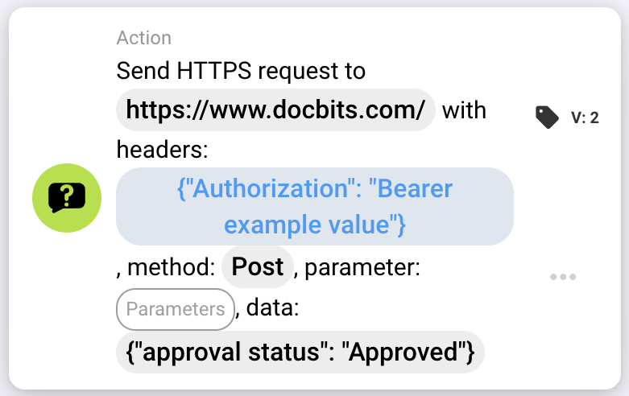

# Send HTTPS request to

<figure><figcaption></figcaption></figure>

## Purpose:

The **"Send HTTPS Request"** workflow card enables users to send HTTPS requests to a specified URL with customizable headers, parameters, and data payload. This card is ideal for integrating external APIs or web services directly into the workflow.

## Components of the Card:

1. **URL**
   * **Description:** Specifies the endpoint where the HTTPS request will be sent.
   * **Detail:** Enter the full URL of the API or web service to connect with.
2. **Headers**
   * **Description:** Defines the headers to be included in the HTTPS request.
   * **Detail:** Provide **key-value pairs** in a **valid JSON format** to specify headers such as authentication tokens or content types. Example: {"Authorization": "Bearer example\_value"}
3. **Method**
   * **Description:** Specifies the HTTP method to be used for the request.
   * **Options:**
     * **GET:** Retrieves data from the endpoint.
     * **POST:** Sends data to the endpoint to create or update resources.
     * **PUT:** Updates existing resources at the endpoint.
     * **DELETE:** Removes resources from the endpoint.
4. **Parameters**
   * **Description:** Key-value pairs to be included in the URL as query parameters.
   * **Detail:** Use this to send filters or additional data required by the endpoint a valid JSON formant. See example for Headers.
5. **Data**
   * **Description:** The body of the HTTPS request.
   * **Detail:** Provide the payload in a valid JSON formant. See example for Headers.

## Functionality:

* **Condition Evaluation:** The card only sends the HTTPS request if the **"Where"** and **"And Sections"** evaluate as true.&#x20;
  * If either condition is false, the request is not sent.
* **Request Execution:**
  * When the conditions are met, the system sends the HTTPS request with the specified configurations.

## Setup and Configuration:

1. **Define URL:** Enter the endpoint where the HTTPS request should be sent.
2. **Set Headers:** Provide the required headers as key-value pairs.
3. **Select HTTP Method:** Choose the appropriate method (**GET**, **POST**, **PUT**, or **DELETE**) based on the action to perform.
4. **Add Parameters:** Specify any query parameters required by the endpoint.
5. **Provide Data Payload:** Enter the request body in the required format (e.g., JSON) if needed.
6. **Configure Conditions:** Define the **"Where"** and **"And Sections"** to ensure the request is sent only when specific conditions are met.

## Example Card:

<figure><figcaption></figcaption></figure>

## Conclusion:

The **"Send HTTPS Request"** workflow card simplifies API integration by allowing users to make customized requests to external services directly from their workflows. By automating the process of sending HTTPS requests and managing responses, this card enhances workflow flexibility and functionality.
