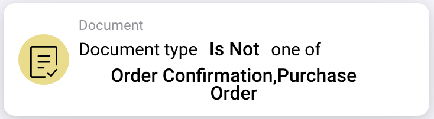

# Card description

## **When Cards: Document type**

<figure><figcaption></figcaption></figure>

<figure><figcaption></figcaption></figure>

A workflow can be started with these two cards. Here you can decide with which document type the workflow begins or whether it should not affect selected document types.

\

<figure><figcaption></figcaption></figure>

<figure><figcaption></figcaption></figure>

This card can also be used to specify multiple document types that the workflow should affect.

