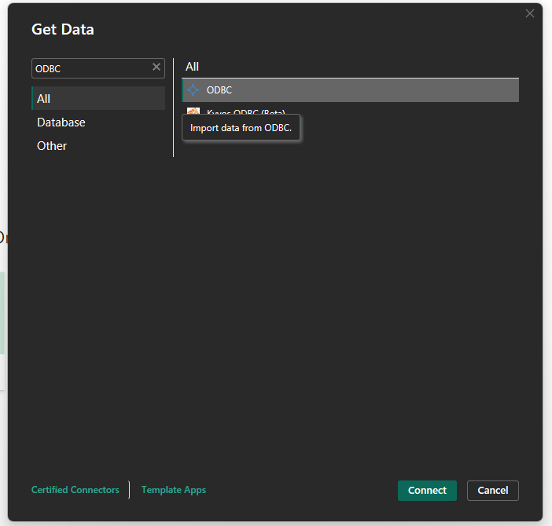
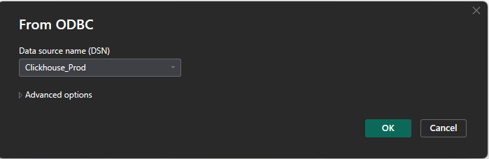
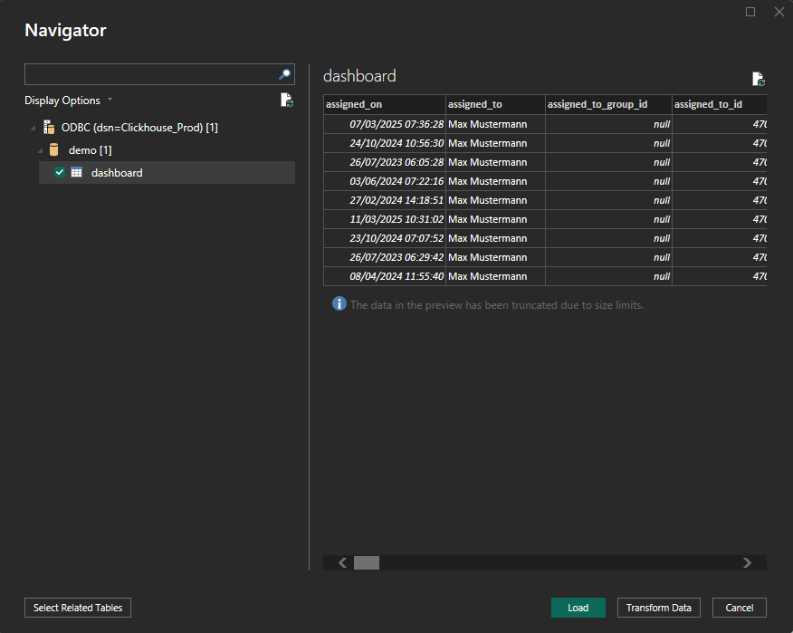

# Conectar via ClickHouse

Este guia mostra como conectar o **ClickHouse** ao **Power BI Desktop** usando o **driver ODBC**. Ele abrange a instalação do driver, configuração do ODBC, integração com o Power BI e configuração da atualização de dados.




### 1. Instalar o Driver ODBC do ClickHouse

* Baixe o **Driver ODBC do ClickHouse** mais recente em:
  * [ClickHouse GitHub - clickhouse-odbc](https://github.com/ClickHouse/clickhouse-odbc)
* Execute o instalador e siga o assistente de configuração.

### 2. Configurar a Fonte de Dados ODBC

* Abra o **Administrador de Fontes de Dados ODBC (64 bits)** via Painel de Controle ou Pesquisa do Windows.
* Vá para a aba **DSN do Sistema** e clique em **Adicionar**.
* Selecione o **Driver ODBC do ClickHouse** na lista e clique em **Concluir**.
*   Preencha os campos obrigatórios. Você pode encontrar as informações necessárias em:

    **DocBits** → **Configurações** → **Processamento de Documentos** → **Módulo** → **Painel de IA** → **Acesso Direto ao ClickHouse**

    

    **Campos Obrigatórios:**

    * **Nome**: Um nome para a conexão (por exemplo, `ClickHouse_Prod`)
    * **Descrição**: Uma breve descrição para sua referência (opcional)
    * **Host**: Copie o valor do host do DocBits
    * **Porta**: Copie o valor da porta do DocBits
    * **Banco de Dados**: Copie o nome do banco de dados do DocBits
    * **Nome de Usuário**: Copie o nome de usuário do DocBits
    * **Senha**: Copie a senha do DocBits

### 3. Conectar o ClickHouse ao Power BI

* Abra o **Power BI Desktop**.
*   Selecione **Obter Dados** → **ODBC** → **Conectar**\

    <figure><figcaption></figcaption></figure>
*   Na lista de DSN, selecione sua fonte configurada (por exemplo, `ClickHouse_Prod`).\

    <figure><figcaption></figcaption></figure>
* Clique em **OK**. Insira as credenciais novamente se solicitado.

### 4. Carregar e Transformar Dados

* No painel **Navegador**, navegue e selecione as tabelas ou visualizações para importar.
* Escolha:
  * **Carregar**: para importar diretamente
  *   **Transformar Dados**: para abrir o Power Query para modelagem de dados\

      <figure><figcaption></figcaption></figure>

### 5. Visualizar Seus Dados

* Use o canvas do relatório para construir visualizações.
* Arraste campos, adicione filtros, escolha tipos de gráficos e use expressões **DAX** conforme necessário.
* Aproveite o **Editor do Power Query** para limpar ou pivotar seus dados do ClickHouse antes de criar visuais.
* Documentação do PowerBI: [https://learn.microsoft.com/en-us/power-bi/](https://learn.microsoft.com/en-us/power-bi/)

### 6. Ativar Atualização Agendada (Opcional)

**Observação:** **Requer Power BI Pro ou Premium + Gateway**

* Para manter seus relatórios sincronizados com o ClickHouse:
* Publique seu arquivo `.pbix` no **Serviço do Power BI**.
* Instale o **Gateway do Power BI** (modo Padrão) em uma máquina com acesso à rede ao ClickHouse.
* No Serviço do Power BI:
  * Acesse seu conjunto de dados → **Configurações** → **Atualização Agendada**
  * Mapeie seu DSN e forneça credenciais
* Mais informações [aqui](https://learn.microsoft.com/en-us/power-bi/connect-data/service-gateway-deployment-guidance).

### 7. Exemplo de Painéis e Visualizações de Dados

