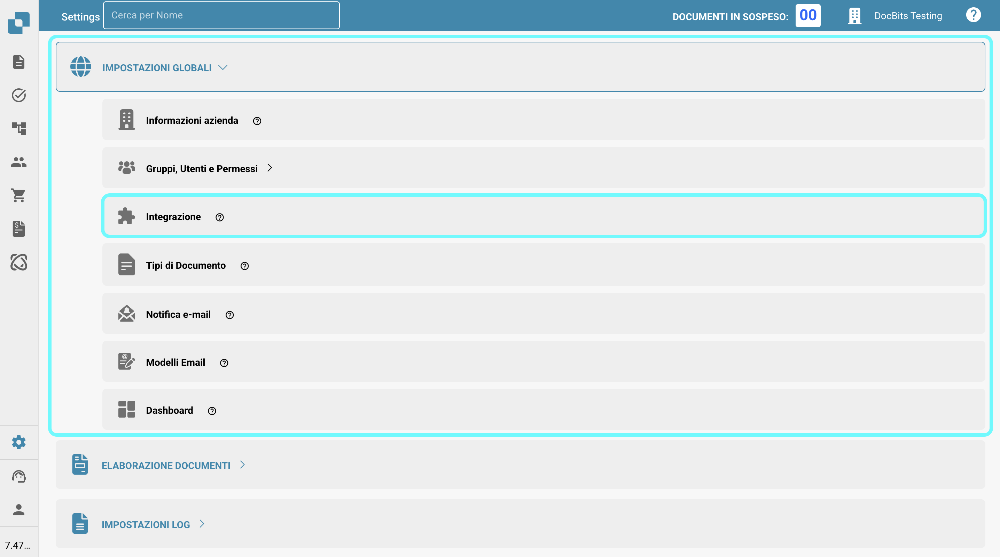

# Importazione dei Dati di Fornitori e Ordini di Acquisto in DocBits da File CSV

## Panoramica

Questa pagina descrive come importare i dati di Fornitori e Ordini di Acquisto in DocBits utilizzando un file Comma Separated Values (.csv).

**Importante:** Prima di importare qualsiasi dato, è fondamentale **esaminare attentamente il file .csv** per garantire l'accuratezza dei dati e la corretta configurazione. L'importazione di dati errati può portare a incoerenze. Fare riferimento alle sezioni [**Specifiche CSV per Ordini di Acquisto**](importing-supplier-and-purchase-order-data-into-docbits-from-csv-files.md#specifiche-csv-per-ordini-di-acquisto) o [**Specifiche CSV per Fornitori**](importing-supplier-and-purchase-order-data-into-docbits-from-csv-files.md#specifiche-csv-per-fornitori) per dettagli sui campi richiesti e facoltativi. Se i campi richiesti sono mancanti, il processo di importazione fallirà.

**Validazione:** Verificare sempre che il file .csv contenga tutte le colonne necessarie come delineato nella rispettiva sezione delle specifiche prima di tentare l'importazione.

## Requisiti Generali:

**Formato Data:**

Tutte le date fornite nel foglio .csv **devono** aderire al seguente formato:

YYYY-MM-DD HH:MM:SS

**Campi Richiesti:**

Per le importazioni di Fornitori e Ordini di Acquisto, tutte le colonne contrassegnate come "Richieste" nelle rispettive specifiche **devono esistere nel file .csv e devono contenere un valore in ogni riga**. Se un campo richiesto è mancante o vuoto per una riga, il processo di importazione fallirà.

### Specifiche CSV per Ordini di Acquisto

**Campi che sono Richiesti** - (la colonna con il nome deve esistere e deve contenere dati)

* `purchase_order_number`

**Campi che possono essere inclusi**

* `warehouse_id`
* `location_id`
* `supplier_id`
* `supplier_name`
* `order_date`
* `requested_shipment_date`
* `promised_delivery_date`
* `payment_terms_code`
* `total_amount`
* `buyer_contact_id`
* `buyer_contact_name`
* `order_last_modified_by`
* `order_last_modified_on`
* `ship_to_party_id`
* `ship_to_party_name`
* `ship_to_address_id`
* `disponent_id`
* `disponent_name`
* `extended_amount`
* `extended_base_amount`
* `extended_report_amount`
* `canceled_amount`
* `canceled_base_amount`
* `canceled_reporting_amount`
* `geo_code`
* `preview_path`
* `type_code`
* `type_description`
* `custom_field_1`
* `custom_field_2`
* `custom_field_3`
* `custom_field_4`
* `custom_field_5`
* `status`
* `line_number`
* `sub_line_number`
* `item_id`
* `supplier_item_id`
* `description`
* `note`
* `quantity`
* `open_quantity`
* `confirmed_quantity`
* `received_quantity`
* `received_base_mou_quantity`
* `promised_delivery_date`
* `requested_ship_date`
* `unit_code`
* `unit_code_price`
* `unit_price`
* `unit_price_per`
* `extended_amount`
* `total_amount`
* `currency`
* `status`
* `buyer_id`
* `buyer_name`
* `geo_code`
* `delivery_method`

### Specifiche CSV per Fornitori

**Campi che sono Richiesti** - (la colonna con il nome deve esistere e deve contenere dati)

* `customer_number`
* `supplier_number`
* `supplier_name`
* `country_code`

**Campi che possono essere inclusi**

* `address_1`
* `address_2`
* `address_3`
* `address_4`
* `town_city`
* `zip_code`
* `supplier_phone`
* `supplier_vat`
* `payment_term_id`
* `payment_method_code`
* `buyer_person_reference_id`
* `buyer_person_reference`
* `supplier_category`
* `supplier_group`
* `discount_term`
* `discount_term_description`
* `bank_id`
* `custom_field_1`
* `custom_field_2`
* `custom_field_3`
* `custom_field_4`
* `custom_field_5`
* `custom_field_6`
* `custom_field_7`
* `custom_field_8`
* `custom_field_9`
* `custom_field_10`
* `status`
* `account_number`
* `financial_partner_id`
* `financial_partner_name`
* `iban`
* `currency`

## Endpoint di Accesso

Per importare i dati, seguire questi passaggi:

1. Visita: [https://api.docbits.com/](https://api.docbits.com/)
2.  Clicca sul pulsante **"Authorize"**.

    <figure><figcaption></figcaption></figure>
3.  Inserisci l'API-Key e clicca su **"Authorize"**

    * L'API-Key può essere trovata in DocBits in Impostazioni -> Impostazioni Globali -> Integrazione
    * **Nota:** La chiave API fornita nella tua richiesta determina l'organizzazione target e il contesto utente sotto il quale i dati saranno importati.

    <figure><figcaption></figcaption></figure>

    <figure><figcaption></figcaption></figure>
4. Premi **CTRL + F** (o **CMD + F** su Mac) per aprire la funzione di ricerca e cerca `/master_data_lookup/import_data`.
5.  Clicca sulla richiesta per visualizzarne i dettagli, quindi clicca su "**Try it out"** per procedere.

    <figure><figcaption></figcaption></figure>

    <figure><figcaption></figcaption></figure>
6.  Ora puoi inserire i parametri richiesti nel Corpo della Richiesta.\\

    **Parametri della Richiesta:**

    Quando si effettua la richiesta di importazione, è necessario specificare i seguenti parametri:

    * **sub\_org\_id:** Rimuovi qualsiasi testo dal campo di testo per garantire che l'opzione "Send empty value" sia abilitata.
    * **data\_type:** Questo parametro specifica il tipo di dati che vengono importati. Può essere `supplier` o `purchase_order` a seconda del contenuto del tuo file .csv.
    * **replace\_all:** Questo parametro booleano determina se tutti i dati esistenti nella rispettiva tabella del database (`supplier` o `purchase_order`) per l'organizzazione specificata devono essere eliminati prima di inserire i nuovi dati dal file .csv. Imposta questo su `true` per sostituire tutti i dati esistenti o `false` per aggiungere o aggiornare con i nuovi dati.
    *   **delimiter:** Questo parametro specifica il carattere utilizzato per separare i singoli valori all'interno di ogni riga del tuo file di dati. **È essenziale identificare il delimitatore corretto utilizzato nel tuo file.** I delimitatori comuni sono la virgola (`,`) e il punto e virgola (`;`).

        **Come controllare il delimitatore:**

        1. Apri il tuo file di dati (ad esempio, il file `.csv`) con un editor di testo semplice (come Notepad su Windows, TextEdit su Mac o simili).
        2. Esamina le prime righe di dati. Cerca il carattere che appare costantemente tra i diversi pezzi di informazione in ogni riga. Questo carattere è il tuo delimitatore.
        3. Imposta il parametro `delimiter` nella tua richiesta di importazione su questo carattere identificato (sia `,` che `;`). Utilizzare il delimitatore sbagliato impedirà ai dati di essere analizzati correttamente e porterà a un'importazione fallita.
    * **on\_conflict & auto\_generate\_id:** La funzionalità per gestire i conflitti di dati (`on_conflict`) e generare automaticamente gli ID (`auto_generate_id`) non è attualmente **implementata** per questi tipi di dati.

    <figure><figcaption></figcaption></figure>
7.  Se hai verificato che tutte le informazioni sono corrette, puoi avviare il processo di importazione cliccando sul pulsante **"Execute"**.

    <figure><figcaption></figcaption></figure>
