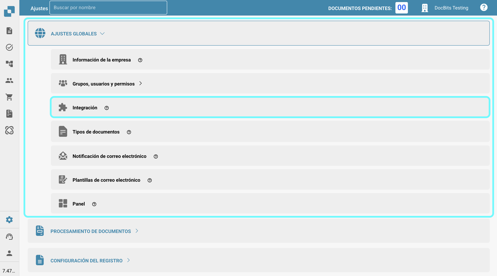

# Importando Datos de Proveedores y Órdenes de Compra en DocBits desde Archivos CSV

## Resumen

Esta página describe cómo importar datos de Proveedores y Órdenes de Compra en DocBits utilizando un archivo de Valores Separados por Comas (.csv).

**Importante:** Antes de importar cualquier dato, es crucial **revisar el archivo .csv a fondo** para asegurar la precisión de los datos y la configuración adecuada. Importar datos incorrectos puede llevar a inconsistencias. Consulte las secciones de [**Especificaciones CSV para Órdenes de Compra**](importing-supplier-and-purchase-order-data-into-docbits-from-csv-files.md#especificaciones-csv-para-ordenes-de-compra) o [**Especificaciones CSV para Proveedores**](importing-supplier-and-purchase-order-data-into-docbits-from-csv-files.md#especificaciones-csv-para-proveedores) para obtener detalles sobre los campos requeridos y opcionales. Si faltan campos requeridos, el proceso de importación fallará.

**Validación:** Siempre verifique que su archivo .csv contenga todas las columnas necesarias según lo descrito en la sección de especificaciones correspondiente antes de intentar la importación.

## Requisitos Generales:

**Formato de Fecha:**

Todas las fechas proporcionadas en la hoja .csv **deben** adherirse al siguiente formato:

YYYY-MM-DD HH:MM:SS

**Campos Requeridos:**

Para las importaciones de Proveedores y Órdenes de Compra, todas las columnas marcadas como "Requeridas" en sus respectivas especificaciones **deben existir en el archivo .csv y deben contener un valor en cada fila**. Si falta algún campo requerido o está vacío en una fila, el proceso de importación fallará.

### Especificaciones CSV para Órdenes de Compra

**Campos que son Requeridos** - (la columna con el nombre debe existir y debe contener datos)

* `purchase_order_number`

**Campos que pueden incluirse**

* `warehouse_id`
* `location_id`
* `supplier_id`
* `supplier_name`
* `order_date`
* `requested_shipment_date`
* `promised_delivery_date`
* `payment_terms_code`
* `total_amount`
* `buyer_contact_id`
* `buyer_contact_name`
* `order_last_modified_by`
* `order_last_modified_on`
* `ship_to_party_id`
* `ship_to_party_name`
* `ship_to_address_id`
* `disponent_id`
* `disponent_name`
* `extended_amount`
* `extended_base_amount`
* `extended_report_amount`
* `canceled_amount`
* `canceled_base_amount`
* `canceled_reporting_amount`
* `geo_code`
* `preview_path`
* `type_code`
* `type_description`
* `custom_field_1`
* `custom_field_2`
* `custom_field_3`
* `custom_field_4`
* `custom_field_5`
* `status`
* `line_number`
* `sub_line_number`
* `item_id`
* `supplier_item_id`
* `description`
* `note`
* `quantity`
* `open_quantity`
* `confirmed_quantity`
* `received_quantity`
* `received_base_mou_quantity`
* `promised_delivery_date`
* `requested_ship_date`
* `unit_code`
* `unit_code_price`
* `unit_price`
* `unit_price_per`
* `extended_amount`
* `total_amount`
* `currency`
* `status`
* `buyer_id`
* `buyer_name`
* `geo_code`
* `delivery_method`

### Especificaciones CSV para Proveedores

**Campos que son Requeridos** - (la columna con el nombre debe existir y debe contener datos)

* `customer_number`
* `supplier_number`
* `supplier_name`
* `country_code`

**Campos que pueden incluirse**

* `address_1`
* `address_2`
* `address_3`
* `address_4`
* `town_city`
* `zip_code`
* `supplier_phone`
* `supplier_vat`
* `payment_term_id`
* `payment_method_code`
* `buyer_person_reference_id`
* `buyer_person_reference`
* `supplier_category`
* `supplier_group`
* `discount_term`
* `discount_term_description`
* `bank_id`
* `custom_field_1`
* `custom_field_2`
* `custom_field_3`
* `custom_field_4`
* `custom_field_5`
* `custom_field_6`
* `custom_field_7`
* `custom_field_8`
* `custom_field_9`
* `custom_field_10`
* `status`
* `account_number`
* `financial_partner_id`
* `financial_partner_name`
* `iban`
* `currency`

## Punto de Acceso

Para importar datos, siga estos pasos:

1. Visite: [https://api.docbits.com/](https://api.docbits.com/)
2.  Haga clic en el botón **"Authorize"**.

    <figure><figcaption></figcaption></figure>
3.  Ingrese la API-Key y haga clic en **"Authorize"**

    * La API-Key se puede encontrar en DocBits en Ajustes -> Ajustes Globales -> Integración
    * **Nota:** La clave API proporcionada en su solicitud determina la organización objetivo y el contexto del usuario bajo el cual se importarán los datos.

    <figure><figcaption></figcaption></figure>

    <figure><figcaption></figcaption></figure>
4. Presione **CTRL + F** (o **CMD + F** en Mac) para abrir la función de búsqueda y busque `/master_data_lookup/import_data`.
5.  Haga clic en la solicitud para ver sus detalles, luego haga clic en "**Try it out**" para continuar.

    <figure><figcaption></figcaption></figure>

    <figure><figcaption></figcaption></figure>
6.  Ahora puede ingresar los parámetros requeridos en el Cuerpo de la Solicitud.\\

    **Parámetros de Solicitud:**

    Al realizar la solicitud de importación, se deben especificar los siguientes parámetros:

    * **sub\_org\_id:** Elimine cualquier texto del campo de texto para asegurarse de que la opción "Send empty value" esté habilitada.
    * **data\_type:** Este parámetro especifica el tipo de datos que se están importando. Puede ser `supplier` o `purchase_order` dependiendo del contenido de su archivo .csv.
    * **replace\_all:** Este parámetro booleano determina si todos los datos existentes en la tabla de base de datos respectiva (`supplier` o `purchase_order`) para la organización especificada deben ser eliminados antes de insertar los nuevos datos del archivo .csv. Establezca esto en `true` para reemplazar todos los datos existentes o `false` para agregar o actualizar con los nuevos datos.
    *   **delimiter:** Este parámetro especifica el carácter utilizado para separar los valores individuales dentro de cada fila de su archivo de datos. **Es esencial identificar el delimitador correcto utilizado en su archivo.** Los delimitadores comunes son la coma (`,`) y el punto y coma (`;`).

        **Cómo verificar el delimitador:**

        1. Abra su archivo de datos (por ejemplo, el archivo `.csv`) con un editor de texto plano (como Notepad en Windows, TextEdit en Mac o similar).
        2. Examine las primeras filas de datos. Busque el carácter que aparece consistentemente entre las diferentes piezas de información en cada fila. Este carácter es su delimitador.
        3. Establezca el parámetro `delimiter` en su solicitud de importación a este carácter identificado (ya sea `,` o `;`). Usar el delimitador incorrecto impedirá que los datos se analicen correctamente y resultará en una importación fallida.
    * **on\_conflict & auto\_generate\_id:** La funcionalidad para manejar conflictos de datos (`on_conflict`) y generar IDs automáticamente (`auto_generate_id`) actualmente **no está implementada** para estos tipos de datos.

    <figure><figcaption></figcaption></figure>
7.  Si ha verificado que toda la información es correcta, puede iniciar el proceso de importación haciendo clic en el botón **"Execute"**.

    <figure><figcaption></figcaption></figure>
