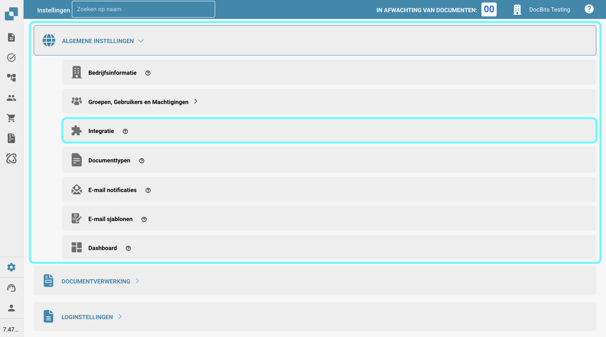

# Leverancier- en Inkoopordergegevens importeren in DocBits vanuit CSV-bestanden

## Overzicht

Deze pagina beschrijft hoe je leverancier- en inkoopordergegevens in DocBits kunt importeren met behulp van een Comma Separated Values (.csv) bestand.

**Belangrijk:** Voordat je gegevens importeert, is het cruciaal om het .csv-bestand grondig te **controleren** om de nauwkeurigheid van de gegevens en de juiste configuratie te waarborgen. Het importeren van onjuiste gegevens kan leiden tot inconsistenties. Raadpleeg de [**CSV-specificaties voor Inkooporder**](importing-supplier-and-purchase-order-data-into-docbits-from-csv-files.md#csv-specificaties-voor-inkooporder) of [**CSV-specificaties voor Leverancier**](importing-supplier-and-purchase-order-data-into-docbits-from-csv-files.md#csv-specificaties-voor-leverancier) secties voor details over vereiste en optionele velden. Als vereiste velden ontbreken, zal het importproces mislukken.

**Validatie:** Controleer altijd of je .csv-bestand alle noodzakelijke kolommen bevat zoals uiteengezet in de respectieve specificatiesectie voordat je probeert te importeren.

## Algemene Vereisten:

**Datumformaat:**

Alle data die in het .csv-blad worden verstrekt, **moeten** voldoen aan het volgende formaat:

YYYY-MM-DD HH:MM:SS

**Vereiste Velden:**

Voor zowel leverancier- als inkooporderimporten moeten alle kolommen die als "Vereist" zijn gemarkeerd in hun respectieve specificaties **bestaan in het .csv-bestand en moeten ze een waarde bevatten in elke rij**. Als een verplicht veld ontbreekt of leeg is voor een rij, zal het importproces mislukken.

### CSV-specificaties voor Inkooporder

**Velden die Vereist zijn** - (kolom met naam moet bestaan & moet gegevens bevatten)

* `purchase_order_number`

**Velden die kunnen worden opgenomen**

* `warehouse_id`
* `location_id`
* `supplier_id`
* `supplier_name`
* `order_date`
* `requested_shipment_date`
* `promised_delivery_date`
* `payment_terms_code`
* `total_amount`
* `buyer_contact_id`
* `buyer_contact_name`
* `order_last_modified_by`
* `order_last_modified_on`
* `ship_to_party_id`
* `ship_to_party_name`
* `ship_to_address_id`
* `disponent_id`
* `disponent_name`
* `extended_amount`
* `extended_base_amount`
* `extended_report_amount`
* `canceled_amount`
* `canceled_base_amount`
* `canceled_reporting_amount`
* `geo_code`
* `preview_path`
* `type_code`
* `type_description`
* `custom_field_1`
* `custom_field_2`
* `custom_field_3`
* `custom_field_4`
* `custom_field_5`
* `status`
* `line_number`
* `sub_line_number`
* `item_id`
* `supplier_item_id`
* `description`
* `note`
* `quantity`
* `open_quantity`
* `confirmed_quantity`
* `received_quantity`
* `received_base_mou_quantity`
* `promised_delivery_date`
* `requested_ship_date`
* `unit_code`
* `unit_code_price`
* `unit_price`
* `unit_price_per`
* `extended_amount`
* `total_amount`
* `currency`
* `status`
* `buyer_id`
* `buyer_name`
* `geo_code`
* `delivery_method`

### CSV-specificaties voor Leverancier

**Velden die Vereist zijn** - (kolom met naam moet bestaan & moet gegevens bevatten)

* `customer_number`
* `supplier_number`
* `supplier_name`
* `country_code`

**Velden die kunnen worden opgenomen**

* `address_1`
* `address_2`
* `address_3`
* `address_4`
* `town_city`
* `zip_code`
* `supplier_phone`
* `supplier_vat`
* `payment_term_id`
* `payment_method_code`
* `buyer_person_reference_id`
* `buyer_person_reference`
* `supplier_category`
* `supplier_group`
* `discount_term`
* `discount_term_description`
* `bank_id`
* `custom_field_1`
* `custom_field_2`
* `custom_field_3`
* `custom_field_4`
* `custom_field_5`
* `custom_field_6`
* `custom_field_7`
* `custom_field_8`
* `custom_field_9`
* `custom_field_10`
* `status`
* `account_number`
* `financial_partner_id`
* `financial_partner_name`
* `iban`
* `currency`

## Toegangseindpunt

Om gegevens te importeren, volg je deze stappen:

1. Bezoek: [https://api.docbits.com/](https://api.docbits.com/)
2.  Klik op de **"Authorize"** knop.

    <figure><figcaption></figcaption></figure>
3.  Voer de API-Key in en klik op **"Authorize"**

    * De API-Key kan worden gevonden in DocBits in Instellingen -> Algemene Instellingen -> Integratie
    * **Opmerking:** De API-sleutel die in je verzoek is opgegeven, bepaalt de doelorganisatie en de gebruikerscontext waaronder de gegevens worden geïmporteerd.

    <figure><figcaption></figcaption></figure>

    <figure><figcaption></figcaption></figure>
4. Druk op **CTRL + F** (of **CMD + F** op Mac) om de zoekfunctie te openen en zoek naar `/master_data_lookup/import_data`.
5.  Klik op het verzoek om de details te bekijken, klik vervolgens op "**Try it out"** om verder te gaan.

    <figure><figcaption></figcaption></figure>

    <figure><figcaption></figcaption></figure>
6.  Je kunt nu de vereiste parameters in het Verzoek Lichaam invoeren.\\

    **Verzoekparameters:**

    Bij het doen van het importverzoek moeten de volgende parameters worden opgegeven:

    * **sub\_org\_id:** Verwijder alle tekst uit het tekstveld om ervoor te zorgen dat de optie "Send empty value" is ingeschakeld.
    * **data\_type:** Deze parameter specificeert het type gegevens dat wordt geïmporteerd. Het kan `supplier` of `purchase_order` zijn, afhankelijk van de inhoud van je .csv-bestand.
    * **replace\_all:** Deze boolean parameter bepaalt of alle bestaande gegevens in de respectieve database tabel (`supplier` of `purchase_order`) voor de opgegeven organisatie moeten worden verwijderd voordat de nieuwe gegevens uit het .csv-bestand worden ingevoegd. Stel dit in op `true` om alle bestaande gegevens te vervangen of `false` om toe te voegen of bij te werken met de nieuwe gegevens.
    *   **delimiter:** Deze parameter specificeert het teken dat wordt gebruikt om de individuele waarden binnen elke rij van je gegevensbestand te scheiden. **Het is essentieel om de juiste delimiter te identificeren die in je bestand wordt gebruikt.** Veelvoorkomende delimiters zijn de komma (`,`) en de puntkomma (`;`).

        **Hoe de delimiter te controleren:**

        1. Open je gegevensbestand (bijv. het `.csv` bestand) met een eenvoudige teksteditor (zoals Kladblok op Windows, TextEdit op Mac of vergelijkbaar).
        2. Bekijk de eerste paar rijen van gegevens. Zoek naar het teken dat consistent tussen de verschillende stukken informatie in elke rij verschijnt. Dit teken is je delimiter.
        3. Stel de `delimiter` parameter in je importverzoek in op dit geïdentificeerde teken (ofwel `,` of `;`). Het gebruik van de verkeerde delimiter voorkomt dat de gegevens correct worden geparsed en resulteert in een mislukte import.
    * **on\_conflict & auto\_generate\_id:** De functionaliteit voor het omgaan met gegevensconflicten (`on_conflict`) en het automatisch genereren van ID's (`auto_generate_id`) is momenteel **niet geïmplementeerd** voor deze datatypes.

    <figure><figcaption></figcaption></figure>
7.  Als je hebt gecontroleerd dat alle informatie correct is, kun je het importproces starten door op de **"Execute"** knop te klikken.

    <figure><figcaption></figcaption></figure>
