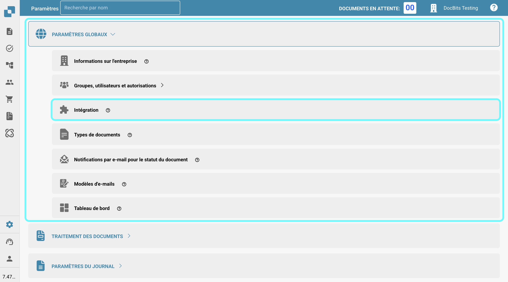

# Importation des données de fournisseur et de commande d'achat dans DocBits à partir de fichiers CSV

## Aperçu

Cette page décrit comment importer des données de fournisseur et de commande d'achat dans DocBits à l'aide d'un fichier de valeurs séparées par des virgules (.csv).

**Important :** Avant d'importer des données, il est crucial de **vérifier soigneusement le fichier .csv** pour garantir l'exactitude des données et la bonne configuration. L'importation de données incorrectes peut entraîner des incohérences. Consultez les sections [**Spécifications CSV pour la commande d'achat**](importing-supplier-and-purchase-order-data-into-docbits-from-csv-files.md#specifications-csv-pour-la-commande-dachat) ou [**Spécifications CSV pour le fournisseur**](importing-supplier-and-purchase-order-data-into-docbits-from-csv-files.md#specifications-csv-pour-le-fournisseur) pour des détails sur les champs requis et optionnels. Si des champs requis sont manquants, le processus d'importation échouera.

**Validation :** Vérifiez toujours que votre fichier .csv contient toutes les colonnes nécessaires comme indiqué dans la section des spécifications respectives avant de tenter l'importation.

## Exigences générales :

**Format de date :**

Toutes les dates fournies dans la feuille .csv **doivent** respecter le format suivant :

YYYY-MM-DD HH:MM:SS

**Champs requis :**

Pour les importations de fournisseur et de commande d'achat, toutes les colonnes marquées comme "Requis" dans leurs spécifications respectives **doivent exister dans le fichier .csv et doivent contenir une valeur dans chaque ligne**. Si un champ requis est manquant ou vide pour une ligne, le processus d'importation échouera.

### Spécifications CSV pour la commande d'achat

**Champs qui sont requis** - (la colonne avec le nom doit exister et doit contenir des données)

* `purchase_order_number`

**Champs qui peuvent être inclus**

* `warehouse_id`
* `location_id`
* `supplier_id`
* `supplier_name`
* `order_date`
* `requested_shipment_date`
* `promised_delivery_date`
* `payment_terms_code`
* `total_amount`
* `buyer_contact_id`
* `buyer_contact_name`
* `order_last_modified_by`
* `order_last_modified_on`
* `ship_to_party_id`
* `ship_to_party_name`
* `ship_to_address_id`
* `disponent_id`
* `disponent_name`
* `extended_amount`
* `extended_base_amount`
* `extended_report_amount`
* `canceled_amount`
* `canceled_base_amount`
* `canceled_reporting_amount`
* `geo_code`
* `preview_path`
* `type_code`
* `type_description`
* `custom_field_1`
* `custom_field_2`
* `custom_field_3`
* `custom_field_4`
* `custom_field_5`
* `status`
* `line_number`
* `sub_line_number`
* `item_id`
* `supplier_item_id`
* `description`
* `note`
* `quantity`
* `open_quantity`
* `confirmed_quantity`
* `received_quantity`
* `received_base_mou_quantity`
* `promised_delivery_date`
* `requested_ship_date`
* `unit_code`
* `unit_code_price`
* `unit_price`
* `unit_price_per`
* `extended_amount`
* `total_amount`
* `currency`
* `status`
* `buyer_id`
* `buyer_name`
* `geo_code`
* `delivery_method`

### Spécifications CSV pour le fournisseur

**Champs qui sont requis** - (la colonne avec le nom doit exister et doit contenir des données)

* `customer_number`
* `supplier_number`
* `supplier_name`
* `country_code`

**Champs qui peuvent être inclus**

* `address_1`
* `address_2`
* `address_3`
* `address_4`
* `town_city`
* `zip_code`
* `supplier_phone`
* `supplier_vat`
* `payment_term_id`
* `payment_method_code`
* `buyer_person_reference_id`
* `buyer_person_reference`
* `supplier_category`
* `supplier_group`
* `discount_term`
* `discount_term_description`
* `bank_id`
* `custom_field_1`
* `custom_field_2`
* `custom_field_3`
* `custom_field_4`
* `custom_field_5`
* `custom_field_6`
* `custom_field_7`
* `custom_field_8`
* `custom_field_9`
* `custom_field_10`
* `status`
* `account_number`
* `financial_partner_id`
* `financial_partner_name`
* `iban`
* `currency`

## Point d'accès

Pour importer des données, suivez ces étapes :

1. Visitez : [https://api.docbits.com/](https://api.docbits.com/)
2.  Cliquez sur le bouton **"Authorize"**.

    <figure><figcaption></figcaption></figure>
3.  Entrez la clé API et cliquez sur **"Authorize"**

    * La clé API peut être trouvée dans DocBits dans Paramètres -> Paramètres Globaux -> Intégration
    * **Remarque :** La clé API fournie dans votre demande détermine l'organisation cible et le contexte utilisateur sous lequel les données seront importées.

    <figure><figcaption></figcaption></figure>

    <figure><figcaption></figcaption></figure>
4. Appuyez sur **CTRL + F** (ou **CMD + F** sur Mac) pour ouvrir la fonction de recherche, et recherchez `/master_data_lookup/import_data`.
5.  Cliquez sur la demande pour voir ses détails, puis cliquez sur "**Try it out**" pour continuer.

    <figure><figcaption></figcaption></figure>

    <figure><figcaption></figcaption></figure>
6.  Vous pouvez maintenant entrer les paramètres requis dans le corps de la demande.\\

    **Paramètres de demande :**

    Lors de la demande d'importation, les paramètres suivants doivent être spécifiés :

    * **sub\_org\_id :** Supprimez tout texte du champ de texte pour garantir que l'option "Send empty value" est activée.
    * **data\_type :** Ce paramètre spécifie le type de données à importer. Il peut être soit `supplier` soit `purchase_order` en fonction du contenu de votre fichier .csv.
    * **replace\_all :** Ce paramètre booléen détermine si toutes les données existantes dans la table de base de données respective (`supplier` ou `purchase_order`) pour l'organisation spécifiée doivent être supprimées avant d'insérer les nouvelles données du fichier .csv. Réglez cela sur `true` pour remplacer toutes les données existantes ou `false` pour ajouter ou mettre à jour avec les nouvelles données.
    *   **delimiter :** Ce paramètre spécifie le caractère utilisé pour séparer les valeurs individuelles dans chaque ligne de votre fichier de données. **Il est essentiel d'identifier le bon délimiteur utilisé dans votre fichier.** Les délimiteurs courants sont la virgule (`,`) et le point-virgule (`;`).

        **Comment vérifier le délimiteur :**

        1. Ouvrez votre fichier de données (par exemple, le fichier `.csv`) avec un éditeur de texte brut (comme Notepad sur Windows, TextEdit sur Mac, ou similaire).
        2. Examinez les premières lignes de données. Recherchez le caractère qui apparaît de manière cohérente entre les différentes informations dans chaque ligne. Ce caractère est votre délimiteur.
        3. Réglez le paramètre `delimiter` dans votre demande d'importation sur ce caractère identifié (soit `,` soit `;`). Utiliser le mauvais délimiteur empêchera les données d'être analysées correctement et entraînera un échec de l'importation.
    * **on\_conflict & auto\_generate\_id :** La fonctionnalité de gestion des conflits de données (`on_conflict`) et de génération automatique d'ID (`auto_generate_id`) n'est actuellement **pas implémentée** pour ces types de données.

    <figure><figcaption></figcaption></figure>
7.  Si vous avez vérifié que toutes les informations sont correctes, vous pouvez initier le processus d'importation en cliquant sur le bouton **"Execute"**.

    <figure><figcaption></figcaption></figure>
