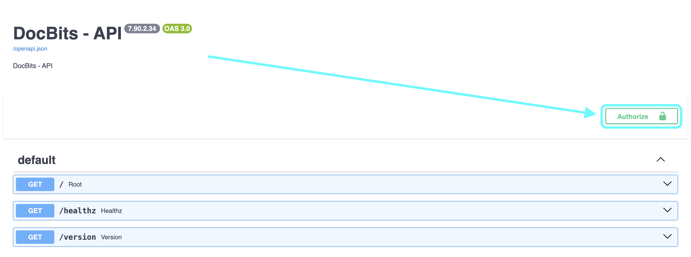
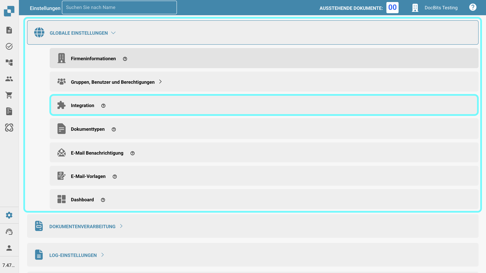
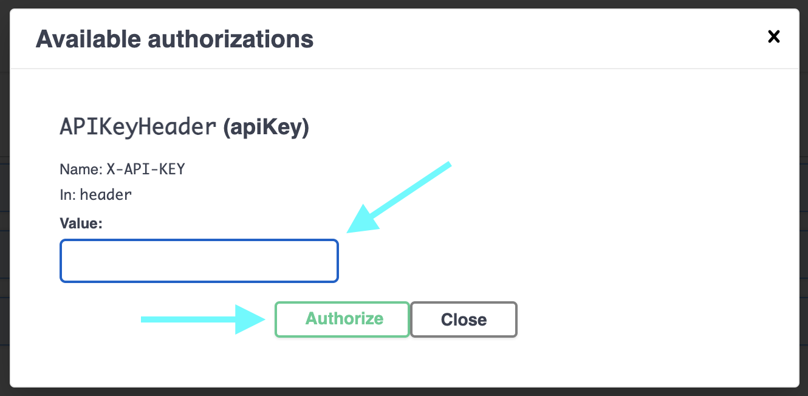
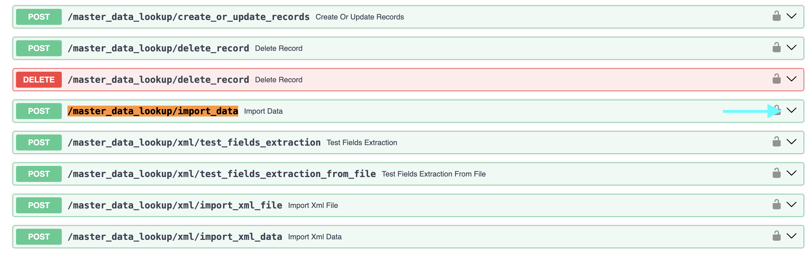
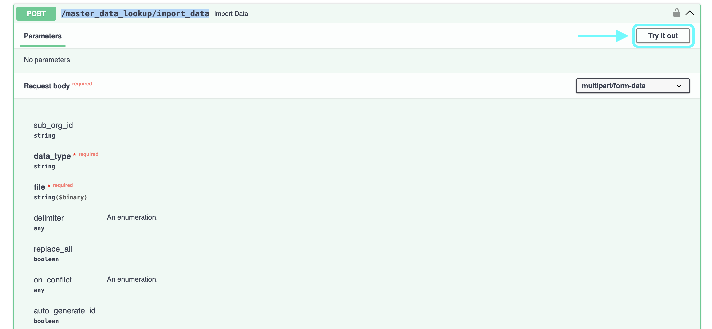
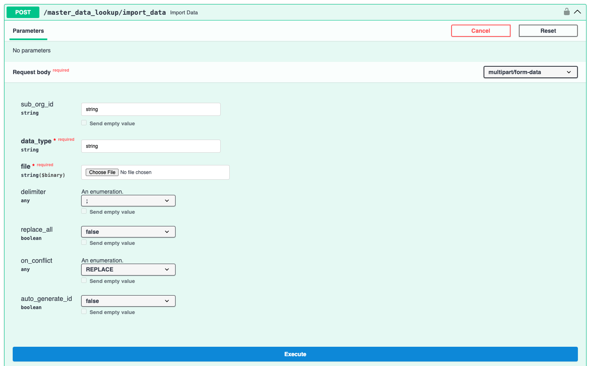
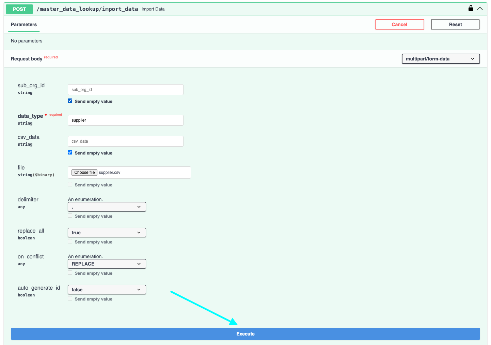

# Importieren von Lieferanten- und Bestelldaten in DocBits aus CSV-Dateien

## Übersicht

Diese Seite beschreibt, wie man Lieferanten- und Bestelldaten in DocBits mithilfe einer durch Kommas getrennten Werte-Datei (.csv) importiert.

**Wichtig:** Vor dem Importieren von Daten ist es entscheidend, die .csv-Datei **gründlich zu überprüfen**, um die Datenintegrität und die richtige Konfiguration sicherzustellen. Das Importieren falscher Daten kann zu Inkonsistenzen führen. Siehe die Abschnitte [**CSV-Spezifikationen für Bestellungen**](importing-supplier-and-purchase-order-data-into-docbits-from-csv-files.md#csv-spezifikationen-fur-bestellungen) oder [**CSV-Spezifikationen für Lieferanten**](importing-supplier-and-purchase-order-data-into-docbits-from-csv-files.md#csv-spezifikationen-fur-lieferanten) für Details zu erforderlichen und optionalen Feldern. Wenn erforderliche Felder fehlen, schlägt der Importprozess fehl.

**Validierung:** Überprüfen Sie immer, dass Ihre .csv-Datei alle notwendigen Spalten gemäß den jeweiligen Spezifikationen enthält, bevor Sie den Import versuchen.

## Allgemeine Anforderungen:

**Datumsformat:**

Alle in der .csv-Datei angegebenen Daten **müssen** dem folgenden Format entsprechen:

YYYY-MM-DD HH:MM:SS

**Erforderliche Felder:**

Für den Import von Lieferanten und Bestellungen müssen alle als "Erforderlich" gekennzeichneten Spalten in den jeweiligen Spezifikationen **in der .csv-Datei vorhanden sein und in jeder Zeile einen Wert enthalten**. Wenn ein erforderliches Feld für eine Zeile fehlt oder leer ist, schlägt der Importprozess fehl.

### CSV-Spezifikationen für Bestellungen

**Erforderliche Felder** - (Spalte mit Namen muss vorhanden sein & muss Daten enthalten)

* `purchase_order_number`

**Felder, die enthalten sein können**

* `warehouse_id`
* `location_id`
* `supplier_id`
* `supplier_name`
* `order_date`
* `requested_shipment_date`
* `promised_delivery_date`
* `payment_terms_code`
* `total_amount`
* `buyer_contact_id`
* `buyer_contact_name`
* `order_last_modified_by`
* `order_last_modified_on`
* `ship_to_party_id`
* `ship_to_party_name`
* `ship_to_address_id`
* `disponent_id`
* `disponent_name`
* `extended_amount`
* `extended_base_amount`
* `extended_report_amount`
* `canceled_amount`
* `canceled_base_amount`
* `canceled_reporting_amount`
* `geo_code`
* `preview_path`
* `type_code`
* `type_description`
* `custom_field_1`
* `custom_field_2`
* `custom_field_3`
* `custom_field_4`
* `custom_field_5`
* `status`
* `line_number`
* `sub_line_number`
* `item_id`
* `supplier_item_id`
* `description`
* `note`
* `quantity`
* `open_quantity`
* `confirmed_quantity`
* `received_quantity`
* `received_base_mou_quantity`
* `promised_delivery_date`
* `requested_ship_date`
* `unit_code`
* `unit_code_price`
* `unit_price`
* `unit_price_per`
* `extended_amount`
* `total_amount`
* `currency`
* `status`
* `buyer_id`
* `buyer_name`
* `geo_code`
* `delivery_method`

### CSV-Spezifikationen für Lieferanten

**Erforderliche Felder** - (Spalte mit Namen muss vorhanden sein & muss Daten enthalten)

* `customer_number`
* `supplier_number`
* `supplier_name`
* `country_code`

**Felder, die enthalten sein können**

* `address_1`
* `address_2`
* `address_3`
* `address_4`
* `town_city`
* `zip_code`
* `supplier_phone`
* `supplier_vat`
* `payment_term_id`
* `payment_method_code`
* `buyer_person_reference_id`
* `buyer_person_reference`
* `supplier_category`
* `supplier_group`
* `discount_term`
* `discount_term_description`
* `bank_id`
* `custom_field_1`
* `custom_field_2`
* `custom_field_3`
* `custom_field_4`
* `custom_field_5`
* `custom_field_6`
* `custom_field_7`
* `custom_field_8`
* `custom_field_9`
* `custom_field_10`
* `status`
* `account_number`
* `financial_partner_id`
* `financial_partner_name`
* `iban`
* `currency`

## Zugriffsendpunkt

Um Daten zu importieren, befolgen Sie diese Schritte:

1. Besuchen Sie: [https://api.docbits.com/](https://api.docbits.com/)
2.  Klicken Sie auf die Schaltfläche **"Authorize"**.

    <figure><figcaption></figcaption></figure>
3.  Geben Sie den API-Schlüssel ein und klicken Sie auf **"Authorize"**

    * Der API-Schlüssel kann in DocBits unter Einstellungen -> Globale Einstellungen -> Integration gefunden werden.
    * **Hinweis:** Der in Ihrer Anfrage angegebene API-Schlüssel bestimmt die Zielorganisation und den Benutzerkontext, unter dem die Daten importiert werden.

    <figure><figcaption></figcaption></figure>

    <figure><figcaption></figcaption></figure>
4. Drücken Sie **CTRL + F** (oder **CMD + F** auf Mac), um die Suchfunktion zu öffnen, und suchen Sie nach `/master_data_lookup/import_data`.
5.  Klicken Sie auf die Anfrage, um die Details anzuzeigen, und klicken Sie dann auf "**Try it out"**, um fortzufahren.

    <figure><figcaption></figcaption></figure>

    <figure><figcaption></figcaption></figure>
6.  Sie können jetzt die erforderlichen Parameter im Anfragekörper eingeben.\\

    **Anfrageparameter:**

    Bei der Durchführung der Importanfrage müssen die folgenden Parameter angegeben werden:

    * **sub\_org\_id:** Entfernen Sie jeglichen Text aus dem Textfeld, um sicherzustellen, dass die Option "Send empty value" aktiviert ist.
    * **data\_type:** Dieser Parameter gibt den Typ der importierten Daten an. Er kann entweder `supplier` oder `purchase_order` sein, abhängig vom Inhalt Ihrer .csv-Datei.
    * **replace\_all:** Dieser boolesche Parameter bestimmt, ob alle vorhandenen Daten in der jeweiligen Datenbanktabelle (`supplier` oder `purchase_order`) für die angegebene Organisation gelöscht werden sollen, bevor die neuen Daten aus der .csv-Datei eingefügt werden. Setzen Sie dies auf `true`, um alle vorhandenen Daten zu ersetzen, oder auf `false`, um die neuen Daten anzuhängen oder zu aktualisieren.
    *   **delimiter:** Dieser Parameter gibt das Zeichen an, das verwendet wird, um die einzelnen Werte innerhalb jeder Zeile Ihrer Datendatei zu trennen. **Es ist wichtig, den richtigen Trennzeichen in Ihrer Datei zu identifizieren.** Häufige Trennzeichen sind das Komma (`,`) und das Semikolon (`;`).

        **So überprüfen Sie das Trennzeichen:**

        1. Öffnen Sie Ihre Datendatei (z. B. die `.csv`-Datei) mit einem einfachen Texteditor (wie Notepad unter Windows, TextEdit auf Mac oder ähnlichem).
        2. Untersuchen Sie die ersten paar Zeilen der Daten. Suchen Sie nach dem Zeichen, das konsequent zwischen den verschiedenen Informationen in jeder Zeile erscheint. Dieses Zeichen ist Ihr Trennzeichen.
        3. Setzen Sie den `delimiter`-Parameter in Ihrer Importanfrage auf dieses identifizierte Zeichen (entweder `,` oder `;`). Die Verwendung des falschen Trennzeichens verhindert, dass die Daten korrekt analysiert werden, und führt zu einem fehlgeschlagenen Import.
    * **on\_conflict & auto\_generate\_id:** Die Funktionalität zur Handhabung von Datenkonflikten (`on_conflict`) und zur automatischen Generierung von IDs (`auto_generate_id`) ist derzeit **nicht implementiert** für diese Datentypen.

    <figure><figcaption></figcaption></figure>
7.  Wenn Sie überprüft haben, dass alle Informationen korrekt sind, können Sie den Importprozess starten, indem Sie auf die Schaltfläche **"Execute"** klicken.

    <figure><figcaption></figcaption></figure>
