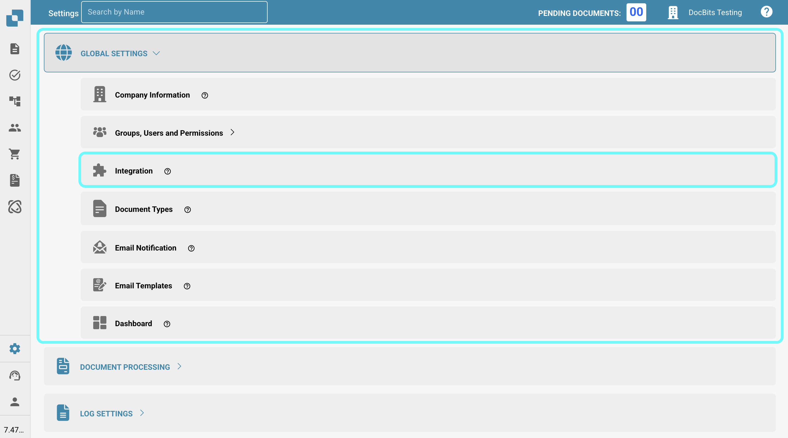

# Importowanie danych dostawcy i zamówień zakupu do DocBits z plików CSV

## Przegląd

Ta strona opisuje, jak importować dane dostawcy i zamówienia zakupu do DocBits za pomocą pliku z wartościami oddzielonymi przecinkami (.csv).

**Ważne:** Przed importowaniem jakichkolwiek danych, kluczowe jest **dokładne sprawdzenie pliku .csv**, aby zapewnić dokładność danych i prawidłową konfigurację. Importowanie niepoprawnych danych może prowadzić do niespójności. Zapoznaj się z sekcjami [**Specyfikacje CSV dla zamówienia zakupu**](importing-supplier-and-purchase-order-data-into-docbits-from-csv-files.md#specyfikacje-csv-dla-zamowienia-zakupu) lub [**Specyfikacje CSV dla dostawcy**](importing-supplier-and-purchase-order-data-into-docbits-from-csv-files.md#specyfikacje-csv-dla-dostawcy) w celu uzyskania szczegółowych informacji na temat wymaganych i opcjonalnych pól. Jeśli wymagane pola są puste, proces importu zakończy się niepowodzeniem.

**Walidacja:** Zawsze weryfikuj, czy twój plik .csv zawiera wszystkie niezbędne kolumny, zgodnie z odpowiednią sekcją specyfikacji, przed próbą importu.

## Ogólne wymagania:

**Format daty:**

Wszystkie daty podane w arkuszu .csv **muszą** być zgodne z następującym formatem:

YYYY-MM-DD HH:MM:SS

**Wymagane pola:**

Zarówno dla importów dostawcy, jak i zamówienia zakupu, wszystkie kolumny oznaczone jako "Wymagane" w odpowiednich specyfikacjach **muszą istnieć w pliku .csv i muszą zawierać wartość w każdym wierszu**. Jeśli jakiekolwiek wymagane pole jest puste lub brakujące w wierszu, proces importu zakończy się niepowodzeniem.

### Specyfikacje CSV dla zamówienia zakupu

**Pola, które są wymagane** - (kolumna z nazwą musi istnieć i musi zawierać dane)

* `purchase_order_number`

**Pola, które mogą być uwzględnione**

* `warehouse_id`
* `location_id`
* `supplier_id`
* `supplier_name`
* `order_date`
* `requested_shipment_date`
* `promised_delivery_date`
* `payment_terms_code`
* `total_amount`
* `buyer_contact_id`
* `buyer_contact_name`
* `order_last_modified_by`
* `order_last_modified_on`
* `ship_to_party_id`
* `ship_to_party_name`
* `ship_to_address_id`
* `disponent_id`
* `disponent_name`
* `extended_amount`
* `extended_base_amount`
* `extended_report_amount`
* `canceled_amount`
* `canceled_base_amount`
* `canceled_reporting_amount`
* `geo_code`
* `preview_path`
* `type_code`
* `type_description`
* `custom_field_1`
* `custom_field_2`
* `custom_field_3`
* `custom_field_4`
* `custom_field_5`
* `status`
* `line_number`
* `sub_line_number`
* `item_id`
* `supplier_item_id`
* `description`
* `note`
* `quantity`
* `open_quantity`
* `confirmed_quantity`
* `received_quantity`
* `received_base_mou_quantity`
* `promised_delivery_date`
* `requested_ship_date`
* `unit_code`
* `unit_code_price`
* `unit_price`
* `unit_price_per`
* `extended_amount`
* `total_amount`
* `currency`
* `status`
* `buyer_id`
* `buyer_name`
* `geo_code`
* `delivery_method`

### Specyfikacje CSV dla dostawcy

**Pola, które są wymagane** - (kolumna z nazwą musi istnieć i musi zawierać dane)

* `customer_number`
* `supplier_number`
* `supplier_name`
* `country_code`

**Pola, które mogą być uwzględnione**

* `address_1`
* `address_2`
* `address_3`
* `address_4`
* `town_city`
* `zip_code`
* `supplier_phone`
* `supplier_vat`
* `payment_term_id`
* `payment_method_code`
* `buyer_person_reference_id`
* `buyer_person_reference`
* `supplier_category`
* `supplier_group`
* `discount_term`
* `discount_term_description`
* `bank_id`
* `custom_field_1`
* `custom_field_2`
* `custom_field_3`
* `custom_field_4`
* `custom_field_5`
* `custom_field_6`
* `custom_field_7`
* `custom_field_8`
* `custom_field_9`
* `custom_field_10`
* `status`
* `account_number`
* `financial_partner_id`
* `financial_partner_name`
* `iban`
* `currency`

## Punkt dostępu

Aby zaimportować dane, wykonaj następujące kroki:

1. Odwiedź: [https://api.docbits.com/](https://api.docbits.com/)
2.  Kliknij przycisk **"Authorize"**.

    <figure><figcaption></figcaption></figure>
3.  Wprowadź klucz API i kliknij **"Authorize"**

    * Klucz API można znaleźć w DocBits w Ustawienia -> Ustawienia globalne -> Integracja
    * **Uwaga:** Klucz API podany w twoim żądaniu określa docelową organizację oraz kontekst użytkownika, w którym dane będą importowane.

    <figure><figcaption></figcaption></figure>

    <figure><figcaption></figcaption></figure>
4. Naciśnij **CTRL + F** (lub **CMD + F** na Macu), aby otworzyć funkcję wyszukiwania i wyszukaj `/master_data_lookup/import_data`.
5.  Kliknij żądanie, aby zobaczyć jego szczegóły, a następnie kliknij "**Try it out**", aby kontynuować.

    <figure><figcaption></figcaption></figure>

    <figure><figcaption></figcaption></figure>
6.  Teraz możesz wprowadzić wymagane parametry w ciele żądania.\\

    **Parametry żądania:**

    Podczas składania żądania importu należy określić następujące parametry:

    * **sub\_org\_id:** Usuń wszelki tekst z pola tekstowego, aby upewnić się, że opcja "Send empty value" jest włączona.
    * **data\_type:** Ten parametr określa typ danych, które są importowane. Może to być `supplier` lub `purchase_order`, w zależności od zawartości twojego pliku .csv.
    * **replace\_all:** Ten parametr boolean określa, czy wszystkie istniejące dane w odpowiedniej tabeli bazy danych (`supplier` lub `purchase_order`) dla określonej organizacji powinny zostać usunięte przed wstawieniem nowych danych z pliku .csv. Ustaw to na `true`, aby zastąpić wszystkie istniejące dane lub `false`, aby dodać lub zaktualizować nowe dane.
    *   **delimiter:** Ten parametr określa znak używany do oddzielania poszczególnych wartości w każdym wierszu twojego pliku danych. **Ważne jest, aby zidentyfikować poprawny delimiter użyty w twoim pliku.** Powszechnymi delimiterami są przecinek (`,`) i średnik (`;`).

        **Jak sprawdzić delimiter:**

        1. Otwórz swój plik danych (np. plik `.csv`) w prostym edytorze tekstu (takim jak Notatnik w Windows, TextEdit na Macu lub podobnym).
        2. Przejrzyj pierwsze kilka wierszy danych. Szukaj znaku, który konsekwentnie pojawia się między różnymi informacjami w każdym wierszu. Ten znak to twój delimiter.
        3. Ustaw parametr `delimiter` w swoim żądaniu importu na ten zidentyfikowany znak (czy to `,`, czy `;`). Użycie niewłaściwego delimiteru uniemożliwi poprawne przetworzenie danych i spowoduje nieudany import.
    * **on\_conflict & auto\_generate\_id:** Funkcjonalność obsługi konfliktów danych (`on_conflict`) i automatycznego generowania identyfikatorów (`auto_generate_id`) jest obecnie **niezaimplementowana** dla tych typów danych.

    <figure><figcaption></figcaption></figure>
7.  Jeśli zweryfikowałeś, że wszystkie informacje są poprawne, możesz rozpocząć proces importu, klikając przycisk **"Execute"**.

    <figure><figcaption></figcaption></figure>
