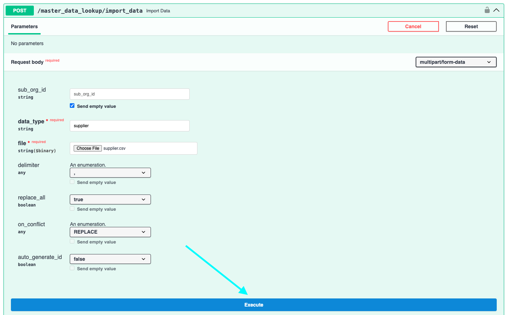

# Importando Dados de Fornecedor e Pedido de Compra no DocBits a partir de Arquivos CSV

## Visão Geral

Esta página descreve como importar dados de Fornecedor e Pedido de Compra no DocBits usando um arquivo de Valores Separados por Vírgula (.csv).

**Importante:** Antes de importar qualquer dado, é crucial **revisar o arquivo .csv minuciosamente** para garantir a precisão dos dados e a configuração adequada. Importar dados incorretos pode levar a inconsistências. Consulte as seções [**Especificações CSV para Pedido de Compra**](importing-supplier-and-purchase-order-data-into-docbits-from-csv-files.md#especificacoes-csv-para-pedido-de-compra) ou [**Especificações CSV para Fornecedor**](importing-supplier-and-purchase-order-data-into-docbits-from-csv-files.md#especificacoes-csv-para-fornecedor) para detalhes sobre os campos obrigatórios e opcionais. Se campos obrigatórios estiverem ausentes, o processo de importação falhará.

**Validação:** Sempre verifique se o seu arquivo .csv contém todas as colunas necessárias, conforme descrito na seção de especificações correspondente, antes de tentar a importação.

## Requisitos Gerais:

**Formato de Data:**

Todas as datas fornecidas na planilha .csv **devem** seguir o seguinte formato:

YYYY-MM-DD HH:MM:SS

**Campos Obrigatórios:**

Para as importações de Fornecedor e Pedido de Compra, todas as colunas marcadas como "Obrigatórias" em suas respectivas especificações **devem existir no arquivo .csv e devem conter um valor em cada linha**. Se algum campo obrigatório estiver ausente ou vazio para uma linha, o processo de importação falhará.

### Especificações CSV para Pedido de Compra

**Campos que são Obrigatórios** - (a coluna com o nome deve existir e deve conter dados)

* `purchase_order_number`

**Campos que podem ser incluídos**

* `warehouse_id`
* `location_id`
* `supplier_id`
* `supplier_name`
* `order_date`
* `requested_shipment_date`
* `promised_delivery_date`
* `payment_terms_code`
* `total_amount`
* `buyer_contact_id`
* `buyer_contact_name`
* `order_last_modified_by`
* `order_last_modified_on`
* `ship_to_party_id`
* `ship_to_party_name`
* `ship_to_address_id`
* `disponent_id`
* `disponent_name`
* `extended_amount`
* `extended_base_amount`
* `extended_report_amount`
* `canceled_amount`
* `canceled_base_amount`
* `canceled_reporting_amount`
* `geo_code`
* `preview_path`
* `type_code`
* `type_description`
* `custom_field_1`
* `custom_field_2`
* `custom_field_3`
* `custom_field_4`
* `custom_field_5`
* `status`
* `line_number`
* `sub_line_number`
* `item_id`
* `supplier_item_id`
* `description`
* `note`
* `quantity`
* `open_quantity`
* `confirmed_quantity`
* `received_quantity`
* `received_base_mou_quantity`
* `promised_delivery_date`
* `requested_ship_date`
* `unit_code`
* `unit_code_price`
* `unit_price`
* `unit_price_per`
* `extended_amount`
* `total_amount`
* `currency`
* `status`
* `buyer_id`
* `buyer_name`
* `geo_code`
* `delivery_method`

### Especificações CSV para Fornecedor

**Campos que são Obrigatórios** - (a coluna com o nome deve existir e deve conter dados)

* `customer_number`
* `supplier_number`
* `supplier_name`
* `country_code`

**Campos que podem ser incluídos**

* `address_1`
* `address_2`
* `address_3`
* `address_4`
* `town_city`
* `zip_code`
* `supplier_phone`
* `supplier_vat`
* `payment_term_id`
* `payment_method_code`
* `buyer_person_reference_id`
* `buyer_person_reference`
* `supplier_category`
* `supplier_group`
* `discount_term`
* `discount_term_description`
* `bank_id`
* `custom_field_1`
* `custom_field_2`
* `custom_field_3`
* `custom_field_4`
* `custom_field_5`
* `custom_field_6`
* `custom_field_7`
* `custom_field_8`
* `custom_field_9`
* `custom_field_10`
* `status`
* `account_number`
* `financial_partner_id`
* `financial_partner_name`
* `iban`
* `currency`

## Endpoint de Acesso

Para importar dados, siga estas etapas:

1. Visite: [https://api.docbits.com/](https://api.docbits.com/)
2.  Clique no botão **"Authorize"**.

    <figure><figcaption></figcaption></figure>
3.  Insira a API-Key e clique em **"Authorize"**

    * A API-Key pode ser encontrada no DocBits em Configurações -> Configurações Globais -> Integração
    * **Nota:** A chave API fornecida em sua solicitação determina a organização alvo e o contexto do usuário sob o qual os dados serão importados.

    <figure><figcaption></figcaption></figure>

    <figure><figcaption></figcaption></figure>
4. Pressione **CTRL + F** (ou **CMD + F** no Mac) para abrir a função de busca e procure por `/master_data_lookup/import_data`.
5.  Clique na solicitação para ver seus detalhes, em seguida, clique em "**Try it out**" para prosseguir.

    <figure><figcaption></figcaption></figure>

    <figure><figcaption></figcaption></figure>
6.  Agora você pode inserir os parâmetros necessários no Corpo da Solicitação.\\

    **Parâmetros da Solicitação:**

    Ao fazer a solicitação de importação, os seguintes parâmetros precisam ser especificados:

    * **sub\_org\_id:** Remova qualquer texto do campo de texto para garantir que a opção "Send empty value" esteja habilitada.
    * **data\_type:** Este parâmetro especifica o tipo de dado que está sendo importado. Pode ser `supplier` ou `purchase_order`, dependendo do conteúdo do seu arquivo .csv.
    * **replace\_all:** Este parâmetro booleano determina se todos os dados existentes na tabela de banco de dados respectiva (`supplier` ou `purchase_order`) para a organização especificada devem ser excluídos antes de inserir os novos dados do arquivo .csv. Defina isso como `true` para substituir todos os dados existentes ou `false` para adicionar ou atualizar com os novos dados.
    *   **delimiter:** Este parâmetro especifica o caractere usado para separar os valores individuais dentro de cada linha do seu arquivo de dados. **É essencial identificar o delimitador correto usado em seu arquivo.** Delimitadores comuns são a vírgula (`,`) e o ponto e vírgula (`;`).

        **Como verificar o delimitador:**

        1. Abra seu arquivo de dados (por exemplo, o arquivo `.csv`) com um editor de texto simples (como o Bloco de Notas no Windows, TextEdit no Mac ou similar).
        2. Examine as primeiras linhas de dados. Procure o caractere que aparece consistentemente entre as diferentes informações em cada linha. Este caractere é o seu delimitador.
        3. Defina o parâmetro `delimiter` em sua solicitação de importação para este caractere identificado (seja `,` ou `;`). Usar o delimitador errado impedirá que os dados sejam analisados corretamente e resultará em uma falha na importação.
    * **on\_conflict & auto\_generate\_id:** A funcionalidade para lidar com conflitos de dados (`on_conflict`) e gerar IDs automaticamente (`auto_generate_id`) atualmente **não está implementada** para esses tipos de dados.

    <figure><figcaption></figcaption></figure>
7.  Se você verificou que todas as informações estão corretas, pode iniciar o processo de importação clicando no botão **"Execute"**.

    <figure><figcaption></figcaption></figure>
