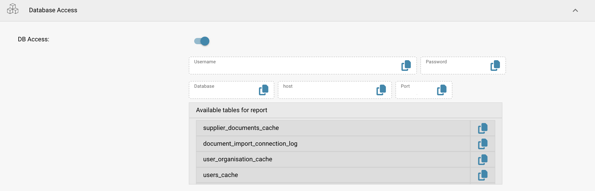
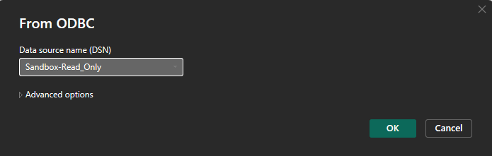
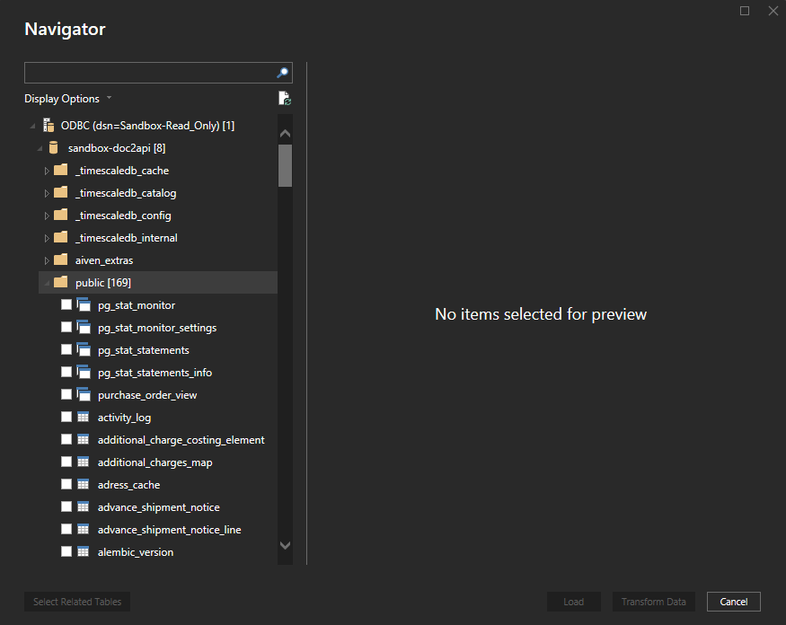
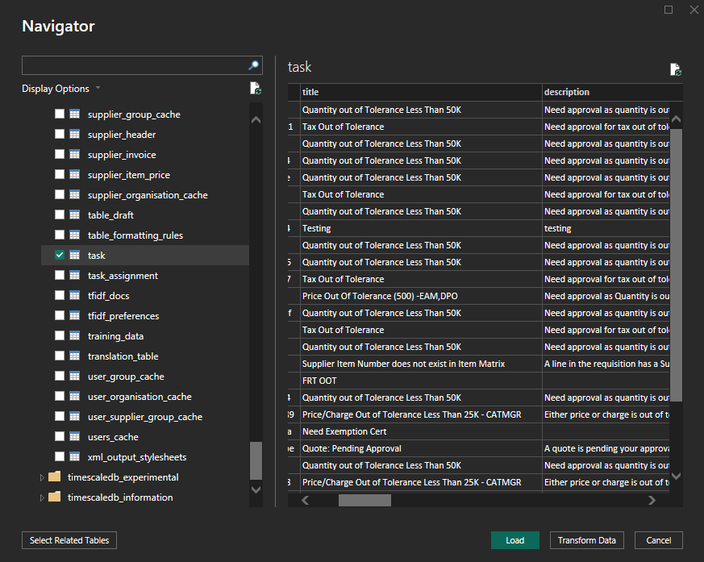

# Connect via Read-Only Database

This guide walks you through connecting **DocBits’ Read-Only Database to Power BI Desktop** using the **PostgreSQL ODBC driver**. It covers driver installation, ODBC configuration, Power BI integration, and scheduled refresh.

#### 1. Install the PostgreSQL ODBC Driver

* Download the latest PostgreSQL ODBC driver (**psqlODBC**) from the official site:
  * [https://www.postgresql.org/ftp/odbc/releases/](https://www.postgresql.org/ftp/odbc/releases/)
* Run the installer and follow the setup wizard.

#### 2. Configure the ODBC Data Source

* Open **ODBC Data Source Administrator (64-bit)** via Control Panel or Windows Search.
* Go to the **System DSN** tab and click **Add**.
* Select **PostgreSQL Unicode(x64)** driver from the list and click **Finish**.
* Fill in the required fields with credentials from:\
  **DocBits → Settings → Document Processing → Module → AI Dashboard → Read-Only DB Access**

<figure><figcaption></figcaption></figure>

**Required Fields:**

* **Name:** A name for the connection (e.g., `Sandbox-Read_Only`)
* **Server:** Copy the host value from DocBits
* **Port:** Copy the port value from DocBits
* **Database:** Copy the database name from DocBits
* **Username:** Copy the username from DocBits
* **Password:** Copy the password from DocBits
* **SSL Mode:** Set to **Require** (ensures encrypted communication)

#### 3. Connect Read-Only DB to Power BI

* Open **Power BI Desktop**.
*   Select **Get Data** → **ODBC** → **Connect**.

    <figure><figcaption></figcaption></figure>
* From the DSN list, select your configured source (e.g., `Sandbox-Read_Only`).

<figure><figcaption></figcaption></figure>

* Click **OK**. Enter credentials again if prompted.
  * <mark style="color:red;">**Note:**</mark> If you see the error **“password authentication failed for user”**, try entering your password wrapped in **curly braces `{}`**.

#### 4. Load and Transform Data

* In the **Navigator** pane, expand the schema list.
* Open the **`public`** schema.
* Select the tables you want to import.

        

* Choose:
  * **Load** → Import directly into Power BI
  * **Transform Data** → Open Power Query for shaping and filtering before loading

#### 5. Visualize Your Data

* Use the Power BI report canvas to build dashboards.
* Drag fields, add slicers, choose chart types, and apply DAX calculations.
* Use **Power Query Editor** to clean or join data before creating visuals.
* Reference: [Power BI Documentation](https://learn.microsoft.com/en-us/power-bi/?utm_source=chatgpt.com)

#### 6. Enable Scheduled Refresh (Optional)

<mark style="color:red;">**Note:**</mark> **Requires Power BI Pro or Premium + Gateway**

* To keep your reports in sync with ClickHouse:
* Publish your `.pbix` file to **Power BI Service**.
* Install the **Power BI Gateway** (Standard mode) on a machine with network access to ClickHouse.
* In Power BI Service:
  * Go to your dataset → **Settings** → **Scheduled Refresh**
  * Map your DSN and provide credentials
* More informations [here](https://learn.microsoft.com/en-us/power-bi/connect-data/service-gateway-deployment-guidance).&#x20;

#### 7. Example Dashboards & Data Views&#x20;

<figure><figcaption></figcaption></figure> <figure><figcaption></figcaption></figure> <figure><figcaption></figcaption></figure> <figure><figcaption></figcaption></figure>

