# Test your BOD connection with Postman

## Overview

This page explains how to verify the successful processing of your BOD (Business Object Document) using Postman. You will test the relevant API endpoint by sending a request with your BOD mapping file. Follow the steps below to complete the process.

## Accessing Your API Key and BOD Mapping File

### Retrieving Your API Key

1.  Go to **Settings → Global Settings → Integration & SSO**.

    <figure>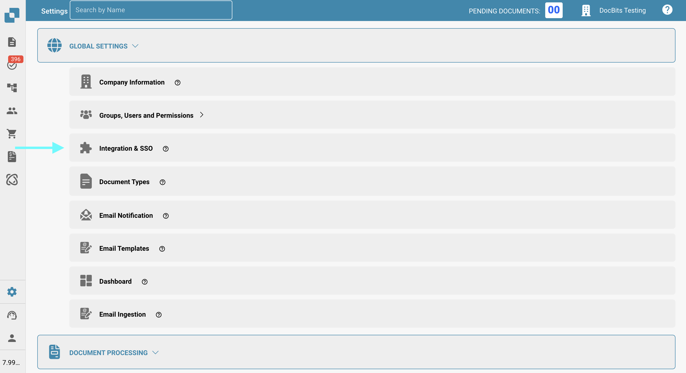<figcaption></figcaption></figure>
2.  You can either manually copy your **API key** or click the copy button to copy it to your clipboard.

    <figure>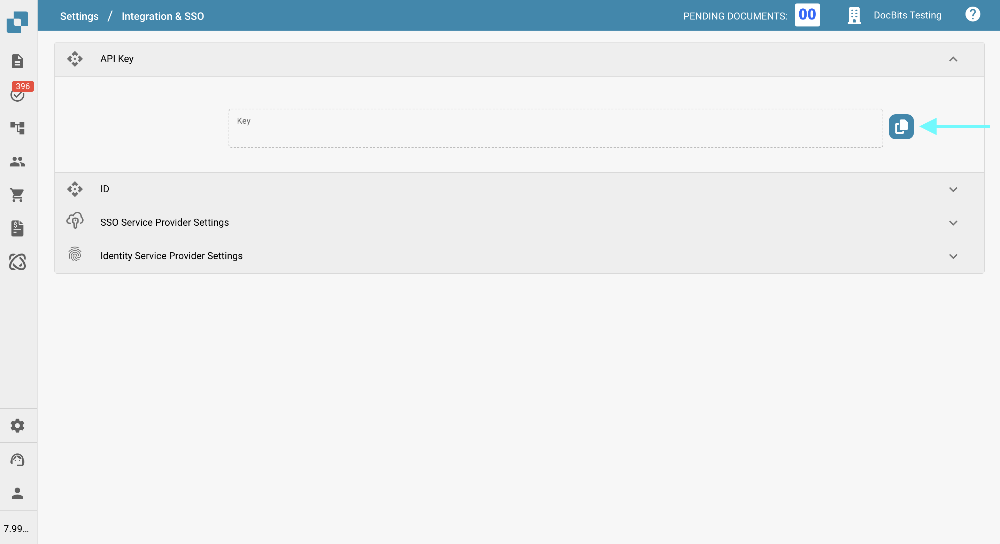<figcaption></figcaption></figure>

### **Downloading the BOD Mapping File**

1.  Go to **Settings → Document Processing → Export**.

    <figure>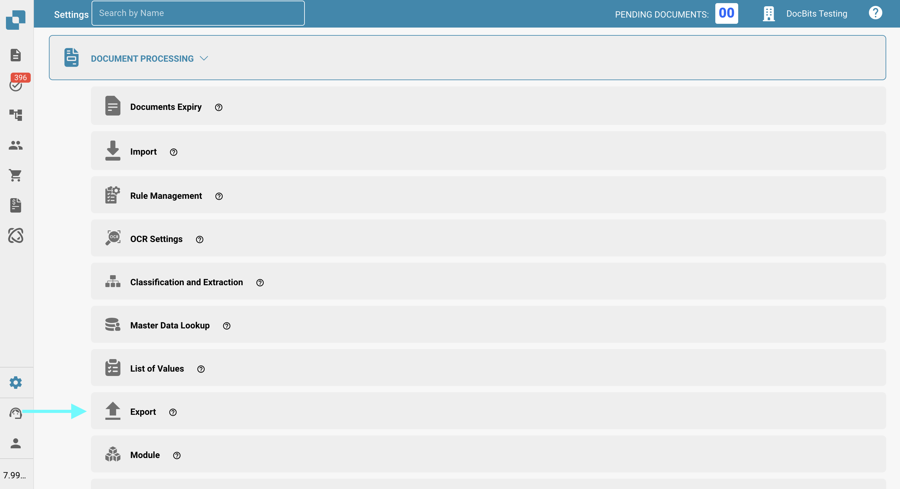<figcaption></figcaption></figure>
2.  In the **Actions** column of the relevant export entry, click the three-dot menu and select **Edit**.

    <figure>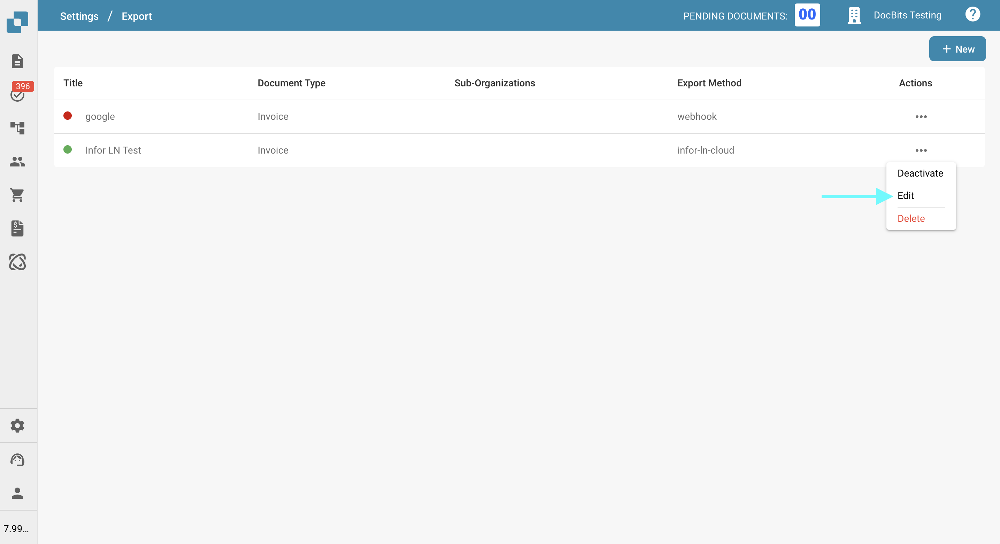<figcaption></figcaption></figure>
3.  Locate the **BOD Mapping File** and click the **Download** button to save it.

    <figure>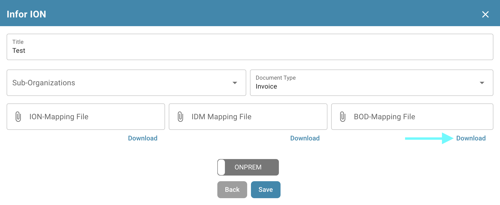<figcaption></figcaption></figure>

## Test the Endpoint in Postman

1.  **Paste the cURL Command in Postman**

    Open Postman and paste the following cURL command into the **Import** section. Postman will automatically configure the request.

    ```bash
    curl -X 'POST' \
      'https://api.docbits.com/prod-api/import/purchase_order_bod' \
      -H 'accept: application/json' \
      -H 'X-API-KEY:' \
      -H 'Content-Type: multipart/form-data' \
      -F 'org_id=' \
      -F 'sub_org_id=' \
      -F 'file=@file.xml;type=text/xml' \
      -F 'custom_fields_mapping='
    ```

    <figure>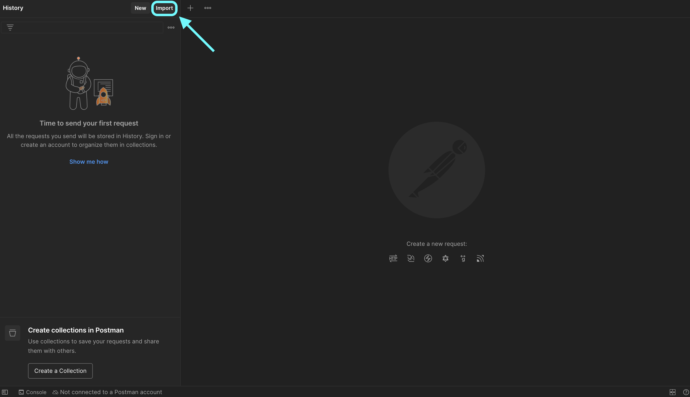<figcaption></figcaption></figure>

    <figure>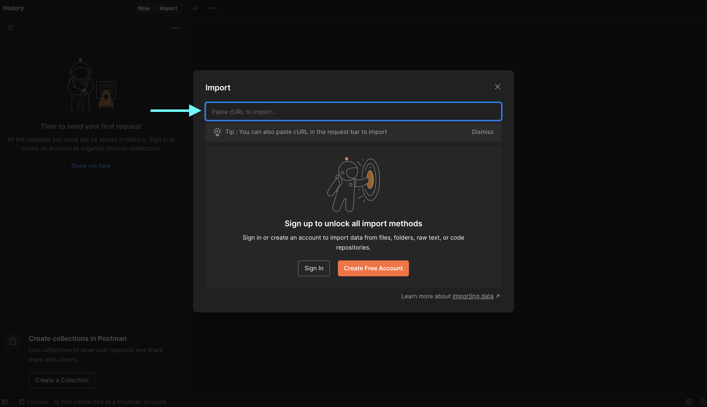<figcaption></figcaption></figure>
2.  **Set the API Key**\
    Go to the **Headers** tab, locate the `X-API-KEY` header, and paste your API key in the value field.

    <figure>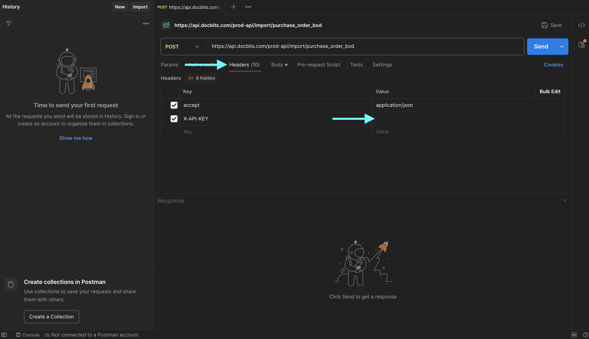<figcaption></figcaption></figure>
3.  **Upload the BOD File**\
    Go to the **Body** tab, make sure **form-data** is selected, then find the `file` field.\
    Click **Select Files** and upload your BOD XML file.

    <figure>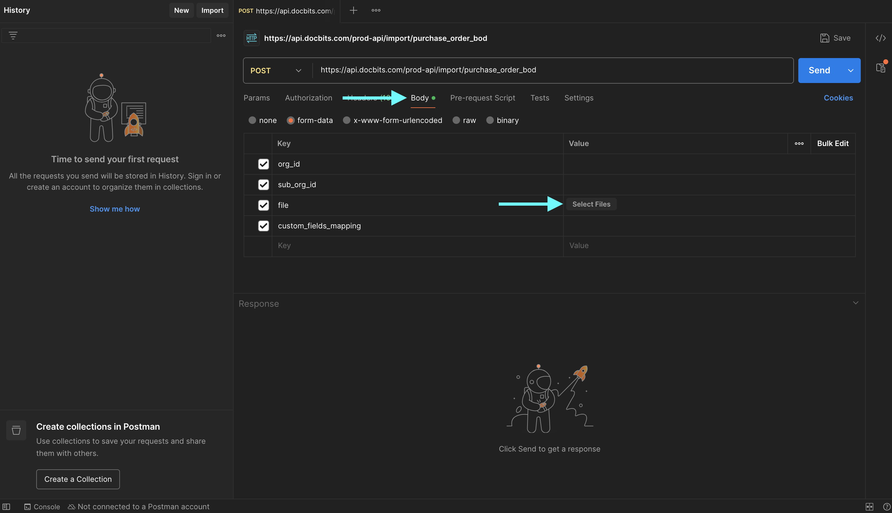<figcaption></figcaption></figure>
4.  **Send the Request**\
    Click **Send** to make the API call.

    <figure>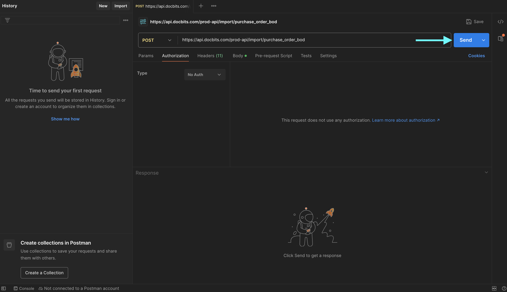<figcaption></figcaption></figure>
5.  **Verify the Response**\
    Check the response to confirm that your BOD was processed successfully.

    <figure>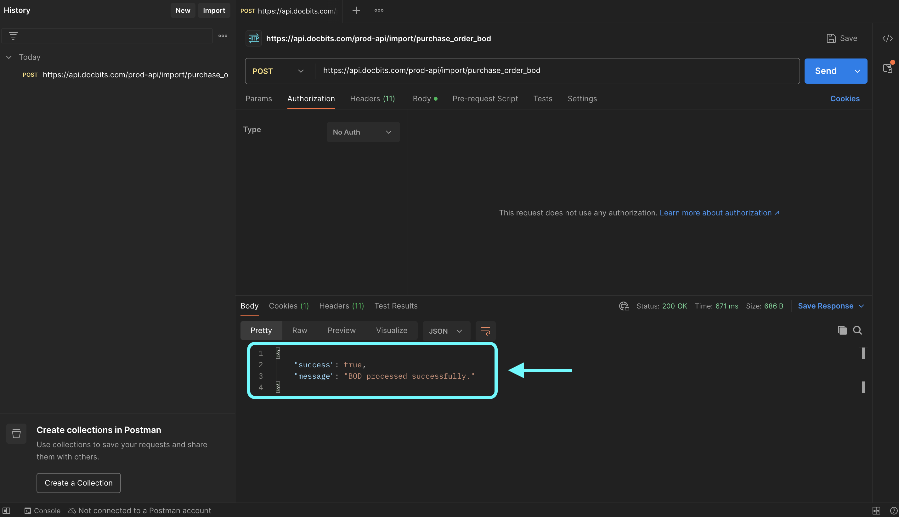<figcaption></figcaption></figure>
