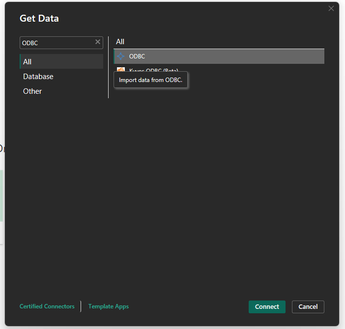
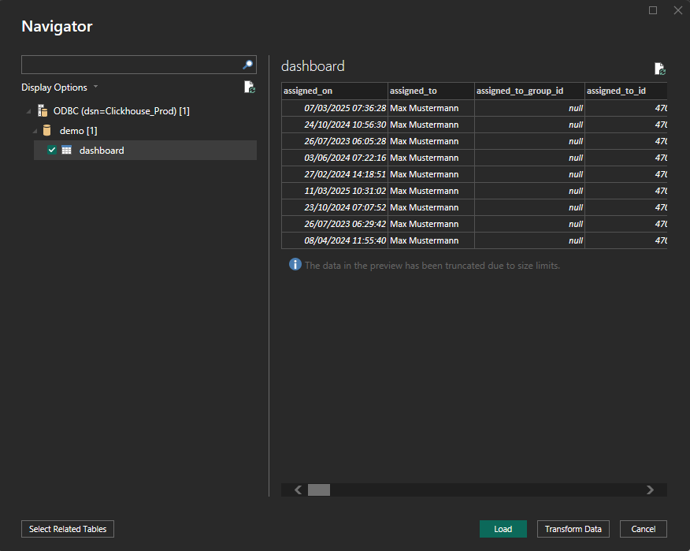

# Verbindung über ClickHouse

Wie man PowerBI konfiguriert

Dieser Leitfaden führt Sie durch die Verbindung von **ClickHouse** mit **Power BI Desktop** unter Verwendung des **ODBC-Treibers**. Es umfasst die Treiberinstallation, die ODBC-Konfiguration, die Integration von Power BI und die Einrichtung der Datenaktualisierung.

### 1. Installieren des ClickHouse ODBC-Treibers

* Laden Sie den neuesten **ClickHouse ODBC-Treiber** herunter von:
  * [ClickHouse GitHub - clickhouse-odbc](https://github.com/ClickHouse/clickhouse-odbc)
* Führen Sie den Installer aus und folgen Sie dem Einrichtungsassistenten.

### 2. Konfigurieren der ODBC-Datenquelle

* Öffnen Sie den **ODBC-Datenquellen-Administrator (64-Bit)** über die Systemsteuerung oder die Windows-Suche.
* Gehen Sie zum Register **System-DSN** und klicken Sie auf **Hinzufügen**.
* Wählen Sie **ClickHouse ODBC-Treiber** aus der Liste und klicken Sie auf **Fertig stellen**.
*   Füllen Sie die erforderlichen Felder aus. Sie finden die notwendigen Informationen unter:

    **DocBits** → **Einstellungen** → **Dokumentenverarbeitung** → **Modul** → **KI-Dashboard** → **Direkter Zugriff auf ClickHouse**

    

    **Erforderliche Felder:**

    * **Name**: Ein Name für die Verbindung (z. B. `ClickHouse_Prod`)
    * **Beschreibung**: Eine kurze Beschreibung für Ihre Referenz (optional)
    * **Host**: Kopieren Sie den Host-Wert von DocBits
    * **Port**: Kopieren Sie den Port-Wert von DocBits
    * **Datenbank**: Kopieren Sie den Datenbanknamen von DocBits
    * **Benutzername**: Kopieren Sie den Benutzernamen von DocBits
    * **Passwort**: Kopieren Sie das Passwort von DocBits

### 3. Verbindung von ClickHouse mit Power BI

* Öffnen Sie **Power BI Desktop**.
*   Wählen Sie **Daten abrufen** → **ODBC** → **Verbinden.**\

    <figure><figcaption></figcaption></figure>
*   Wählen Sie aus der DSN-Liste Ihre konfigurierte Quelle aus (z. B. `ClickHouse_Prod`).\

    <figure><figcaption></figcaption></figure>
* Klicken Sie auf **OK**. Geben Sie bei Bedarf erneut Anmeldeinformationen ein.

### 4. Daten laden und transformieren

* Im **Navigator**-Fenster durchsuchen und wählen Sie die Tabellen oder Ansichten zum Import aus.
* Wählen Sie:
  * **Laden**: um direkt zu importieren
  *   **Daten transformieren**: um Power Query für die Datenformung zu öffnen\

      <figure><figcaption></figcaption></figure>

### 5. Visualisieren Ihrer Daten

* Verwenden Sie die Berichtsfläche, um Visualisierungen zu erstellen.
* Ziehen Sie Felder, fügen Sie Filter hinzu, wählen Sie Diagrammtypen und verwenden Sie **DAX**-Ausdrücke nach Bedarf.
* Nutzen Sie den **Power Query Editor**, um Ihre ClickHouse-Daten zu bereinigen oder zu pivotieren, bevor Sie Visuals erstellen.
* PowerBI-Dokumentation: [https://learn.microsoft.com/en-us/power-bi/](https://learn.microsoft.com/en-us/power-bi/)

### 6. Geplante Aktualisierung aktivieren (Optional)

**Hinweis:** **Erfordert Power BI Pro oder Premium + Gateway**

* Um Ihre Berichte mit ClickHouse synchron zu halten:
* Veröffentlichen Sie Ihre `.pbix`-Datei in den **Power BI Service**.
* Installieren Sie das **Power BI Gateway** (Standardmodus) auf einem Rechner mit Netzwerkzugriff auf ClickHouse.
* In Power BI Service:
  * Gehen Sie zu Ihrem Datensatz → **Einstellungen** → **Geplante Aktualisierung**
  * Ordnen Sie Ihre DSN zu und geben Sie Anmeldeinformationen ein
* Weitere Informationen [hier](https://learn.microsoft.com/en-us/power-bi/connect-data/service-gateway-deployment-guidance).

### 7. Beispiel-Dashboards & Datenansichten

