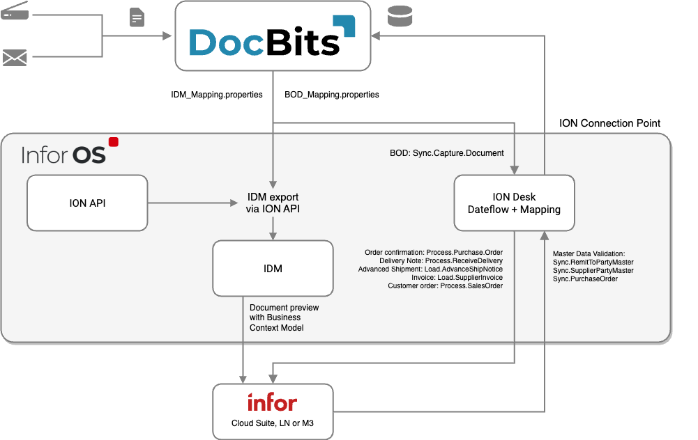

# Mimarlık

<figure><figcaption></figcaption></figure>

Doc**Bits**, Infor LN/M3 ile sorunsuz bir şekilde ION API, ION Desk ve Infor Standart BOD'lar aracılığıyla entegre olur. API entegrasyonumuz, verileri Infor'a aktarmamıza ve Doc**Bits** içinde ana veri doğrulaması yapmamıza olanak tanır.

## Verilerin Infor'a Aktarılması

PDF'yi özelliklerle birlikte IDM'ye göndermek için ION API'yi kullanıyoruz ve BOD Sync.CaptureDocument'ı ION Desk'e gönderiyoruz. ION Desk'te, işlenen belge türüne bağlı olarak [Sync.CaptureDocument](admin-section/setup/exporting-in-docbits/)ı istenen hedef BOD'lara dönüştürüyoruz. Bu dönüştürülen Infor BOD'ları daha sonra LN veya M3'e otomatik olarak aktarılır.


[Infor'a](admin-section/setup/exporting-in-docbits/exporting-to-infor/) Aktarım


## DocBits'te Ana Veri Doğrulaması

Tedarikçiyi tanımlamak veya satın alma sipariş satırlarını karşılaştırmak/eşleştirmek için, LN/M3'te Sync.RemitToPartyMaster, Sync.SupplierPartyMaster ve Sync.PurchaseOrder BOD'larını Doc**Bits**'e gönderen bir tetikleyiciyi etkinleştiriyoruz. Bu işlemi ION Desk'te, veri akışını Doc**Bits**'e belirli bir bağlantı noktasına tanımlayarak yapılandırıyoruz.

\
