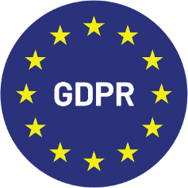

# Zertifizierungen

## 1. ISO/IEC 27001

<figure><figcaption></figcaption></figure>

Dieser internationale Standard definiert die Anforderungen für die Einrichtung, Implementierung, Aufrechterhaltung und kontinuierliche Verbesserung eines Informationssicherheits-Managementsystems (ISMS). Er hilft Organisationen, Daten auf systematische und kosteneffiziente Weise zu schützen, einschließlich Prozessen für Risikomanagement und Informationssicherheitskontrollen.

Auswirkungen für Kunden: Stellt sicher, dass DocBits die höchsten Standards der Informationssicherheit einhält und Vertrauen bietet, dass sensible Daten gut geschützt sind.

## 2. SOC 1 (Service Organization Control 1)

<figure><figcaption></figcaption></figure>

SOC 1-Berichte sind für Organisationen konzipiert, die die Wirksamkeit interner Kontrollen über die Finanzberichterstattung nachweisen müssen. Sie sind besonders relevant für Dienstleister, die die Finanzberichterstattung ihrer Kunden beeinflussen.

Relevanz für DocBits: Demonstriert unser Engagement für die Aufrechterhaltung strenger interner Kontrollen über Finanzdaten und bietet den Kunden Sicherheit über die Zuverlässigkeit unserer Prozesse.

## 3. SOC 2 (Service Organization Control 2)

<figure><figcaption></figcaption></figure>

SOC 2 konzentriert sich auf die Kontrollen einer Dienstleistungsorganisation, die für die Sicherheit, Verfügbarkeit, Integrität der Verarbeitung, Vertraulichkeit und den Datenschutz von Daten relevant sind. Es ist entscheidend für Technologie- und Cloud-Computing-Unternehmen, die mit sensiblen Informationen umgehen.

Wert für Kunden: Bietet eine unabhängige Validierung, dass DocBits effektive Kontrollen implementiert hat, um Kundendaten zu schützen, und gewährleistet die Vertrauenswürdigkeit unserer Software und Dienstleistungen.

## 4. GDPR (General Data Protection Regulation) Compliance

<figure><figcaption></figcaption></figure>

Die GDPR ist eine Verordnung im EU-Recht zum Datenschutz und zur Privatsphäre in der Europäischen Union und im Europäischen Wirtschaftsraum. Sie regelt auch die Übertragung personenbezogener Daten außerhalb der EU und EEA.

Kundensicherheit: Die Einhaltung der GDPR stellt sicher, dass DocBits personenbezogene Daten gemäß den EU-Vorschriften verarbeitet, die Privatsphäre der Nutzer schützt und strengen Richtlinien zur Datenverarbeitung folgt.
