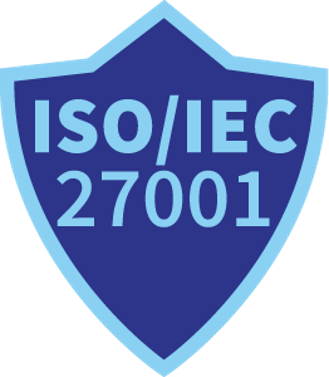

# Certificações

## 1. ISO/IEC 27001

<figure><figcaption></figcaption></figure>

Esta norma internacional define os requisitos para estabelecer, implementar, manter e melhorar continuamente um Sistema de Gestão de Segurança da Informação (SGSI). Ela ajuda as organizações a proteger dados de maneira sistemática e econômica, incluindo processos para gestão de riscos e controles de segurança da informação.

Impacto para os Clientes: Garante que a DocBits adere aos mais altos padrões de segurança da informação, proporcionando confiança de que dados sensíveis estão bem protegidos.

## 2. SOC 1 (Service Organization Control 1)

<figure><figcaption></figcaption></figure>

Os relatórios SOC 1 são projetados para organizações que precisam demonstrar a eficácia dos controles internos sobre relatórios financeiros. É particularmente relevante para prestadores de serviços que afetam os relatórios financeiros de seus clientes.

Relevância para a DocBits: Demonstra nosso compromisso em manter controles internos rigorosos sobre dados financeiros, proporcionando segurança aos clientes sobre a confiabilidade de nossos processos.

## 3. SOC 2 (Service Organization Control 2)

<figure><figcaption></figcaption></figure>

O SOC 2 foca nos controles de uma organização de serviços relevantes para segurança, disponibilidade, integridade de processamento, confidencialidade e privacidade dos dados. É crucial para empresas de tecnologia e computação em nuvem que lidam com informações sensíveis.

Valor para os Clientes: Fornece uma validação independente de que a DocBits implementou controles eficazes para proteger os dados dos clientes, garantindo a confiabilidade de nosso software e serviços.

## 4. GDPR (General Data Protection Regulation) Compliance

<figure><figcaption></figcaption></figure>

O GDPR é um regulamento na legislação da UE sobre proteção de dados e privacidade na União Europeia e no Espaço Econômico Europeu. Ele também aborda a transferência de dados pessoais para fora das áreas da UE e do EEE.

Garantia ao Cliente: A conformidade com o GDPR garante que a DocBits processa dados pessoais de acordo com as regulamentações da UE, protegendo a privacidade do usuário e aderindo a diretrizes rigorosas de manuseio de dados.
