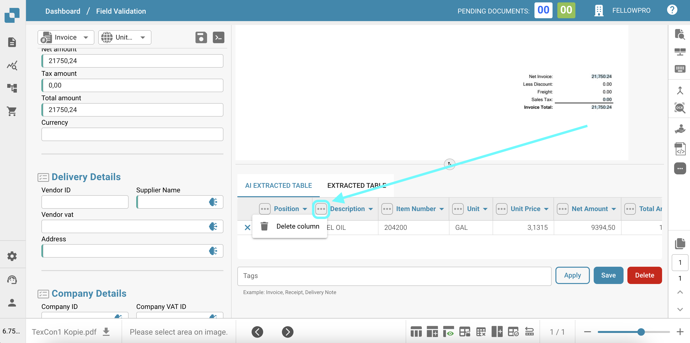
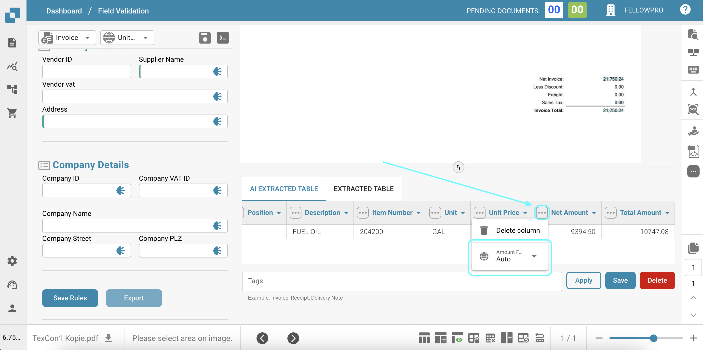
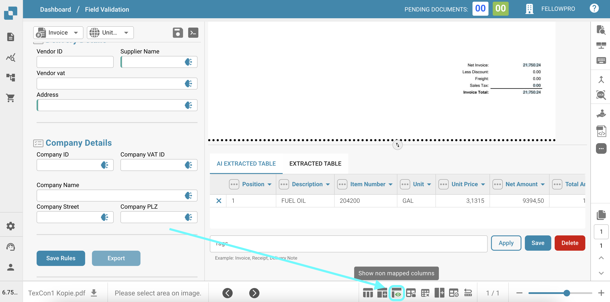
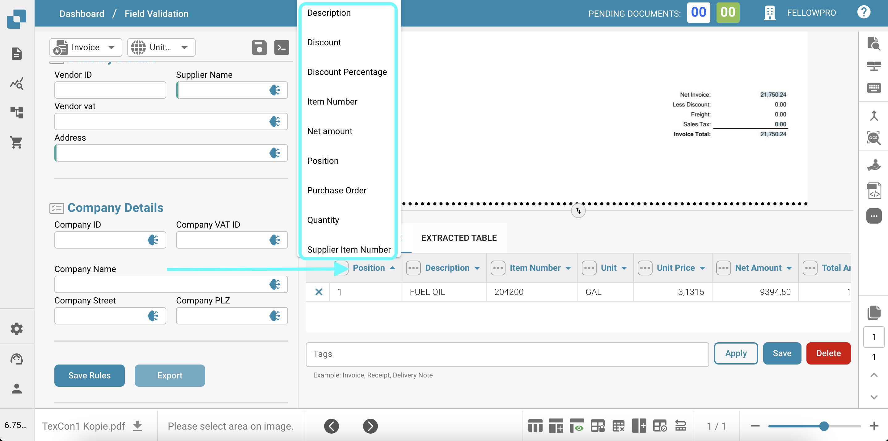

# Tabla AI

La función de Tabla Extraída por IA permite a los usuarios manipular y personalizar fácilmente los datos extraídos del documento de la factura. Aquí se presentan las capacidades clave y las instrucciones de uso:

* **Eliminar Columnas**: Si ciertas columnas en la tabla extraída no son necesarias, los usuarios pueden eliminarlas fácilmente haciendo clic en el icono "Eliminar columna" (representado por tres puntos verticales) junto al encabezado de la columna. Esto ayuda a limpiar la tabla y enfocarse solo en la información relevante.

<figure><figcaption></figcaption></figure>

* **Cambiar Formato de Moneda**: El formato de moneda se puede cambiar seleccionando el formato deseado en el menú desplegable junto al campo "Moneda". Esto asegura que los valores de la moneda se muestren en el formato preferido, facilitando su interpretación y análisis de los datos financieros.

<figure><figcaption></figcaption></figure>

* **Mostrar/Ocultar Columnas no Mapeadas**: Por defecto, solo las columnas mapeadas (columnas con datos extraídos) son visibles en la tabla. Sin embargo, los usuarios pueden optar por mostrar u ocultar las columnas no mapeadas haciendo clic en el botón "Ocultar columnas no mapeadas" o "Mostrar columnas no mapeadas" en la parte inferior de la tabla. Esta función es útil cuando los usuarios desean revisar todas las columnas disponibles, incluso si actualmente no contienen datos.

<figure><figcaption></figcaption></figure>

* **Cambiar Encabezados de la Tabla**: Los encabezados de la tabla (nombres de las columnas) se pueden modificar haciendo clic en el encabezado e ingresando el nombre deseado. Esta función permite a los usuarios personalizar los nombres de las columnas para que se ajusten mejor a su terminología o preferencias, haciendo que los datos sean más legibles y comprensibles.

<figure><figcaption></figcaption></figure>

Estas características brindan a los usuarios flexibilidad y control sobre los datos extraídos, lo que les permite adaptar la información según sus necesidades y preferencias específicas. La Tabla Extraída por IA tiene como objetivo mejorar la experiencia del usuario al ofrecer una forma fluida e intuitiva de interactuar y analizar los datos de la factura.
