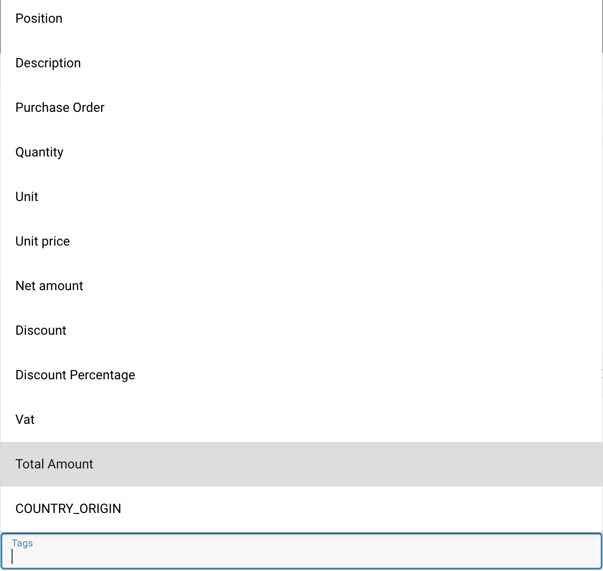

# Tags de Tabela de IA

### Instruções passo a passo sobre como adicionar tags a uma tabela:

**Passo 1:** Escolha os nomes das colunas (tags)

* **Selecione os nomes das colunas:** Revise os nomes das colunas da sua tabela e decida quais tags adicionar.

<figure><figcaption></figcaption></figure>

**Passo 2:** Pressione o botão "Aplicar"

* **Pressione o botão:** Depois de selecionar a tag apropriada para uma coluna, pressione o botão "Aplicar" ao lado da coluna e tag selecionadas.

**Passo 3:** Adicione a tag à tabela

* **Adicione a tag:** A tag selecionada será adicionada à tabela como uma coluna adicional ao lado da coluna correspondente.

<figure><figcaption></figcaption></figure>

**Passo 4:** Salvar ou Excluir Tag

* **Salvar Tag**: Pressione o botão Salvar para salvar a tag desejada
* **Excluir Tag:** Para excluir a tag selecionada, pressione o botão Excluir

### Aqui está uma explicação detalhada de cada coluna e as possíveis tags:

<figure><figcaption></figcaption></figure>

### **Posição:**

**Descrição:** Posição ou ordem do item dentro do pedido.

**Tag:** Inteiro

**Exemplo:** 1, 2, 3...

### **Descrição:**

**Descrição:** Breve descrição do item.

**Tag:** Texto

**Exemplo:** Parafuso, Porca, Widget...

### Pedido de Compra:

**Descrição:** O número do pedido associado.

**Tag:** Alfanumérico

**Exemplo:** PO12345, PO98765...

### Quantidade:

**Descrição:** Número de unidades solicitadas.

**Tag:** Número

**Exemplo:** 100, 50, 200...

### Unidade:

**Descrição:** Unidade de medida (por exemplo, peça, quilograma).

**Tag:** Texto

**Exemplo:** Pçs, kg, l...

### Preço Unitário:

**Descrição:** Preço por unidade do item.

**Tag:** Moeda

**Exemplo:** €10,00, €5,50, €100,00...

### Valor Líquido:

**Descrição:** Preço total antes de deduções e impostos (calculado como quantidade \* preço unitário).

**Tag:** Moeda

**Exemplo:** €1.000,00, €275,00, €10.000,00...

### Desconto:

**Descrição:** Valor absoluto do desconto aplicado ao valor líquido.

**Tag:** Moeda

**Exemplo:** €50,00, €20,00, €500,00...

### Percentual de Desconto:

**Descrição:** Percentual de desconto aplicado ao valor líquido.

**Tag:** Percentagem

**Exemplo:** 5%, 10%, 15%...

### IVA:

**Descrição:** Valor do IVA aplicado ao item.

**Tag:** Moeda

**Exemplo:** €200,00, €55,00, €1.900,00...

### Valor Total:

**Descrição**: Valor final após o desconto ser deduzido e o IVA ser adicionado.

**Tag:** Moeda

**Exemplo:** €1.150,00, €310,00, €11.400,00...

### País de Origem:

**Descrição:** País onde o item foi fabricado ou enviado.

**Tag:** Texto

**Exemplo:** EUA, Alemanha, China...

### Número do Item:

**Descrição:** Identificador único ou SKU para o item.

**Tag:** Alfanumérico

**Exemplo:** 987654, A12345, Z98765...

### Número da Nota de Entrega:

**Descrição:** Número da nota de entrega associada.

**Tag:** Alfanumérico

**Exemplo:** DN56789, DN12345...

### Frase (informações adicionais):

**Descrição:** Comentários adicionais, códigos ou informações relevantes.

**Tag:** Texto

**Exemplo:** Comentário, Especificação...

Com essa estrutura e tags, a tabela é mais claramente definida e as informações podem ser melhor categorizadas e processadas.
