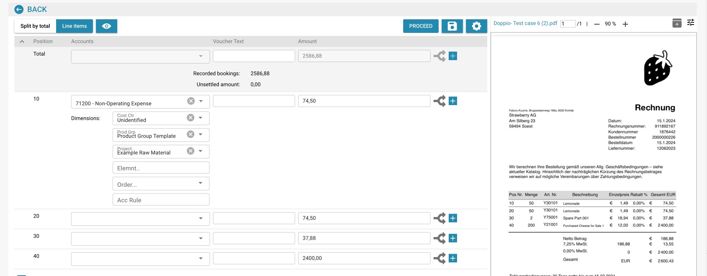

# Comptabilité pour les factures de coûts et les ventes indirectes

## Introduction

Bienvenue dans le module de Comptabilisation des Factures de Coût et des Ventes Indirectes ! Ce module est conçu pour vous aider à gérer et à rapprocher efficacement vos transactions financières au sein de votre système ERP. Avec des fonctionnalités telles que l'extraction automatique de données, la correspondance de documents et le suivi détaillé, vous pouvez vous assurer que vos dossiers financiers sont précis et à jour.

<figure><figcaption></figcaption></figure>

## Commencer

Pour commencer à utiliser le module de comptabilité, assurez-vous que votre administrateur système a configuré les autorisations nécessaires. Vous aurez besoin d'accéder aux modules de comptabilité analytique et de comptabilité des ventes au sein du système ERP.

## Exigences du Système

* Accès aux modules de comptabilité analytique et de comptabilité des ventes au sein du système ERP.
* Permissions utilisateur appropriées pour visualiser et traiter les documents financiers.

## Fonctionnalités Clés

1. **Extraction Automatique de Données** : Extrait et interprète automatiquement les données des factures numériques et d'autres documents.
2. **Comparaison de Données** : Compare les données extraites des factures avec les données existantes des bons de commande.
3. **Vérification de Correspondance** : Vérifie les correspondances basées sur des règles et tolérances prédéfinies.
4. **Rapport de Discrepances** : Identifie et rapporte toute divergence entre les factures et les bons de commande.
5. **Piste d'Audit** : Maintient un journal de toutes les actions pour la conformité et la révision.
6. **Formation de Documents** : Formez le système à reconnaître de nouveaux documents avec un minimum d'effort, généralement une seule fois.
7. **Répartition des Montants** : Répartissez les montants par département pour un suivi financier détaillé.
8. **Définition du Compte de Grand Livre** : L'équipe APS (Système de Comptabilité et d'Approvisionnement) peut définir le compte de grand livre une fois les données extraites.

## Interface Utilisateur

L'interface du module de comptabilité comprend généralement les composants suivants :

* **Tableau de Bord** : Vue d'ensemble de l'état des factures et des ventes, et activité récente.
* **Outils de Recherche et de Filtrage** : Capacités de recherche et de filtrage des factures et des enregistrements de ventes.
* **Enregistrements Correspondants** : Section affichant les enregistrements correspondants avec succès.
* **Discrepances** : Section montrant les enregistrements avec des divergences nécessitant une révision ou une action.
* **Rapports** : Accès à des rapports détaillés et options d'exportation.

## Guide Étape par Étape pour Utiliser le Module de Comptabilité

### 1. Accéder au Module de Comptabilité

Naviguez vers le module de comptabilité depuis le menu principal de votre système ERP.

### 2. Importer ou Accéder aux Factures

* **Importation Automatisée** : Si votre système est configuré pour la capture de données automatisée, les factures seront importées automatiquement dans le système.
* **Téléchargement Manuel** : Si nécessaire, téléchargez manuellement les fichiers de factures dans le système en utilisant l'interface fournie.

### 3. Examiner les Factures Correspondantes Automatiquement

* Examinez les factures qui ont été automatiquement associées aux bons de commande.
* Vérifiez les détails de la correspondance, y compris les numéros d'article, les quantités et les prix.

### 4. Gérer les Discrepances

* Accédez à la section Discrepances pour examiner les factures qui n'ont pas pu être automatiquement associées.
* Ajustez manuellement les quantités ou les prix si nécessaire, ou signalez la facture pour une révision plus approfondie.

### 5. Correspondance Manuelle

Pour les factures non associées automatiquement :

* Utilisez les outils de recherche et de filtrage pour trouver le bon de commande correspondant.
* Vérifiez et associez manuellement la facture au bon de commande.

### 6. Former le Système

* Pour les nouveaux types de documents, formez le système à les reconnaître en fournissant un échantillon.
* En général, vous n'avez besoin de former le système qu'une seule fois pour qu'il reconnaisse avec précision des documents similaires à l'avenir.

### 7. Enregistrer les Réservations

* Naviguez vers l'onglet "Articles de ligne" pour visualiser et enregistrer les réservations pour chaque facture.
* Allouez les montants aux comptes appropriés, centres de coûts et dimensions spécifiques à Infor LN/M3.

**Exemple : Enregistrer une Facture de Coût**

1. **Sélectionner l'Article de Ligne** : Choisissez l'article de ligne pour la facture de coût.
2. **Attribuer le Compte** : Attribuez le compte approprié, tel que "71200 - Dépense Non Opérationnelle".
3. **Définir les Dimensions** : Définissez des dimensions supplémentaires comme le centre de coûts, le groupe de produits et le projet.
4. **Répartir le Montant** : Si nécessaire, répartissez le montant par département pour un suivi plus détaillé.
5. **Entrer le Montant** : Entrez le montant pour l'article de ligne.

### 8. Définir les Comptes de Grand Livre

* Une fois les données extraites, l'équipe APS peut définir les comptes de grand livre.
* Cela garantit que chaque transaction est enregistrée sous le bon compte pour un rapport financier précis.

### 9. Générer des Rapports

* Accédez à la section "Rapports" pour générer des rapports détaillés sur les transactions financières.
* Utilisez les options d'exportation pour enregistrer les rapports pour une analyse plus approfondie ou pour la tenue de dossiers.

### Exemple d'Utilisation

1. **Téléchargement de Documents** : Les utilisateurs peuvent télécharger divers documents (factures, bons de livraison, etc.) dans le système.
2. **Correspondance Automatique** : Le système associe automatiquement les documents téléchargés aux bons de commande existants.
3. **Examen des Correspondances** : Les utilisateurs peuvent examiner les correspondances, vérifier les détails et voir les indicateurs de statut.
4. **Résolution des Discrepances** : Toute non-concordance ou divergence est mise en évidence pour que l'utilisateur puisse la réviser et la corriger manuellement.
5. **Exportation de Données** : Les données correspondantes peuvent être exportées pour un traitement ultérieur ou pour la tenue de dossiers.
