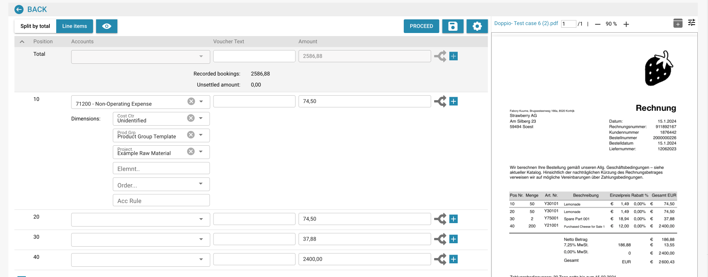

# Contabilità per fattura di costo e vendite indirette

## Introduzione

Benvenuti nel modulo di Contabilità per Fatture di Costo e Vendite Indirette! Questo modulo è progettato per aiutarti a gestire e riconciliare efficacemente le tue transazioni finanziarie all'interno del tuo sistema ERP. Con funzionalità come l'estrazione automatica dei dati, l'abbinamento dei documenti e il monitoraggio dettagliato, puoi garantire che i tuoi registri finanziari siano accurati e aggiornati.

<figure><figcaption></figcaption></figure>

## Iniziare

Per iniziare a utilizzare il modulo di contabilità, assicurati di avere i permessi necessari impostati dal tuo amministratore di sistema. Avrai bisogno di accesso sia ai moduli di contabilità dei costi che a quelli di contabilità delle vendite all'interno del sistema ERP.

## Requisiti di Sistema

* Accesso ai moduli di contabilità dei costi e contabilità delle vendite all'interno del sistema ERP.
* Permessi utente appropriati per visualizzare e processare documenti finanziari.

## Caratteristiche Principali

1. **Estrazione Automatica dei Dati**: Estrae e interpreta automaticamente i dati da fatture digitali e altri documenti.
2. **Confronto Dati**: Confronta i dati delle fatture estratti con i dati degli ordini di acquisto esistenti.
3. **Verifica degli Abbinamenti**: Verifica gli abbinamenti basati su regole e tolleranze predefinite.
4. **Segnalazione delle Discrepanze**: Identifica e segnala eventuali discrepanze tra fatture e ordini di acquisto.
5. **Tracciabilità**: Mantiene un registro di tutte le azioni per conformità e revisione.
6. **Addestramento dei Documenti**: Addestra il sistema a riconoscere nuovi documenti con il minimo sforzo, tipicamente solo una volta.
7. **Suddivisione degli Importi**: Suddivide gli importi per dipartimento per un monitoraggio finanziario dettagliato.
8. **Definizione del Conto di Mastro**: Il team APS (Sistema di Contabilità e Approvvigionamento) può definire il conto di mastro una volta che i dati sono estratti.

## Interfaccia Utente

L'interfaccia del modulo di contabilità include tipicamente i seguenti componenti:

* **Dashboard**: Panoramica dello stato delle fatture e delle vendite, e attività recenti.
* **Strumenti di Ricerca e Filtro**: Capacità di cercare e filtrare fatture e registri di vendita.
* **Registri Abbinati**: Sezione che mostra i registri abbinati con successo.
* **Discrepanze**: Sezione che mostra i registri con discrepanze che necessitano di revisione o azione.
* **Report**: Accesso a report dettagliati e opzioni di esportazione.

## Guida Passo-Passo all'Uso del Modulo di Contabilità

### 1. Accedi al Modulo di Contabilità

Naviga al modulo di contabilità dal menu principale del tuo sistema ERP.

### 2. Importa o Accedi alle Fatture

* **Importazione Automatica**: Se il tuo sistema è configurato per la cattura automatica dei dati, le fatture verranno importate automaticamente nel sistema.
* **Caricamento Manuale**: Se necessario, carica manualmente i file delle fatture nel sistema utilizzando l'interfaccia fornita.

### 3. Rivedi le Fatture Abbinati Automaticamente

* Rivedi le fatture che sono state abbinate automaticamente con gli ordini di acquisto.
* Verifica i dettagli dell'abbinamento, inclusi numeri di articolo, quantità e prezzi.

### 4. Gestisci le Discrepanze

* Accedi alla sezione Discrepanze per rivedere eventuali fatture che non sono state abbinate automaticamente.
* Regola manualmente le quantità o i prezzi se necessario, o segnala la fattura per ulteriori revisioni.

### 5. Abbinamento Manuale

Per le fatture non abbinate automaticamente:

* Usa gli strumenti di ricerca e filtro per trovare l'ordine di acquisto corrispondente.
* Verifica e abbina manualmente la fattura all'ordine di acquisto.

### 6. Addestra il Sistema

* Per nuovi tipi di documenti, addestra il sistema a riconoscerli fornendo un campione.
* Tipicamente, devi addestrare il sistema solo una volta affinché riconosca accuratamente documenti simili in futuro.

### 7. Registra le Prenotazioni

* Naviga alla scheda "Voci di riga" per visualizzare e registrare le prenotazioni per ciascuna fattura.
* Assegna gli importi ai conti appropriati, centri di costo e dimensioni specifiche per Infor LN/M3.

**Esempio: Registrazione di una Fattura di Costo**

1. **Seleziona Voce di Riga**: Scegli la voce di riga per la fattura di costo.
2. **Assegna Conto**: Assegna il conto appropriato, come "71200 - Spese Non Operative".
3. **Imposta Dimensioni**: Imposta dimensioni aggiuntive come centro di costo, gruppo di prodotto e progetto.
4. **Suddividi Importo**: Se necessario, suddividi l'importo per dipartimento per un monitoraggio più dettagliato.
5. **Inserisci Importo**: Inserisci l'importo per la voce di riga.

### 8. Definisci i Conti di Mastro

* Una volta che i dati sono estratti, il team APS può definire i conti di mastro.
* Questo assicura che ogni transazione sia registrata sotto il conto corretto per una rendicontazione finanziaria accurata.

### 9. Genera Report

* Accedi alla sezione "Report" per generare report dettagliati sulle transazioni finanziarie.
* Usa le opzioni di esportazione per salvare i report per ulteriori analisi o registrazioni.

### Esempio di Utilizzo

1. **Caricamento Documenti**: Gli utenti possono caricare vari documenti (fatture, note di consegna, ecc.) nel sistema.
2. **Abbinamento Automatico**: Il sistema abbina automaticamente i documenti caricati con gli ordini di acquisto esistenti.
3. **Revisione degli Abbinamenti**: Gli utenti possono rivedere gli abbinamenti, verificare i dettagli e vedere gli indicatori di stato.
4. **Risoluzione delle Discrepanze**: Eventuali disallineamenti o discrepanze sono evidenziati per la revisione e correzione manuale da parte dell'utente.
5. **Esportazione dei Dati**: I dati abbinati possono essere esportati per ulteriori elaborazioni o registrazioni.
