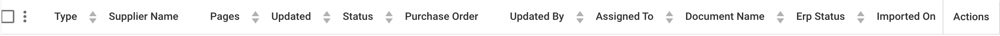
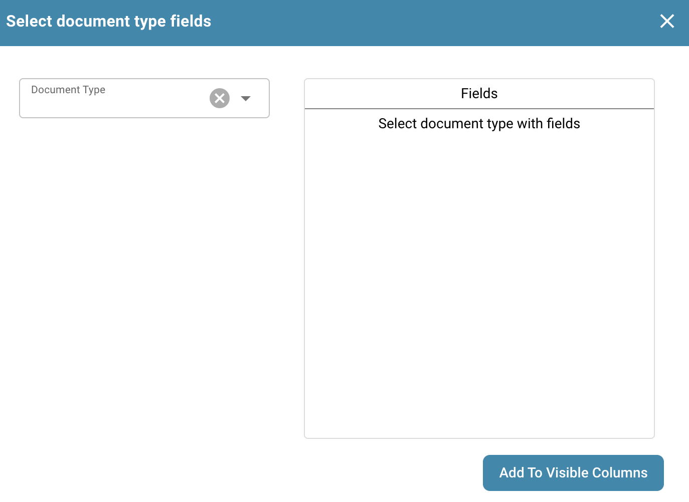
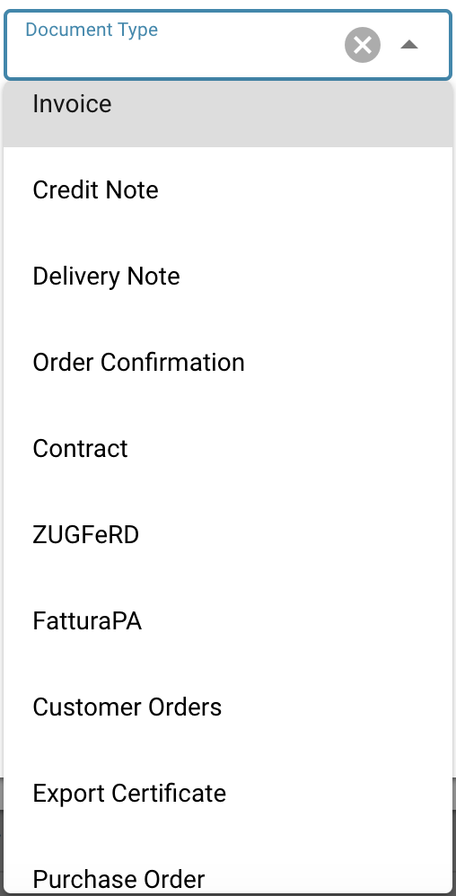
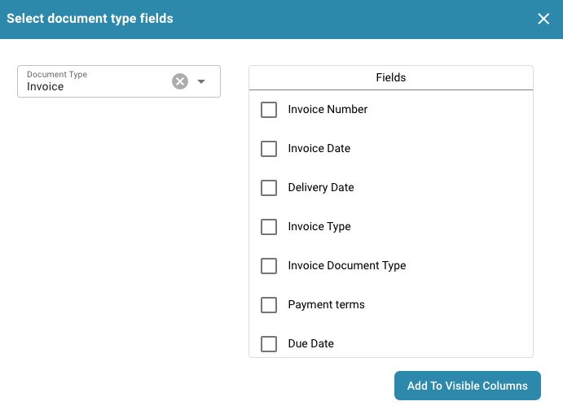

# Alterar Colunas do Documento

No Painel de Controle, clique no ícone de Configurações Avançadas conforme mostrado abaixo:

<figure><figcaption></figcaption></figure>

O seguinte menu será exibido:

Selecione o botão rotulado “Definir colunas do painel para a organização” e uma lista de todos os nomes de colunas será exibida.

Neste menu, você pode selecionar os nomes das colunas e usar as setas para adicionar e remover as colunas desejadas.

<figure><figcaption></figcaption></figure>

Você pode definir a ordem das colunas clicando nos pontos ao lado do nome da coluna e arrastando-os para a posição apropriada.

Outra opção também permite que você adicione campos de um tipo de documento:

<figure><figcaption></figcaption></figure>

<figure><figcaption></figcaption></figure>

Aqui você pode escolher entre os diferentes tipos de documentos:

<figure><figcaption></figcaption></figure>

Para cada tipo de documento, há diferentes campos que você pode adicionar:

<figure><figcaption></figcaption></figure>

Selecione os campos que você precisa e clique em "Adicionar às Colunas Visíveis", eles então aparecerão nas configurações de coluna.

<figure><figcaption></figcaption></figure>

<figure><figcaption></figcaption></figure>

