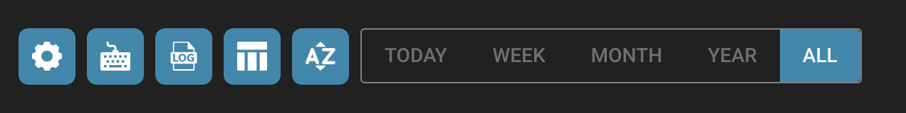

# Dashboard-Tools

Rechts neben der Suchleiste finden Sie weitere Dashboard-Werkzeuge.

<figure><figcaption></figcaption></figure>

* Aktualisieren der Liste: Dies wird verwendet, um das Dashboard zu aktualisieren, ohne Ihren Browser-Tab neu laden zu müssen.
* Erweiterte Einstellungen: Weitere Informationen zu diesem Thema finden Sie weiter unten auf dieser Seite.
* Analytik: Dies bietet Ihnen weitere Einblicke in die Dokumente, die Sie in DocBits hochgeladen haben.
* Hochladen: Weitere Informationen zu diesem Thema im nächsten Abschnitt.

<figure><figcaption></figcaption></figure>

Die erweiterten Einstellungen enthalten oft zusätzliche Konfigurationsoptionen und Funktionen, die spezifischere Anpassungen und Feinabstimmungen ermöglichen.

<figure><figcaption></figcaption></figure>

* Weitere Einstellungen
* Tastenkombinationen
* Importprotokoll
* PO-Tabellenspalten für die Organisation festlegen
* Dashboard-Sortierung nach Organisation festlegen
* Dokumente nach Tag, Woche, Monat, Jahr oder allen filtern. Die Filterung bezieht sich auf den Zeitpunkt, zu dem das Dokument importiert wird.

Auf den nächsten Seiten finden Sie weitere Informationen zu den einzelnen Einstellungen.

<figure><figcaption></figcaption></figure>
