# Strumenti della scheda

A destra della barra di ricerca, troverai alcuni strumenti della scheda.

<figure>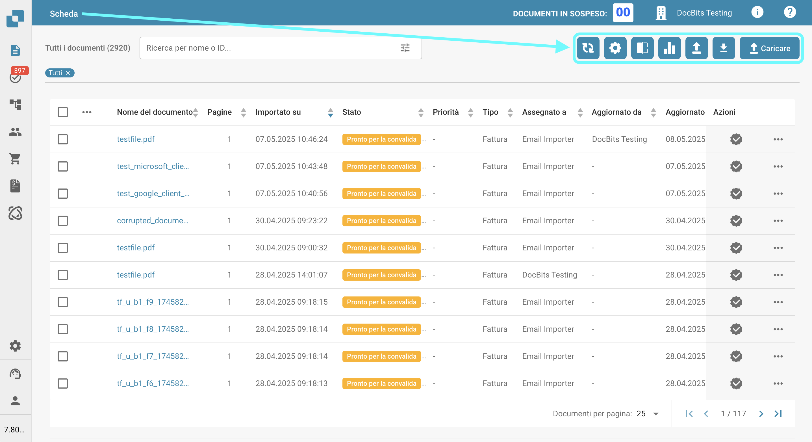<figcaption></figcaption></figure>

## Aggiornare la tabella

Clicca questo pulsante per aggiornare la scheda e caricare i dati e gli stati più aggiornati.

<figure><figcaption></figcaption></figure>

## Impostazioni avanzate

Clicca sull'icona dell'ingranaggio per aprire il menu delle Impostazioni avanzate.

<figure>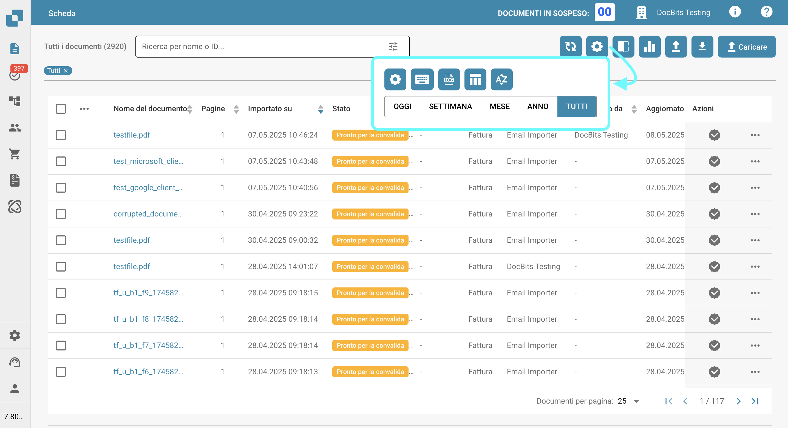<figcaption></figcaption></figure>

Nel menu delle Impostazioni avanzate saranno disponibili le seguenti opzioni:

### Altre impostazioni

Usa questo pulsante per accedere alle Impostazioni Admin per la scheda. La documentazione completa per queste impostazioni può essere trovata [qui](../../../administration-and-setup/settings/global-settings/dashboard/).

<figure><figcaption></figcaption></figure>

### Scorciatoie da tastiera

Usa questo pulsante per visualizzare tutte le scorciatoie da tastiera per la scheda. Spiegazioni dettagliate per ogni scorciatoia possono essere trovate [qui](keyboard-shortcuts.md).

<figure><figcaption></figcaption></figure>

### Importazione del registro

Usa questo pulsante per aprire una tabella che mostra tutti i documenti recentemente importati via email, insieme alle informazioni pertinenti per ciascuno.

<figure><figcaption></figcaption></figure>

<figure>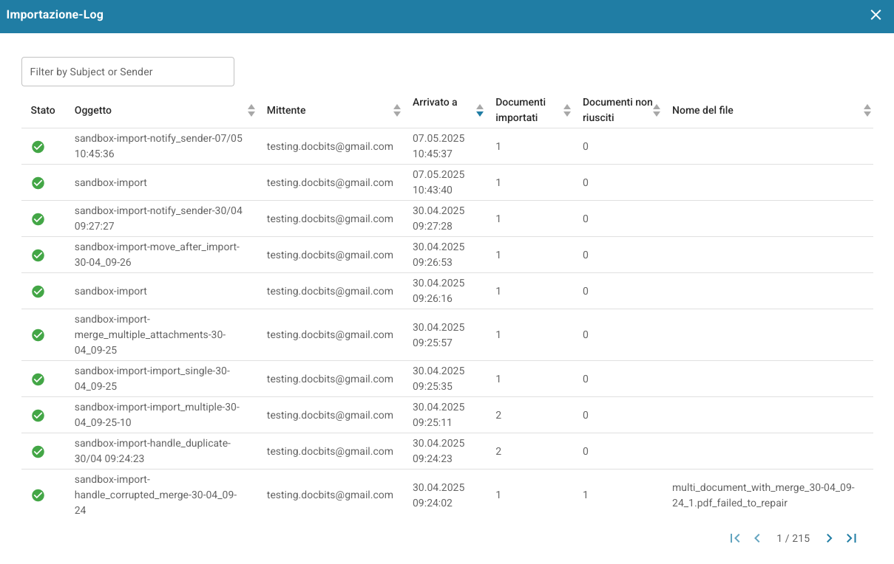<figcaption></figcaption></figure>

Puoi filtrare i registri per oggetto o mittente, ordinare le colonne in ordine crescente o decrescente cliccando sulle intestazioni delle colonne e riordinarle usando il drag-and-drop.

### Impostare le colonne della tabella per l'organizzazione

<figure><figcaption></figcaption></figure>

Clicca questo pulsante per aprire un menu dove puoi gestire la visibilità delle colonne della scheda. Seleziona i nomi delle colonne e usa le frecce per aggiungerle o rimuoverle dalla vista della scheda. Clicca 'Fatto' per salvare le tue modifiche.

<figure>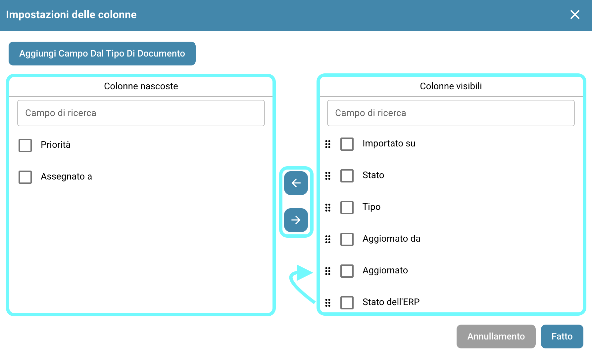<figcaption></figcaption></figure>

Puoi impostare l'ordine delle colonne cliccando sui punti accanto a un nome di colonna e trascinandolo nella posizione desiderata.

#### Aggiungi campo dal tipo di documento come colonne nella scheda.

Hai anche l'opzione di aggiungere colonne aggiuntive da campi specifici di tipi di documenti specifici per personalizzare la vista della tua scheda. Per fare ciò, basta cliccare 'Aggiungi campo dal tipo di documento'.

<figure>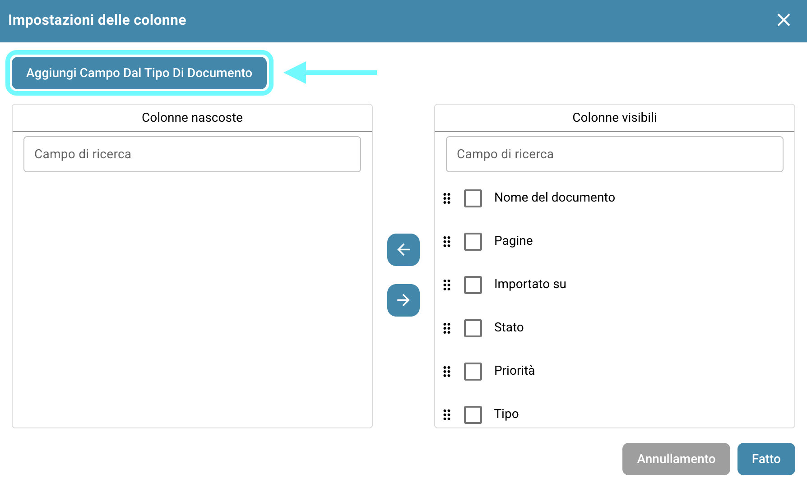<figcaption></figcaption></figure>

Scegli un tipo di documento per vedere quali campi sono disponibili per il tipo selezionato. Per ogni tipo di documento ci sono diversi campi che puoi aggiungere. Puoi cercare un campo specifico usando la barra di ricerca in alto.

<figure>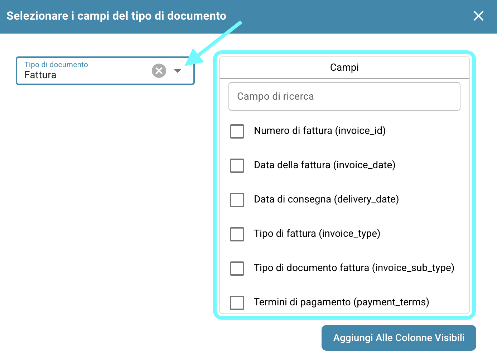<figcaption></figcaption></figure>

Seleziona i campi che desideri visualizzare come colonne, quindi clicca 'Aggiungi alle colonne visibili'. I campi selezionati appariranno come colonne sulla scheda, mostrando i loro valori corrispondenti.

### Impostare l'ordinamento del dashboard per l'organizzazione

<figure><figcaption></figcaption></figure>

<figure>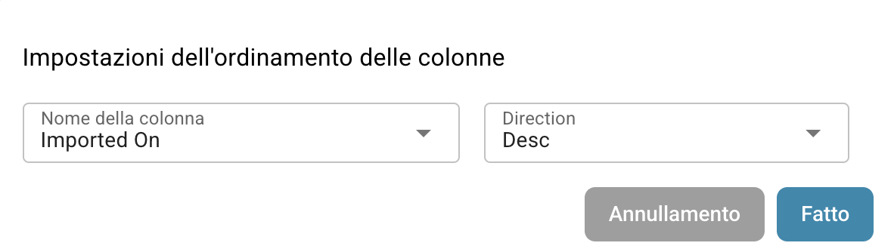<figcaption></figcaption></figure>

Usa questo pulsante per impostare l'ordine di ordinamento predefinito per le colonne nella scheda. Seleziona la colonna e scegli l'ordine di ordinamento (crescente o decrescente), quindi clicca 'Fatto'. Puoi configurare l'ordinamento per tutte le colonne attive nella scheda.

### Filtrare i documenti

Puoi filtrare i documenti per giorno, settimana, mese, anno, o visualizzare tutti cliccando sul periodo di tempo desiderato. Il filtraggio si basa sul tempo di importazione del documento.

<figure>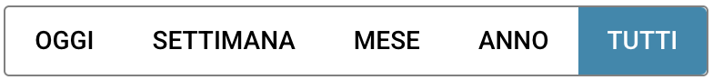<figcaption></figcaption></figure>

## Scansione dei documenti

Usa questo pulsante per scansionare un documento direttamente.

<figure><figcaption></figcaption></figure>

<figure>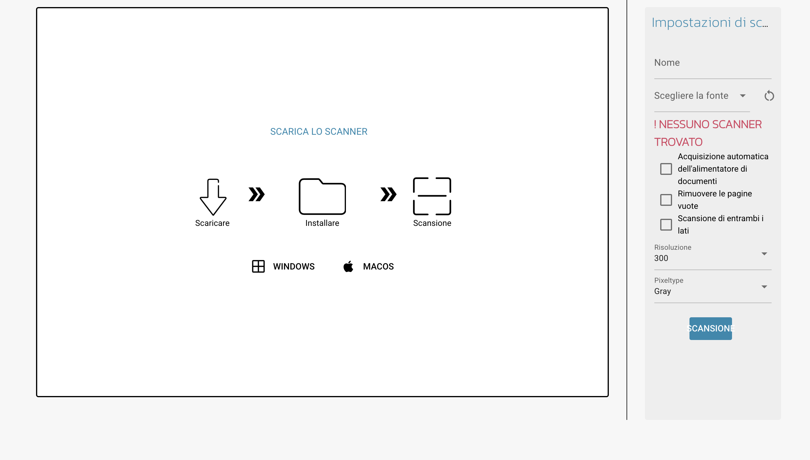<figcaption></figcaption></figure>

Per utilizzare questa funzione, è necessario avere uno scanner collegato al sistema. Se uno scanner è disponibile, puoi selezionarlo a destra, nominare il tuo documento e cliccare 'Scansione'. Facoltativamente, puoi regolare le impostazioni di scansione a destra prima di avviare il processo.

<mark style="color:red;">**Nota:**</mark> Questa funzione deve essere attivata sotto _**Impostazioni -> Elaborazione dei documenti/Modulo -> Tipi di documenti/Scansione dei documenti**_

<figure>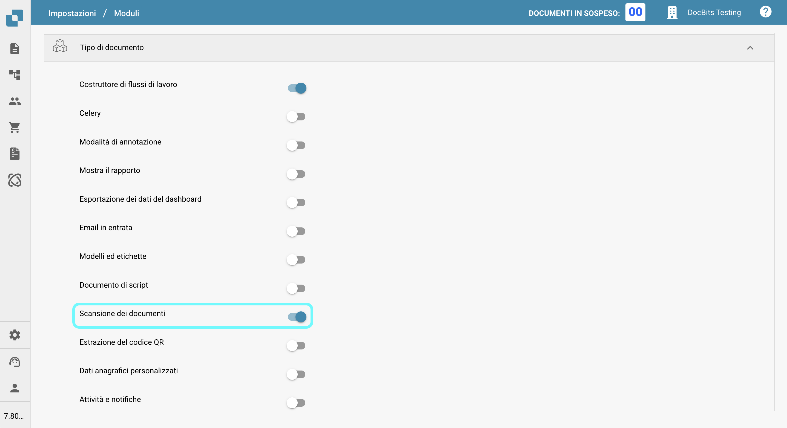<figcaption></figcaption></figure>

## Analisi

Cliccando su questo pulsante verrà visualizzata una nuova area che mostra il conteggio attuale dei documenti in ciascuna categoria.

<figure><figcaption></figcaption></figure>

<figure>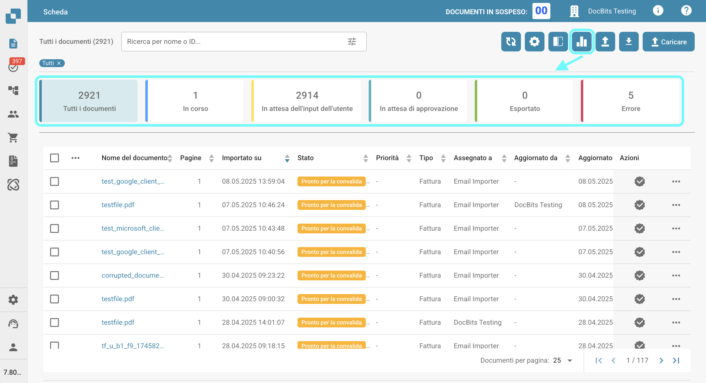<figcaption></figcaption></figure>

Clicca su qualsiasi categoria per filtrare i documenti per quella specifica categoria.

## Avviare l'importazione di e-mail

Cliccando su questo pulsante verrà controllata la tua casella di posta elettronica, secondo la configurazione dell'importazione delle e-mail, e verranno importati eventuali nuovi documenti.

<figure><figcaption></figcaption></figure>

## Esportazione della tabella

Usa questo pulsante per esportare tutti i documenti attualmente visualizzati sulla scheda, in base al numero di documenti mostrati per pagina.

<figure><figcaption></figcaption></figure>

<mark style="color:red;">**Nota:**</mark> Questa funzione deve essere attivata sotto _**Impostazioni -> Elaborazione dei documenti/Modulo -> Tipi di documenti/Esportazione dei dati del dashboard**_

<figure><figcaption></figcaption></figure>

## Caricare

Clicca questo pulsante per caricare manualmente uno o più file.

<figure><figcaption></figcaption></figure>

<figure>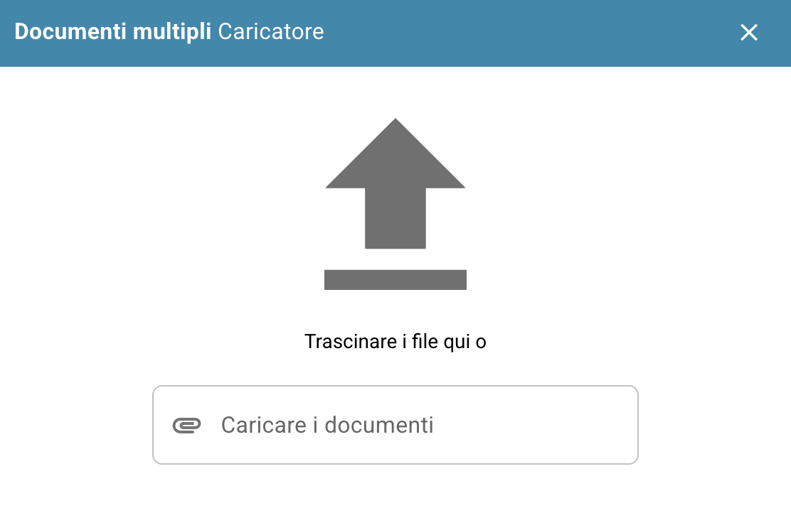<figcaption></figcaption></figure>

Puoi trascinare e rilasciare i file nella finestra pop-up oppure cliccare su 'Carica documenti' per selezionarli dall'esplora file.

## Modalità di debug

Puoi attivare la modalità di debug per ricevere un'opzione aggiuntiva.\
Per accedere alla modalità di debug basta aggiungere all'url `?debug=true`. Ora dovresti avere un'opzione aggiuntiva

<figure><figcaption></figcaption></figure>

### Show loading times

<figure><figcaption></figcaption></figure>

Cliccando su questo pulsante si aprirà una finestra pop-up che mostra i tempi di caricamento per ciascun servizio, con il tempo totale di caricamento mostrato in fondo.

<figure><figcaption></figcaption></figure>
