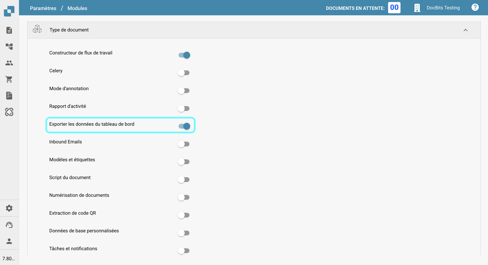

# Outils du tableau de bord

À droite de la barre de recherche, vous trouverez quelques outils du tableau de bord.

<figure><figcaption></figcaption></figure>

## Rafraîchir la table :

Cliquez sur ce bouton pour rafraîchir le tableau de bord et charger les données et statuts les plus récents.

<figure><figcaption></figcaption></figure>

## Paramètres avancés :

Cliquez sur l'icône d'engrenage pour ouvrir le menu des Paramètres avancés.

<figure><figcaption></figcaption></figure>

Dans le menu des Paramètres avancés, les options suivantes seront disponibles :

### Plus de paramètres

Utilisez ce bouton pour accéder aux Paramètres Admin pour le tableau de bord. La documentation complète pour ces paramètres peut être trouvée [ici](../../../administration-and-setup/settings/global-settings/dashboard.md).

<figure><figcaption></figcaption></figure>

### Raccourcis clavier

Utilisez ce bouton pour afficher tous les raccourcis clavier pour le tableau de bord. Des explications détaillées pour chaque raccourci peuvent être trouvées [ici](keyboard-shortcuts.md).

<figure><figcaption></figcaption></figure>

### Journal des importations

Utilisez ce bouton pour ouvrir un tableau affichant tous les documents récemment importés par e-mail, ainsi que les informations pertinentes pour chacun.

<figure><figcaption></figcaption></figure>

<figure><figcaption></figcaption></figure>

Vous pouvez filtrer les journaux par sujet ou expéditeur, trier les colonnes par ordre croissant ou décroissant en cliquant sur les en-têtes de colonne, et les réorganiser en utilisant le glisser-déposer.

### Définir les colonnes du tableau pour l'organisation

<figure><figcaption></figcaption></figure>

Cliquez sur ce bouton pour ouvrir un menu où vous pouvez gérer la visibilité des colonnes du tableau de bord. Sélectionnez les noms de colonnes et utilisez les flèches pour les ajouter ou les retirer de la vue du tableau de bord. Cliquez sur 'Terminé' pour enregistrer vos modifications.

<figure><figcaption></figcaption></figure>

Vous pouvez définir l'ordre des colonnes en cliquant sur les points à côté d'un nom de colonne et en le faisant glisser à la position souhaitée.

#### Ajouter un champ à partir du type de document comme colonnes dans le tableau de bord.

Vous avez également la possibilité d'ajouter des colonnes supplémentaires à partir de champs spécifiques de types de documents spécifiques pour personnaliser votre vue du tableau de bord. Pour ce faire, cliquez simplement sur 'Ajouter un champ à partir du type de document'.

<figure><figcaption></figcaption></figure>

Choisissez un type de document pour voir quels champs sont disponibles pour le type sélectionné. Pour chaque type de document, il existe différents champs que vous pouvez ajouter. Vous pouvez rechercher un champ spécifique en utilisant la barre de recherche en haut.

<figure><figcaption></figcaption></figure>

Sélectionnez les champs que vous souhaitez afficher comme colonnes, puis cliquez sur 'Ajouter aux colonnes visibles'. Les champs sélectionnés apparaîtront comme colonnes sur le tableau de bord, affichant leurs valeurs correspondantes.

### Définir le tri du tableau de bord pour l'organisation

<figure><figcaption></figcaption></figure>

<figure><figcaption></figcaption></figure>

Utilisez ce bouton pour définir l'ordre de tri par défaut pour les colonnes du tableau de bord. Sélectionnez la colonne et choisissez l'ordre de tri (croissant ou décroissant), puis cliquez sur 'Terminé'. Vous pouvez configurer le tri pour toutes les colonnes actives du tableau de bord.

### Filtrer les documents :

Vous pouvez filtrer les documents par jour, semaine, mois, année, ou voir tous en cliquant sur la période de temps souhaitée. Le filtrage est basé sur l'heure d'importation du document.

<figure><figcaption></figcaption></figure>

## Numérisation de documents :

Utilisez ce bouton pour numériser un document directement.

<figure><figcaption></figcaption></figure>

<figure><figcaption></figcaption></figure>

Pour utiliser cette fonctionnalité, vous devez avoir un scanner connecté à votre système. Si un scanner est disponible, vous pouvez le sélectionner à droite, nommer votre document, et cliquer sur 'Numériser'. En option, vous pouvez ajuster les paramètres de numérisation à droite avant de commencer le processus.

<mark style="color:red;">**Remarque :**</mark> Cette fonctionnalité doit être activée sous _**Paramètres -> Traitement des documents/Module -> Type de document/Numérisation de documents**_

<figure><figcaption></figcaption></figure>

## Analytique :

Cliquer sur ce bouton affichera une nouvelle zone montrant le nombre actuel de documents dans chaque catégorie.

<figure><figcaption></figcaption></figure>

<figure><figcaption></figcaption></figure>

Cliquez sur n'importe quelle catégorie pour filtrer les documents par cette catégorie spécifique.

## Démarrer l'importation des e-mails :

Cliquer sur ce bouton vérifiera votre boîte de réception e-mail, selon la configuration de l'importation des e-mails, et importera tous les nouveaux documents.

<figure><figcaption></figcaption></figure>

## Exporter ce tableau :

Utilisez ce bouton pour exporter tous les documents actuellement affichés sur le tableau de bord, en fonction du nombre de documents affichés par page.

<mark style="color:red;">**Remarque :**</mark> Cette fonctionnalité doit être activée sous _**Paramètres -> Traitement des documents/Module -> Type de document/Exporter les données du tableau de bord**_

<figure><figcaption></figcaption></figure>

## Télécharger :

Cliquez sur ce bouton pour télécharger manuellement un ou plusieurs fichiers.

<figure><figcaption></figcaption></figure>

<figure><figcaption></figcaption></figure>

Vous pouvez soit glisser-déposer des fichiers dans la fenêtre contextuelle, soit cliquer sur 'Télécharger des documents' pour les sélectionner dans l'explorateur de fichiers.

## Mode de débogage

Vous pouvez activer le mode de débogage pour recevoir une option supplémentaire.\
Pour accéder au mode de débogage, ajoutez simplement à l'URL `?debug=true`. Vous devriez maintenant avoir une option supplémentaire.

<figure><figcaption></figcaption></figure>

### Afficher les temps de chargement

<figure><figcaption></figcaption></figure>

Cliquer sur ce bouton ouvrira une fenêtre contextuelle affichant les temps de chargement pour chaque service, avec le temps de chargement total affiché en bas.

<figure><figcaption></figcaption></figure>
