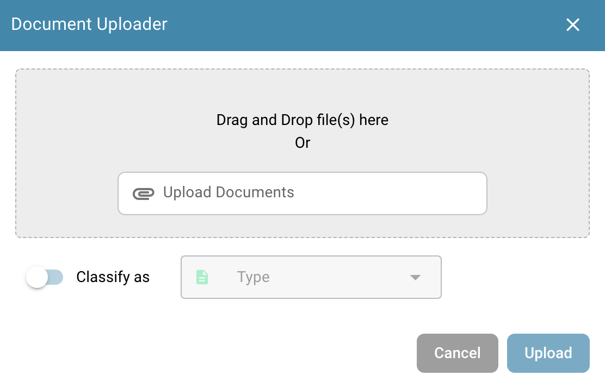

# Ferramentas do Painel

À direita da barra de pesquisa, você encontrará algumas ferramentas do painel.

<figure><figcaption></figcaption></figure>

## Atualizar tabela

Clique neste botão para atualizar o painel e carregar os dados e status mais recentes.

<figure><figcaption></figcaption></figure>

## Configurações avançadas

Clique no ícone de engrenagem para abrir o menu de Configurações Avançadas.

<figure><figcaption></figcaption></figure>

No menu de Configurações Avançadas, as seguintes opções estarão disponíveis:

### Mais configurações

Use este botão para acessar as Configurações de Admin para o painel. A documentação completa para essas configurações pode ser encontrada [aqui](../../../administration-and-setup/settings/global-settings/dashboard/).

<figure><figcaption></figcaption></figure>

### Atalhos de teclado

Use este botão para exibir todos os atalhos de teclado para o painel. Explicações detalhadas para cada atalho podem ser encontradas [aqui](keyboard-shortcuts.md).

<figure><figcaption></figcaption></figure>

### Registro de importação

Use este botão para abrir uma tabela exibindo todos os documentos recentemente importados via e-mail, juntamente com informações relevantes para cada um.

<figure><figcaption></figcaption></figure>

<figure><figcaption></figcaption></figure>

Você pode filtrar os registros por assunto ou remetente, classificar colunas em ordem crescente ou decrescente clicando nos cabeçalhos das colunas e reorganizá-las usando arrastar e soltar.

### Definir colunas da tabela para organização

<figure><figcaption></figcaption></figure>

Clique neste botão para abrir um menu onde você pode gerenciar a visibilidade das colunas do painel. Selecione os nomes das colunas e use as setas para adicioná-las ou removê-las da visualização do painel. Clique em 'Concluído' para salvar suas alterações.

<figure><figcaption></figcaption></figure>

Você pode definir a ordem das colunas clicando nos pontos ao lado do nome de uma coluna e arrastando-a para a posição desejada.

#### Adicionar campos de um tipo de documento como colunas no painel.

Você também tem a opção de adicionar colunas adicionais de campos específicos de tipos de documentos específicos para personalizar sua visualização do painel. Para fazer isso, basta clicar em 'Adicionar Campo do Tipo de Documento'.

<figure><figcaption></figcaption></figure>

Escolha um tipo de documento para ver quais campos estão disponíveis para o tipo selecionado. Para cada tipo de documento, existem diferentes campos que você pode adicionar. Você pode procurar um campo específico usando a barra de pesquisa na parte superior.

<figure><figcaption></figcaption></figure>

Selecione os campos que deseja exibir como colunas e clique em 'Adicionar às Colunas Visíveis'. Os campos selecionados aparecerão como colunas no painel, mostrando seus valores correspondentes.

### Definir ordenação do painel para organização

<figure><figcaption></figcaption></figure>

<figure><figcaption></figcaption></figure>

Use este botão para definir a ordem de classificação padrão para as colunas no painel. Selecione a coluna e escolha a ordem de classificação (crescente ou decrescente), em seguida, clique em 'Concluído'. Você pode configurar a classificação para todas as colunas ativas no painel.

### Filtrar documentos

Você pode filtrar documentos por dia, semana, mês, ano ou visualizar todos clicando no período de tempo desejado. A filtragem é baseada no horário de importação do documento.

<figure><figcaption></figcaption></figure>

## Digitalizar documento

Use este botão para digitalizar um documento diretamente.

<figure><figcaption></figcaption></figure>

<figure><figcaption></figcaption></figure>

Para usar este recurso, você precisa ter um scanner conectado ao seu sistema. Se um scanner estiver disponível, você pode selecioná-lo à direita, nomear seu documento e clicar em 'Digitalizar'. Opcionalmente, você pode ajustar as configurações de digitalização à direita antes de iniciar o processo.

<mark style="color:red;">**Nota:**</mark> Este recurso deve ser ativado em _**Configurações -> Processamento de Documentos/Módulo -> Tipo de Documento/Digitalização de Documento**_

<figure><figcaption></figcaption></figure>

## Análise

Clicar neste botão exibirá uma nova área mostrando a contagem atual de documentos em cada categoria.

<figure><figcaption></figcaption></figure>

<figure><figcaption></figcaption></figure>

Clique em qualquer categoria para filtrar os documentos por essa categoria específica.

## Iniciar importação de e-mail

Clicar neste botão verificará sua caixa de entrada de e-mail, de acordo com a configuração de importação de e-mail, e importará quaisquer novos documentos.

<figure><figcaption></figcaption></figure>

## Exportar esta tabela

Use este botão para exportar todos os documentos atualmente exibidos no painel, com base no número de documentos mostrados por página.

<figure><figcaption></figcaption></figure>

<mark style="color:red;">**Nota:**</mark> Este recurso deve ser ativado em _**Configurações -> Processamento de Documentos/Módulo -> Tipo de Documento/Exportar Dados do Painel**_

<figure><figcaption></figcaption></figure>

## Carregar

Clique neste botão para carregar manualmente um ou mais arquivos.

<figure><figcaption></figcaption></figure>

<figure><figcaption></figcaption></figure>

Você pode arrastar e soltar arquivos na janela pop-up ou clicar em 'Carregar Documentos' para selecioná-los no explorador de arquivos.

## Modo de depuração

Você pode ativar o modo de depuração para receber uma opção adicional.\
Para acessar o modo de depuração, basta adicionar ao URL `?debug=true`. Agora você deve ter uma opção adicional.

<figure><figcaption></figcaption></figure>

### Mostrar tempos de carregamento

<figure><figcaption></figcaption></figure>

Clicar neste botão abrirá uma janela pop-up exibindo os tempos de carregamento para cada serviço, com o tempo total de carregamento mostrado na parte inferior.

<figure><figcaption></figcaption></figure>
