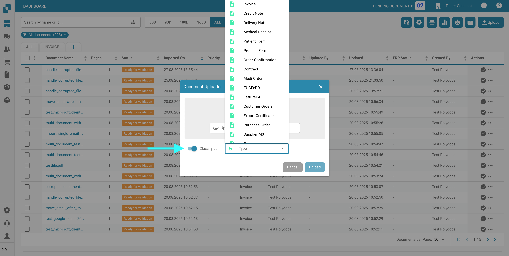
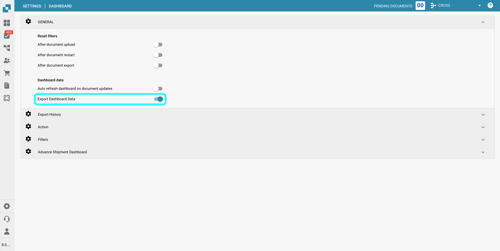

# Pulpit Narzędzia

Po prawej stronie paska wyszukiwania znajdziesz kilka narzędzi pulpitu.

<figure><figcaption></figcaption></figure>

## Odśwież tabelę

Kliknij ten przycisk, aby odświeżyć pulpit i załadować najnowsze dane i statusy.

<figure><figcaption></figcaption></figure>

## Ustawienia zaawansowane

Kliknij ikonę koła zębatego, aby otworzyć menu Ustawienia zaawansowane.

<figure><figcaption></figcaption></figure>

W menu Ustawienia zaawansowane będą dostępne następujące opcje:

### Więcej ustawień

Użyj tego przycisku, aby uzyskać dostęp do Ustawień administratora dla pulpitu. Pełna dokumentacja dotycząca tych ustawień znajduje się [tutaj](../../../administration-and-setup/settings/global-settings/dashboard.md).

<figure><figcaption></figcaption></figure>

### Skróty klawiaturowe

Użyj tego przycisku, aby wyświetlić wszystkie skróty klawiaturowe dla pulpitu. Szczegółowe wyjaśnienia dla każdego skrótu można znaleźć [tutaj](keyboard-shortcuts.md).

<figure><figcaption></figcaption></figure>

### Dziennik importu

Użyj tego przycisku, aby otworzyć tabelę wyświetlającą wszystkie ostatnio importowane dokumenty za pośrednictwem e-maila, wraz z odpowiednimi informacjami dla każdego z nich.

<figure><figcaption></figcaption></figure>

<figure><figcaption></figcaption></figure>

Możesz filtrować dzienniki według tematu lub nadawcy, sortować kolumny w porządku rosnącym lub malejącym, klikając nagłówki kolumn, oraz przestawiać je za pomocą przeciągania i upuszczania.

### Ustaw kolumny tabeli dla organizacji

<figure><figcaption></figcaption></figure>

Kliknij ten przycisk, aby otworzyć menu, w którym możesz zarządzać widocznością kolumn pulpitu. Wybierz nazwy kolumn i użyj strzałek, aby dodać je lub usunąć z widoku pulpitu. Kliknij 'Gotowe', aby zapisać zmiany.

<figure><figcaption></figcaption></figure>

Możesz ustawić kolejność kolumn, klikając kropki obok nazwy kolumny i przeciągając ją na żądane miejsce.

#### Dodaj pola z typu dokumentu jako kolumny w pulpicie.

Masz również możliwość dodania dodatkowych kolumn z konkretnych pól określonych typów dokumentów, aby dostosować widok pulpitu. Aby to zrobić, po prostu kliknij 'Dodaj pole z typu dokumentu'.

<figure><figcaption></figcaption></figure>

Wybierz typ dokumentu, aby zobaczyć, które pola są dostępne dla wybranego typu. Dla każdego typu dokumentu dostępne są różne pola, które możesz dodać. Możesz wyszukiwać konkretne pole, używając paska wyszukiwania na górze.

<figure><figcaption></figcaption></figure>

Wybierz pola, które chcesz wyświetlić jako kolumny, a następnie kliknij 'Dodaj do widocznych kolumn'. Wybrane pola pojawią się jako kolumny na pulpicie, pokazując ich odpowiadające wartości.

### Ustaw sortowanie pulpitu dla organizacji

<figure><figcaption></figcaption></figure>

<figure><figcaption></figcaption></figure>

Użyj tego przycisku, aby ustawić domyślną kolejność sortowania dla kolumn w pulpicie. Wybierz kolumnę i wybierz kolejność sortowania (rosnąca lub malejąca), a następnie kliknij 'Gotowe'. Możesz skonfigurować sortowanie dla wszystkich aktywnych kolumn w pulpicie.

### Filtrowanie dokumentów

Możesz filtrować dokumenty według dnia, tygodnia, miesiąca, roku lub wyświetlić wszystkie, klikając na żądany okres czasu. Filtrowanie opiera się na czasie importu dokumentu.

<figure><figcaption></figcaption></figure>

## Skanuj dokument

Użyj tego przycisku, aby bezpośrednio zeskanować dokument.

<figure><figcaption></figcaption></figure>

<figure><figcaption></figcaption></figure>

Aby skorzystać z tej funkcji, musisz mieć skaner podłączony do swojego systemu. Jeśli skaner jest dostępny, możesz go wybrać po prawej stronie, nadać nazwę swojemu dokumentowi i kliknąć 'Skanuj'. Opcjonalnie możesz dostosować ustawienia skanowania po prawej stronie przed rozpoczęciem procesu.

<mark style="color:red;">**Uwaga:**</mark> Ta funkcja musi być aktywowana w _**Ustawienia -> Przetwarzanie dokumentów/Moduł -> Typ dokumentu/Skanowanie dokumentu**_

<figure><figcaption></figcaption></figure>

## Analiza

Kliknięcie tego przycisku wyświetli nowy obszar pokazujący bieżącą liczbę dokumentów w każdej kategorii.

<figure><figcaption></figcaption></figure>

<figure><figcaption></figcaption></figure>

Kliknij dowolną kategorię, aby filtrować dokumenty według tej konkretnej kategorii.

## Rozpocznij import e-maili

Kliknięcie tego przycisku sprawdzi Twoją skrzynkę e-mailową, zgodnie z konfiguracją importu e-maili, i zaimportuje wszelkie nowe dokumenty.

<figure><figcaption></figcaption></figure>

## Eksportuj tę tabelę

Użyj tego przycisku, aby wyeksportować wszystkie dokumenty aktualnie wyświetlane na pulpicie, w zależności od liczby dokumentów pokazanych na stronie.

<figure><figcaption></figcaption></figure>

<mark style="color:red;">**Uwaga:**</mark> Ta funkcja musi być aktywowana w _**Ustawienia -> Przetwarzanie dokumentów/Moduł -> Typ dokumentu/Eksportuj dane pulpitu**_

<figure><figcaption></figcaption></figure>

## Prześlij

Kliknij ten przycisk, aby ręcznie przesłać jeden lub więcej plików.

<figure><figcaption></figcaption></figure>

<figure><figcaption></figcaption></figure>

Możesz przeciągnąć i upuścić pliki do okna pop-up lub kliknąć 'Prześlij dokumenty', aby wybrać je z eksploratora plików.

## Tryb debugowania

Możesz aktywować tryb debugowania, aby otrzymać dodatkową opcję.\
Aby uzyskać dostęp do trybu debugowania, po prostu dodaj do adresu URL `?debug=true`. Teraz powinieneś mieć dodatkową opcję.

<figure><figcaption></figcaption></figure>

### Pokaż czasy ładowania

<figure><figcaption></figcaption></figure>

Kliknięcie tego przycisku otworzy okno pop-up wyświetlające czasy ładowania dla każdej usługi, z całkowitym czasem ładowania pokazanym na dole.

<figure><figcaption></figcaption></figure>
