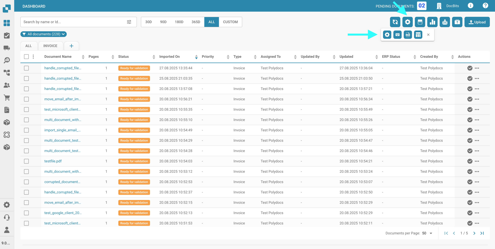

# Dashboard Tools

To the right of the search bar, you will find some dashboard tools.

<figure><figcaption></figcaption></figure>

## Refresh table:

Click this button to refresh the dashboard and load the most up-to-date data and statuses.

<figure><figcaption></figcaption></figure>

## Advanced settings:&#x20;

Click the gear icon to open the Advanced Settings menu.

<figure><figcaption></figcaption></figure>

In the Advanced Settings menu the following options will be available:

### More settings

Use this button to access the Admin Settings for the dashboard. Full documentation for these settings can be found [here](../../../administration-and-setup/settings/global-settings/dashboard/).

<figure><figcaption></figcaption></figure>

### Keyboard shortcuts

Use this button to display all keyboard shortcuts for the dashboard. Detailed explanations for each shortcut can be found [here](keyboard-shortcuts.md).

<figure><figcaption></figcaption></figure>

### Import log

Use this button to open a table displaying all recently imported documents via email, along with relevant information for each.

<figure><figcaption></figcaption></figure>

<figure><figcaption></figcaption></figure>

You can filter the logs by subject or sender, sort columns in ascending or descending order by clicking the column headers, and rearrange them using drag-and-drop.

### Set table columns for organization

<figure><figcaption></figcaption></figure>

Click this button to open a menu where you can manage the visibility of dashboard columns. Select column names and use the arrows to add or remove them from the dashboard view. Click 'Done' to save your changes.

<figure><figcaption></figcaption></figure>

You can set the column order by clicking the dots next to a column name and dragging it to the desired position.

#### Add fields from a document type as columns in the dashboard.

You also have the option to add additional columns from specific fields of specific document types to customize your dashboard view. To do this, simply click 'Add Field from Document Type'.

<figure><figcaption></figcaption></figure>

Choose a document type to see which fields are available for the selected type. For each document type there are different fields that you can add. You can search for a specific field using the search bar at the top.

<figure><figcaption></figcaption></figure>

Select the fields you want to display as columns, then click 'Add to Visible Columns'. The selected fields will appear as columns on the dashboard, showing their corresponding values.

### Set dashboard sorting for organization

<figure><figcaption></figcaption></figure>

<figure><figcaption></figcaption></figure>

Use this button to set the default sorting order for columns in the dashboard. Select the column and choose the sorting order (ascending or descending), then click 'Done'. You can configure sorting for all active columns in the dashboard.

### Filter documents:

You can filter documents by day, week, month, year, or view all by clicking on your desired time period. The filtering is based on the document import time.

<figure><figcaption></figcaption></figure>

## Scan document:

Use this button to scan a document directly.

<figure><figcaption></figcaption></figure>

<figure><figcaption></figcaption></figure>

To use this feature, you need to have a scanner connected to your system. If a scanner is available, you can select it on the right, name your document, and click 'Scan'. Optionally, you can adjust scanning settings on the right before starting the process.

<mark style="color:red;">**Note:**</mark> This feature must be activated under _**Settings -> Document Processing/Module -> Document Type/Document scan**_

<figure><figcaption></figcaption></figure>

## Analytics:&#x20;

Clicking this button will display a new area showing the current count of documents in each category.

<figure><figcaption></figcaption></figure>

<figure><figcaption></figcaption></figure>

Click any category to filter the documents by that specific category.

## Start email import:

Clicking this button will check your email inbox, according to the email import configuration, and import any new documents.

<figure><figcaption></figcaption></figure>

## Export this table:

Use this button to export all documents currently displayed on the dashboard, based on the number of documents shown per page.

<figure><figcaption></figcaption></figure>

<mark style="color:red;">**Note:**</mark> This feature must be activated under _**Settings -> Document Processing/Module -> Document Type/Export Dashboard Data**_

<figure><figcaption></figcaption></figure>

## Upload:&#x20;

Click this button to manually upload one or more files.

<figure><figcaption></figcaption></figure>

<figure><figcaption></figcaption></figure>

You can either drag and drop files into the pop-up window or click 'Upload Documents' to select them from the file explorer.

## Debugging mode

You can activate debugging mode to receive an additional option.\
To access debug mode simply add to the url `?debug=true` . Now you should have an additional option

<figure><figcaption></figcaption></figure>

### Show loading times

<figure><figcaption></figcaption></figure>

Clicking this button will open a pop-up window displaying the loading times for each service, with the total loading time shown at the bottom.

<figure><figcaption></figcaption></figure>
