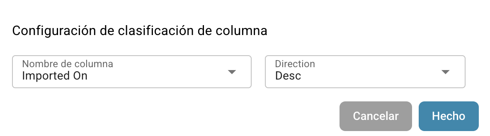
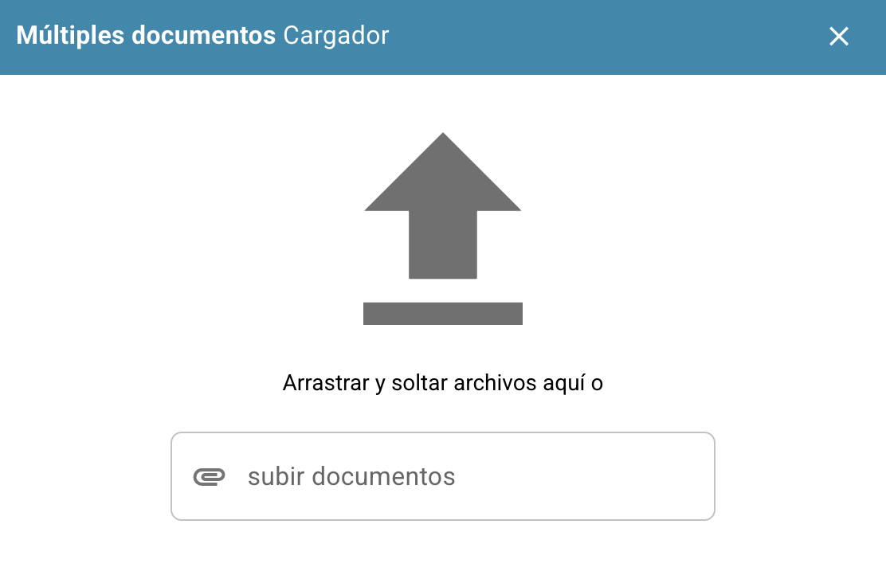

# Herramientas del Panel

A la derecha de la barra de búsqueda, encontrarás algunas herramientas del panel.

<figure><figcaption></figcaption></figure>

## Refrescar Tabla:

Haz clic en este botón para refrescar el panel y cargar los datos y estados más actualizados.

<figure><figcaption></figcaption></figure>

## Ajustes avanzados:

Haz clic en el ícono de engranaje para abrir el menú de Ajustes Avanzados.

<figure><figcaption></figcaption></figure>

En el menú de Ajustes Avanzados estarán disponibles las siguientes opciones:

### Más ajustes

Utiliza este botón para acceder a los Ajustes de Administración para el panel. La documentación completa para estos ajustes se puede encontrar [aquí](../../../administration-and-setup/settings/global-settings/dashboard.md).

<figure><figcaption></figcaption></figure>

### Atajos de teclado

Utiliza este botón para mostrar todos los atajos de teclado para el panel. Las explicaciones detalladas para cada atajo se pueden encontrar [aquí](keyboard-shortcuts.md).

<figure><figcaption></figcaption></figure>

### Registro de importación

Utiliza este botón para abrir una tabla que muestra todos los documentos importados recientemente por correo electrónico, junto con la información relevante para cada uno.

<figure><figcaption></figcaption></figure>

<figure><figcaption></figcaption></figure>

Puedes filtrar los registros por asunto o remitente, ordenar las columnas en orden ascendente o descendente haciendo clic en los encabezados de columna, y reorganizarlas utilizando arrastrar y soltar.

### Establecer columnas de tabla para la organización

<figure><figcaption></figcaption></figure>

Haz clic en este botón para abrir un menú donde puedes gestionar la visibilidad de las columnas del panel. Selecciona los nombres de las columnas y utiliza las flechas para agregarlas o eliminarlas de la vista del panel. Haz clic en 'Hecho' para guardar tus cambios.

<figure><figcaption></figcaption></figure>

Puedes establecer el orden de las columnas haciendo clic en los puntos junto a un nombre de columna y arrastrándolo a la posición deseada.

#### Agregar campo desde el tipo de documento como columnas en el panel.

También tienes la opción de agregar columnas adicionales desde campos específicos de tipos de documentos específicos para personalizar la vista de tu panel. Para hacer esto, simplemente haz clic en 'Agregar campo desde el tipo de documento'.

<figure><figcaption></figcaption></figure>

Elige un tipo de documento para ver qué campos están disponibles para el tipo seleccionado. Para cada tipo de documento hay diferentes campos que puedes agregar. Puedes buscar un campo específico utilizando la barra de búsqueda en la parte superior.

<figure><figcaption></figcaption></figure>

Selecciona los campos que deseas mostrar como columnas, luego haz clic en 'Agregar a columnas visibles'. Los campos seleccionados aparecerán como columnas en el panel, mostrando sus valores correspondientes.

### Establezca la clasificación del tablero para la organización

<figure><figcaption></figcaption></figure>

<figure><figcaption></figcaption></figure>

Utiliza este botón para establecer el orden de clasificación predeterminado para las columnas en el panel. Selecciona la columna y elige el orden de clasificación (ascendente o descendente), luego haz clic en 'Hecho'. Puedes configurar la clasificación para todas las columnas activas en el panel.

### Filtrar documentos:

Puedes filtrar documentos por día, semana, mes, año, o ver todos haciendo clic en tu período de tiempo deseado. El filtrado se basa en el tiempo de importación del documento.

<figure><figcaption></figcaption></figure>

## Escanear documento:

Utiliza este botón para escanear un documento directamente.

<figure><figcaption></figcaption></figure>

<figure><figcaption></figcaption></figure>

Para utilizar esta función, necesitas tener un escáner conectado a tu sistema. Si hay un escáner disponible, puedes seleccionarlo a la derecha, nombrar tu documento y hacer clic en 'Escanear'. Opcionalmente, puedes ajustar la configuración de escaneo a la derecha antes de comenzar el proceso.

<mark style="color:red;">**Nota:**</mark> Esta función debe ser activada en Ajustes -> Procesamiento de documentos/Módulo -> Tipo de documento/Escaneado de documentos

<figure><figcaption></figcaption></figure>

## Analítica:

Hacer clic en este botón mostrará un nuevo área que muestra el conteo actual de documentos en cada categoría.

<figure><figcaption></figcaption></figure>

<figure><figcaption></figcaption></figure>

Haz clic en cualquier categoría para filtrar los documentos por esa categoría específica.

## Iniciar importación de correo electrónico:

Hacer clic en este botón revisará tu bandeja de entrada de correo electrónico, de acuerdo con la configuración de importación de correo electrónico, e importará cualquier documento nuevo.

<figure><figcaption></figcaption></figure>

## Exportar esta tabla:

Utiliza este botón para exportar todos los documentos que actualmente se muestran en el panel, basado en el número de documentos mostrados por página.

<figure><figcaption></figcaption></figure>

<mark style="color:red;">**Nota:**</mark> Esta función debe ser activada en Ajustes -> Procesamiento de documentos/Módulo -> Tipo de documento/Exportar datos del cuadro de mandos

<figure><figcaption></figcaption></figure>

## Subir:

Haz clic en este botón para subir manualmente uno o más archivos.

<figure><figcaption></figcaption></figure>

<figure><figcaption></figcaption></figure>

Puedes arrastrar y soltar archivos en la ventana emergente o hacer clic en 'Subir Documentos' para seleccionarlos desde el explorador de archivos.

## Modo de depuración

Puedes activar el modo de depuración para recibir una opción adicional.\
Para acceder al modo de depuración simplemente agrega a la url `?debug=true`. Ahora deberías tener una opción adicional.

<figure><figcaption></figcaption></figure>

### Mostrar tiempos de carga

<figure><figcaption></figcaption></figure>

Hacer clic en este botón abrirá una ventana emergente que muestra los tiempos de carga para cada servicio, con el tiempo total de carga mostrado en la parte inferior.
