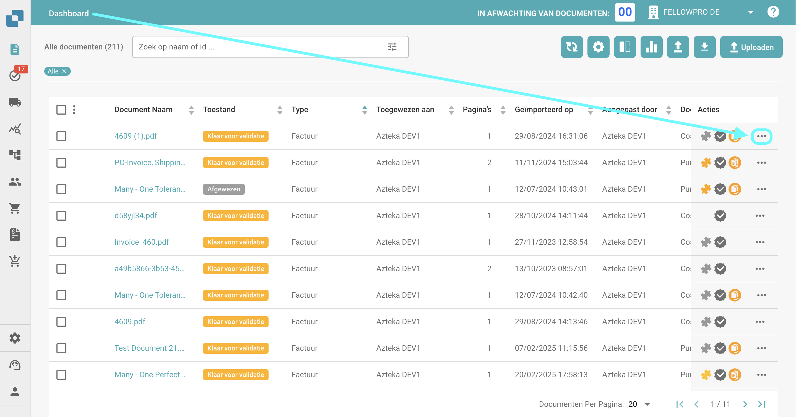
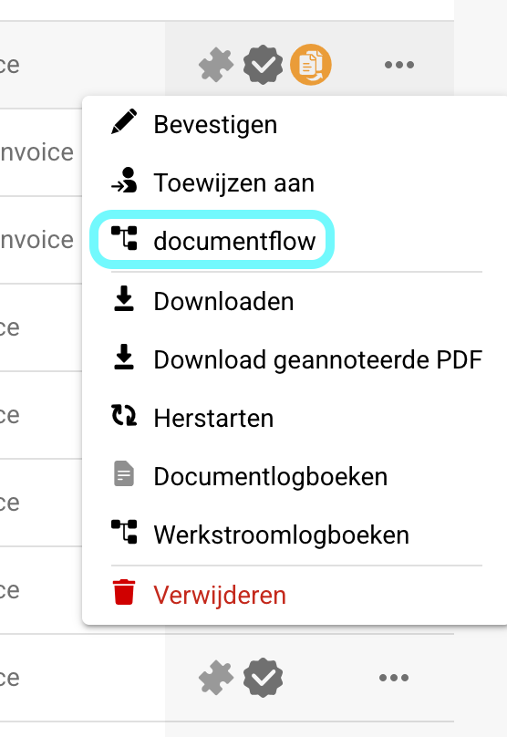
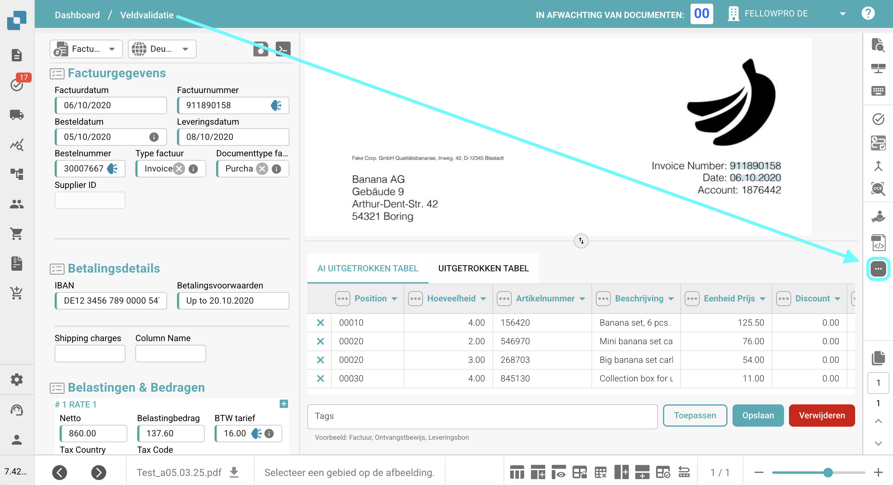
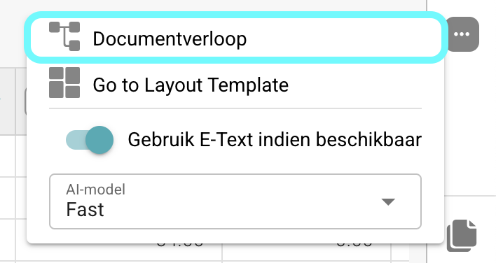
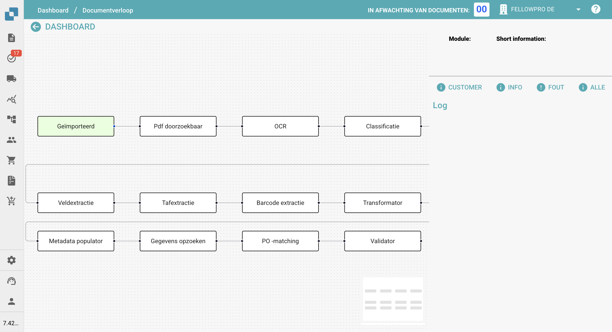
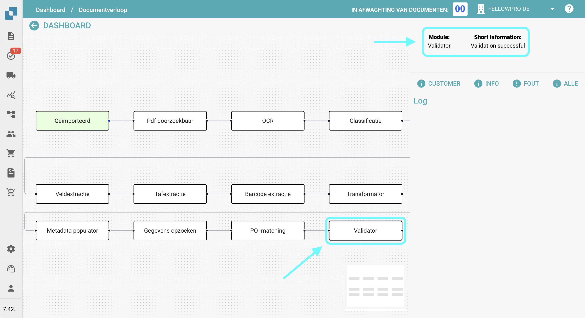

# Documentflow

## **Overzicht:**

Deze pagina biedt een grafisch overzicht van de verschillende stappen die een document tot nu toe heeft doorlopen.

## **Toegang:**

### **Optie 1:**

1.  Navigeer naar de actieskolom op het Dashboard en klik op de drie stippen naast het document waarvan je de documentflow wilt bekijken.

    <figure><figcaption></figcaption></figure>
2.  Selecteer **Documentflow**.

    <figure><figcaption></figcaption></figure>

### **Optie 2:**

1. Open het document waarvan je de documentflow wilt bekijken.
2.  Klik op de drie stippen aan de rechterkant van de Veldvalidatie.

    <figure><figcaption></figcaption></figure>
3.  Selecteer **Documentflow**.

    <figure><figcaption></figcaption></figure>

## **Beschrijving:**

Aan de linkerkant van het scherm zie je de individuele stappen van de documentflow, van links naar rechts weergegeven.

<figure><figcaption></figcaption></figure>

* Stappen die het documentflowproces initiëren (zoals importeren of herstarten) worden in het groen weergegeven.
* Om door de stappen te navigeren, sleep je ze eenvoudig op het scherm.
*   Wanneer je op een stap klikt, verschijnt de naam van de module en informatie over of de stap succesvol was of niet aan de rechterkant van het scherm.

    <figure><figcaption></figcaption></figure>
