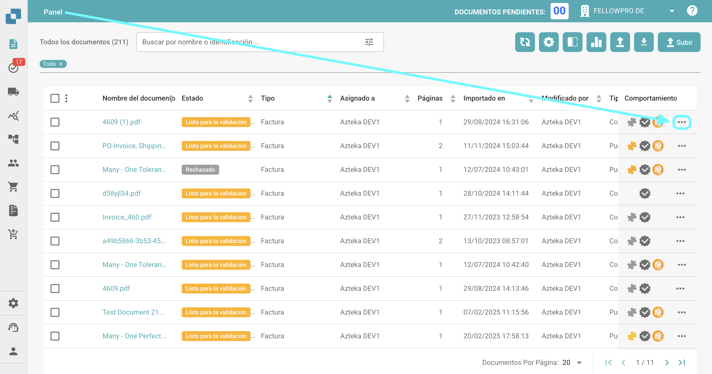
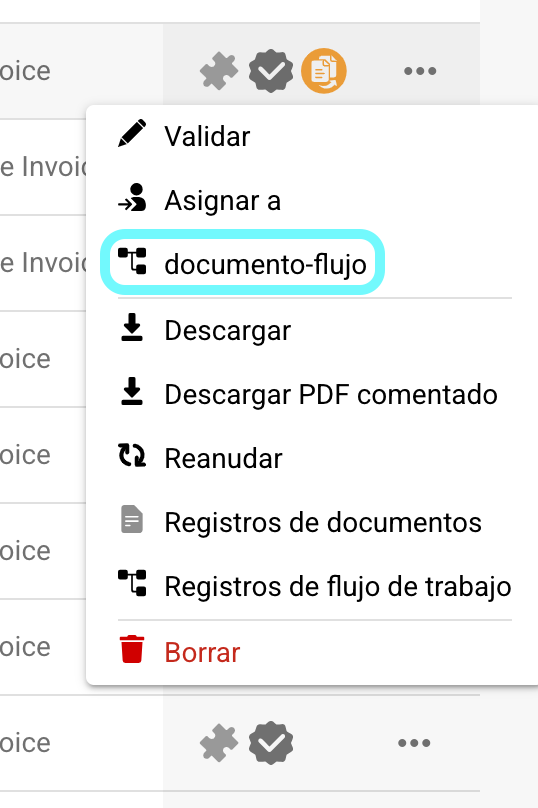
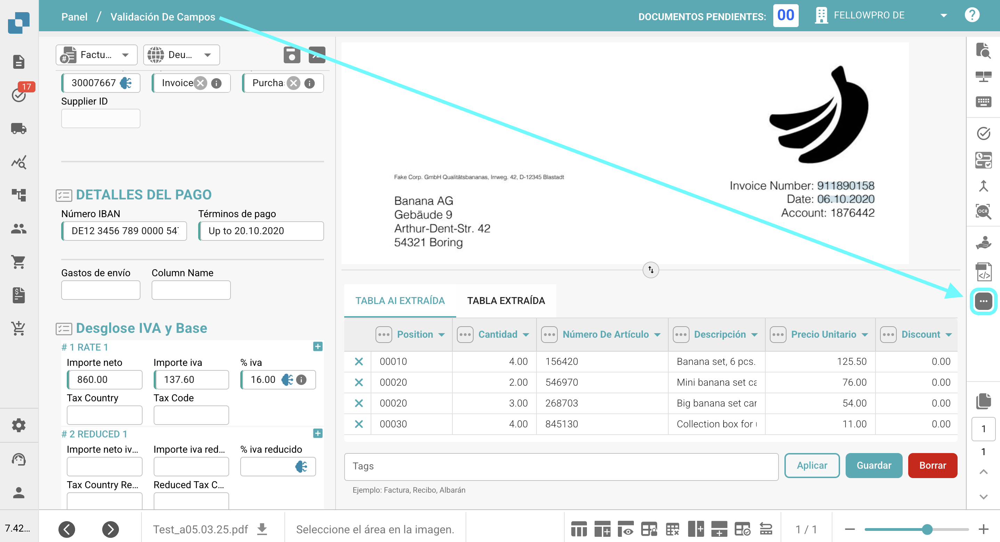
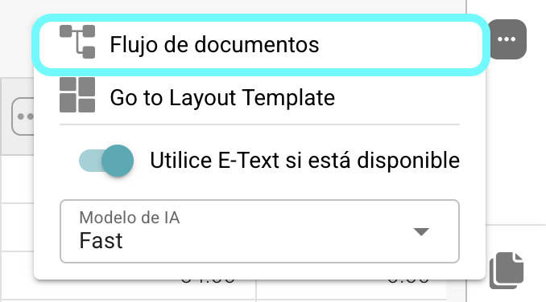
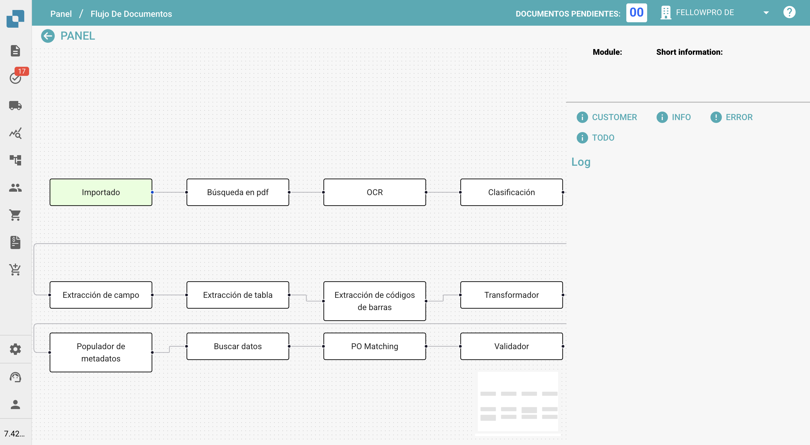
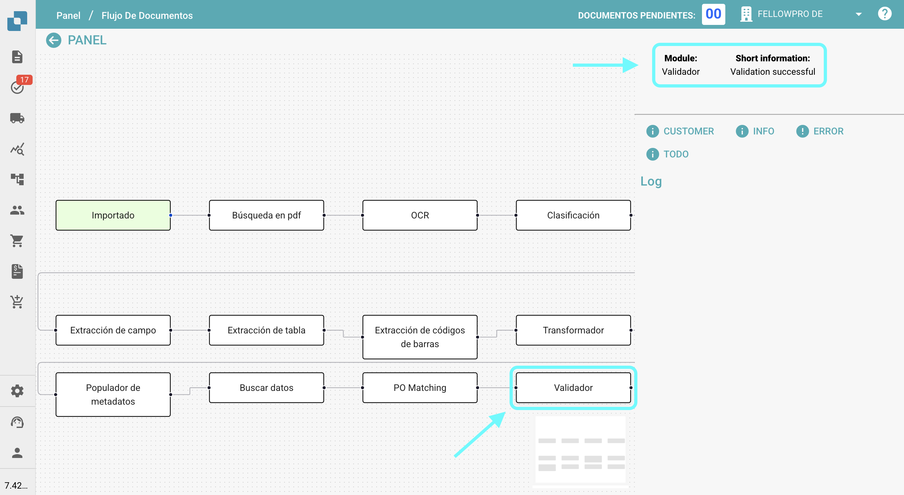

# Documento-Flujo

## **Descripción general:**

Esta página proporciona una visión gráfica de los diversos pasos que un documento ha seguido hasta este punto.

## **Cómo acceder:**

### **Opción 1:**

1.  Navega a la columna de comportamiento en el panel y haz clic en los tres puntos junto al documento para el cual deseas ver el documento-flujo.

    <figure><figcaption></figcaption></figure>
2.  Selecciona **Documento-Flujo**.

    <figure><figcaption></figcaption></figure>

### **Opción 2:**

1. Abre el documento para el cual deseas ver el documento-flujo.
2.  Haz clic en los tres puntos en el lado derecho de la Validación De Campos.

    <figure><figcaption></figcaption></figure>
3.  Selecciona **Documento-Flujo**.

    <figure><figcaption></figcaption></figure>

## **Descripción:**

En el lado izquierdo de la pantalla, verás los pasos individuales del documento-flujo, listados de izquierda a derecha.

<figure><figcaption></figcaption></figure>

* Los pasos que inician el proceso de documento-flujo (como importar o reiniciar) aparecerán en verde.
* Para navegar a través de los pasos, simplemente arrástralos y suéltalos en la pantalla.
*   Cuando haces clic en un paso, el nombre del módulo y la información sobre si el paso fue exitoso o no aparecerán en el lado derecho de la pantalla.

    <figure><figcaption></figcaption></figure>
