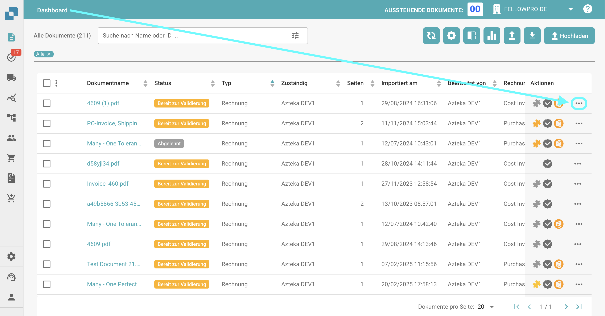
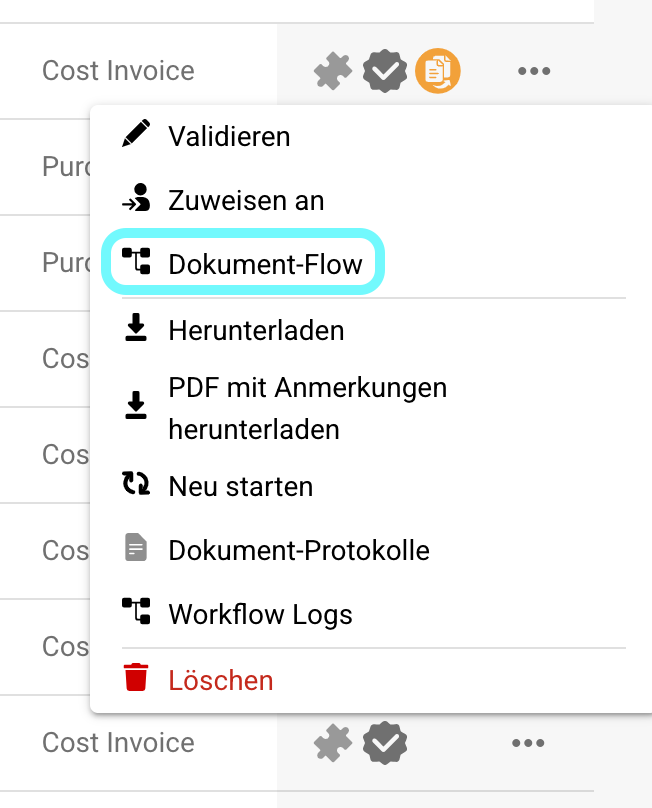
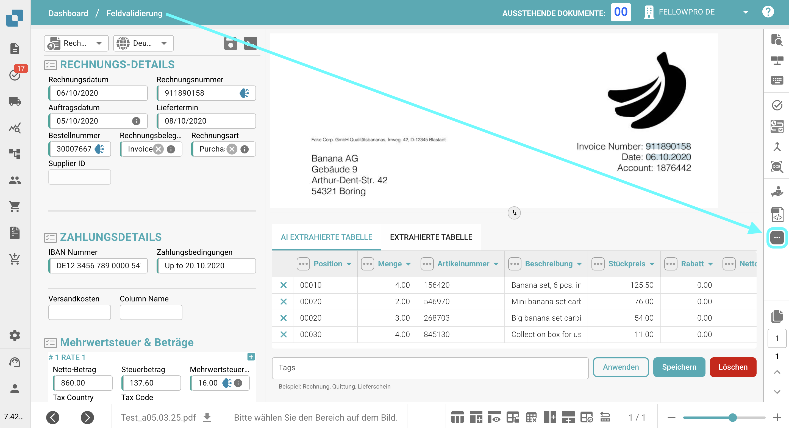
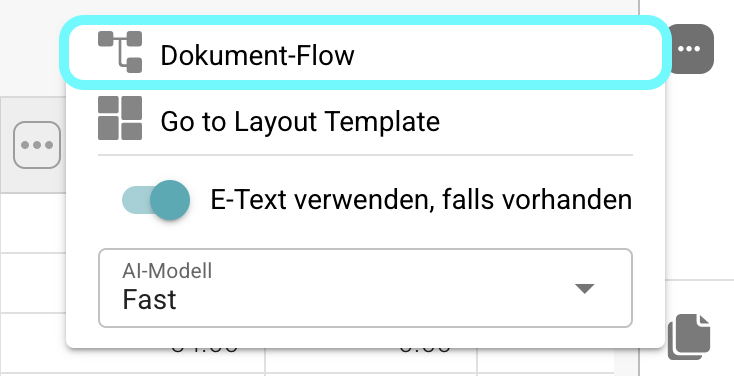
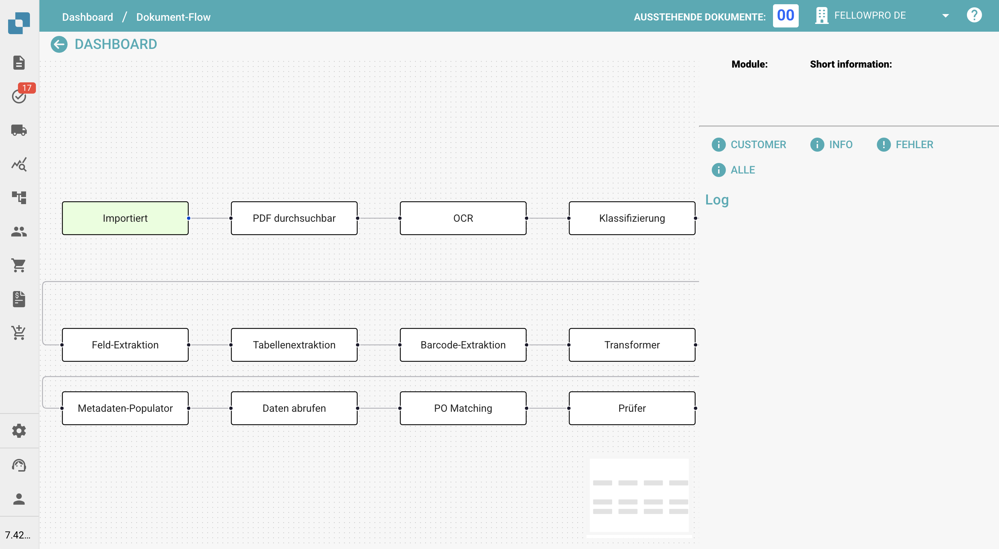
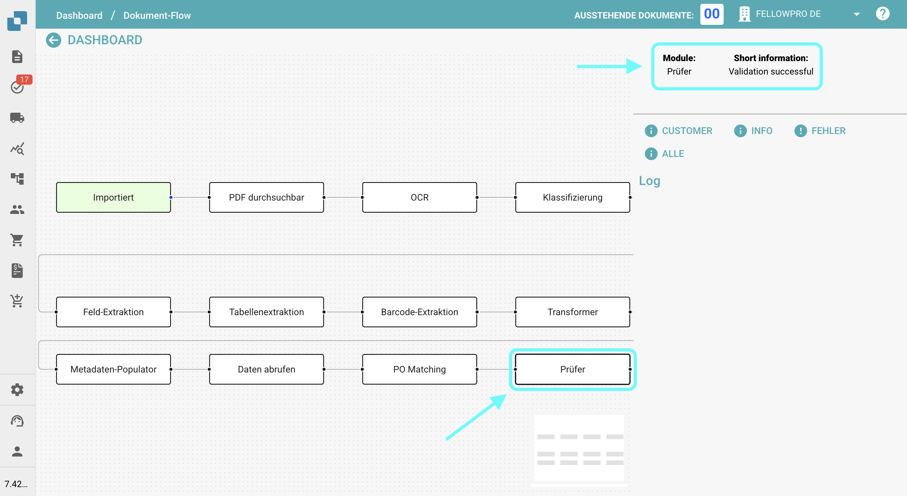

# Document-Flow

## **Überblick:**

Diese Seite bietet eine grafische Übersicht über die verschiedenen Schritte, die ein Dokument bis zu diesem Punkt durchlaufen hat.

## **Zugriff:**

### **Option 1:**

1.  Navigieren Sie zur Aktionsspalte auf dem Dashboard und klicken Sie auf die drei Punkte neben dem Dokument, für das Sie den Document-Flow anzeigen möchten.

    <figure><figcaption></figcaption></figure>
2.  Wählen Sie **Document-Flow**.

    <figure><figcaption></figcaption></figure>

### **Option 2:**

1. Öffnen Sie das Dokument, für das Sie den Document-Flow anzeigen möchten.
2.  Klicken Sie auf die drei Punkte auf der rechten Seite der Feldvalidierung.

    <figure><figcaption></figcaption></figure>
3.  Wählen Sie **Document-Flow**.

    <figure><figcaption></figcaption></figure>

## **Beschreibung:**

Auf der linken Seite des Bildschirms sehen Sie die einzelnen Schritte des Document-Flows, aufgelistet von links nach rechts.

<figure><figcaption></figcaption></figure>

* Schritte, die den Document-Flow-Prozess initiieren (wie Import oder Neustart), werden grün angezeigt.
* Um durch die Schritte zu navigieren, ziehen Sie sie einfach auf dem Bildschirm.
*   Wenn Sie auf einen Schritt klicken, wird der Name des Moduls und Informationen darüber, ob der Schritt erfolgreich war oder nicht, auf der rechten Seite des Bildschirms angezeigt.

    <figure><figcaption></figcaption></figure>
