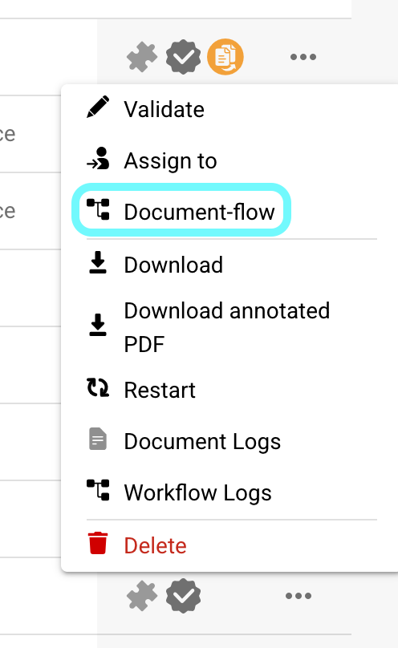

# Document Flow

## **Overview:**

This page provides a graphical overview of the various steps a document has gone through up to this point.

## **How to Access:**

### **Option 1:**

1.  Navigate to the actions column on the dashboard and click the three dots next to the document for which you want to view the document flow.

    <figure><figcaption></figcaption></figure>
2.  Select **Document Flow**.

    <figure><figcaption></figcaption></figure>

### **Option 2:**

1. Open the document you want to view the document flow for.
2.  Click the three dots on the right side of the validation screen.

    <figure><figcaption></figcaption></figure>
3.  Select **Document Flow**.

    <figure><figcaption></figcaption></figure>

## **Description:**

On the left side of the screen, you will see the individual steps of the document flow, listed from left to right.

<figure><figcaption></figcaption></figure>

* Steps that initiate the document flow process (such as import or restart) will appear in green.
* To navigate through the steps, simply drag and drop them on the screen.
*   When you click on a step, the name of the module and information about whether the step was successful or not will appear on the right side of the screen.

    <figure><figcaption></figcaption></figure>
